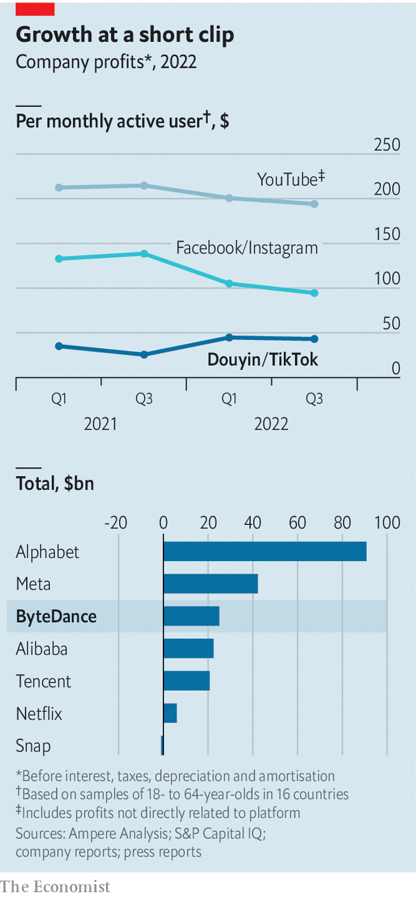

###### ByteDance the night away

# ByteDance, TikTok’s Chinese parent, reports a record profit 

##### Just wait until the West’s favourite short-video app starts making money 

 

> Apr 13th 2023 

 


TikTok is becoming the West’s favourite time sink. Last month it said it had 150m users in America, putting it ahead of Instagram and within striking distance of Facebook, two social networks owned by Meta. For its Chinese parent company, ByteDance, it remains a money sink. ByteDance can afford to be patient with the lossmaking Western app thanks to its lucrative Chinese version, Douyin. Last year the tech group as a whole made a gross operating profit of $25bn or so, most of it at home. On that measure, it overtook China’s reigning tech titans, Alibaba and Tencent. The gap between Meta’s overall profits per user and those of ByteDance’s apps is narrowing—and will shrink further once TikTok starts making money. Unless, that is, Western politicians act on their threats to ban TikTok on national-security grounds.■


