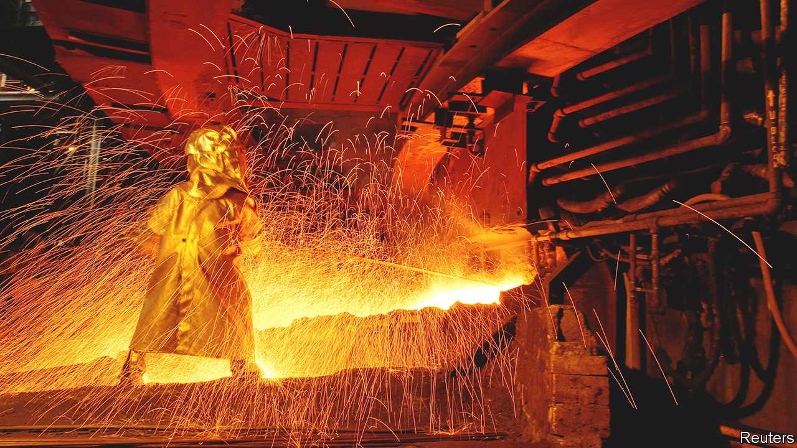

###### Nickel and dimes

# Indonesia’s nickel boom tests Western green sensibilities 

##### Making batteries for electric vehicles requires environmental and geopolitical trade-offs 

 

> Apr 13th 2023 

In a miserable year for initial public offerings, Indonesia’s capital is turning heads. The Jakarta Stock Exchange enjoyed record IPO volumes in the first quarter. The $800m raised in these flotations outstripped the sums drummed up on Hong Kong’s or New York’s stock exchanges in the same period. The bulk of the money came from the listing of Pertamina Geothermal Energy, a green subsidiary of the state oil-and-gas giant. It may have been just the start of Indonesia’s clean-energy IPO boom. On April 12th Harita Nickel, a firm that processes the battery metal, pulled off the country’s biggest IPO in almost a year, raising nearly $700m at a valuation of around $5bn. Later this month Merdeka Battery Materials, another nickel firm, aims to raise more than $500m. 

Nickel is at the centre of Indonesia’s efforts to become a clean-energy superpower. The country has one of the world’s two largest reserves of the stuff. In an attempt to capture more of the higher-margin markets for metal-processing and battery-making, a decade ago the government banned the export of raw nickel ore. Harita’s and Merdeka’s blockbuster IPOs show that the policy is having an effect. But the industry also highlights some of the uncomfortable trade-offs involved in the global battery business.

The first set of trade-offs is environmental. Digging up and smelting nickel is a grubby trade. JATAM, a network of NGOs, has accused Harita of making land grabs on Obi island, where it has a smelter, and of polluting the water around it. Harita denies the claims, and has the backing of the local and national governments. It touts a planned investment in a 300-megawatt solar-power plant for 2025 as evidence of its efforts to diversify away from the coal that currently fuels its operations on Obi.

Western investors and nickel-buyers, under pressure from environmental activists and virtue-signalling consumers back home, are still uneasy. This discomfort must be weighed against the desire of those same groups to accelerate the energy transition. A lot more electric cars must hit the road if the West’s climate goals are to be met: just one in four sold last year in China and Europe, and one in 14 in America, were electric or hybrid. Without Indonesian nickel, getting to net zero emissions would be tougher than it already is. 

The second set of trade-offs concerns geopolitics. America and Europe want to rely less on authoritarian China for all manner of technology, including in clean energy. Western governments may end up splurging on the order of $1trn to wrest  from Chinese firms, which dominate sectors from critical-mineral refining to the making of batteries and solar panels. Yet Chinese involvement in these industries will remain a fact of life for years to come. That is also true in Indonesia, where Western companies often find themselves working with Chinese ones. In March Ford teamed up with a local firm, PT Vale Indonesia, to erect a $4.5bn nickel processing plant on the island of Sulawesi. Their other partner is a Chinese firm, Zhejiang Huayou Cobalt. 

Other Westerners may still shun Indonesian nickel. If so, less squeamish rivals will happily step in. Last year South Korea’s LG Energy Solution and CATL, its bigger battery-making rival from China, each broke ground on new Indonesian smelters. In March POSCO, a South Korean industrial group, announced it would build a nickel-processing plant together with Ningbo Richin, another Chinese metals firm. ■


