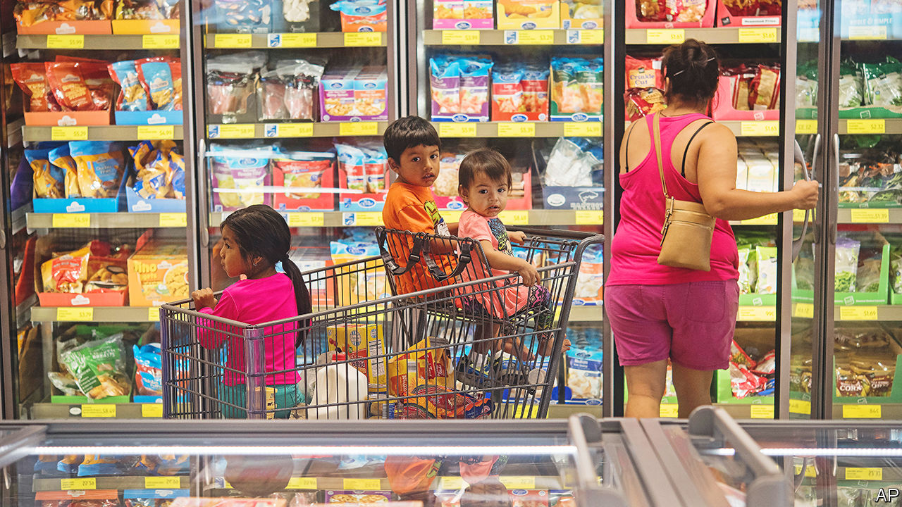

###### Yes, they can (and box, and package)

# Inflation has yet to dent big food’s earnings 

##### Fat times for American packaged-foods giants 

 

> Apr 13th 2023 

FOR YEARS nutritionists have advised Americans to steer clear of grocery shops’ central aisles and instead fill their trolleys from the outlying shelves. Fresh meat, dairy products, fresh fruit and vegetables often line supermarket walls; cans, boxes and other packages of less salubrious processed food are stacked in the middle. Some shoppers have heeded that advice: sales of canned soup have been lacklustre in recent times, even as those of fresher refrigerated  have grown. Now makers of the packaged stuff are staging a comeback. This says as much about shifting economic conditions as it does about products on shelves.

This month Conagra, which owns brands including Orville Redenbacher’s popcorn, Bird’s Eye frozen veg and Duncan Hines cake mixes, reported bumper results for its latest quarter. Sales and margins were all up year on year. The company expects higher earnings in the fiscal year to May than it had previously forecast. A few weeks earlier General Mills, which peddles canned soups, frozen vegetables and breakfast cereals, unveiled similarly juicy quarterly numbers. McCormick &amp; Company, which sells spices and sauces, and the J.M. Smucker Company, best known for jams and peanut butter, are likewise having a sweet time of it. Investors are licking their lips: Conagra’s share price has risen by 8% in the past 12 months, compared with a decline of 7% for the S&amp;P 500 index of large American firms. General Mills’ has shot up by 23%.

For America’s packaged-food firms, the past decade was a cycle of famine and feast. Lean years before the pandemic ended when restaurants closed amid covid-19 and people stocked their pantries. Stimulus cheques from the government meant that shoppers were flush and the food companies were not being nagged by their retail partners to offer discounts. Then in 2022 people began dining out again, putting pressure on volumes even as commodity-price shocks caused by Russia’s invasion of Ukraine pushed up costs.

As big food’s results show, the industry is managing to ride out the latest tumult. For one thing, the pandemic may have altered consumer habits, leading to a lasting bump in the consumption of frozen and packaged meals. Americans are still eating more meals at home than they were before the first covid-19 lockdowns. According to EY, a consultancy, nearly three in four consumers anyway do not carefully distinguish frozen vegetables from the fresh sort, treating them as the same category. And though inflation is leading shoppers to trade down from branded products to retailers’ cheaper private-label offerings when buying things like cosmetics or home goods, they are still happy to pay a bit extra for premium grub; 20- and 30-somethings in particular seem readier to spend larger shares of their income on food and are less likely to trade down than their elders. 

The food giants also benefit from a diverse range of products and brands, which they are adapting to changing consumer tastes. Conagra has introduced (Italian readers avert your eyes) “crustless pizzas”—microwavable boxes of sauce, cheese and meat—to appeal to the carb-phobic. Its vegan Power Bowls seem tailor-made for the avocado-loving yoga crowd. General Mills is marketing cereal as an after-school snack and alternative to dessert in the evening, rather than just something to munch for breakfast. And although they managed to maintain or even expand their margins by raising prices in line with their costs or faster, they might be all too content to take advantage of cheaper inputs without concomitant price cuts. 

Can the good times last? The biggest question-mark hangs over sales volumes, which could be crimped by those higher prices and a looming economic slowdown that may prompt shoppers to start pinching pennies. If wage growth slows or unemployment ticks up, at some point people will probably cut back even on smaller luxuries. Should one food firm decide to trim prices in an effort to boost volumes at its competitors’ expense, an old-fashioned price war may erupt. For the time being, though, the foodmakers will keep reaping the peace dividend. ■


