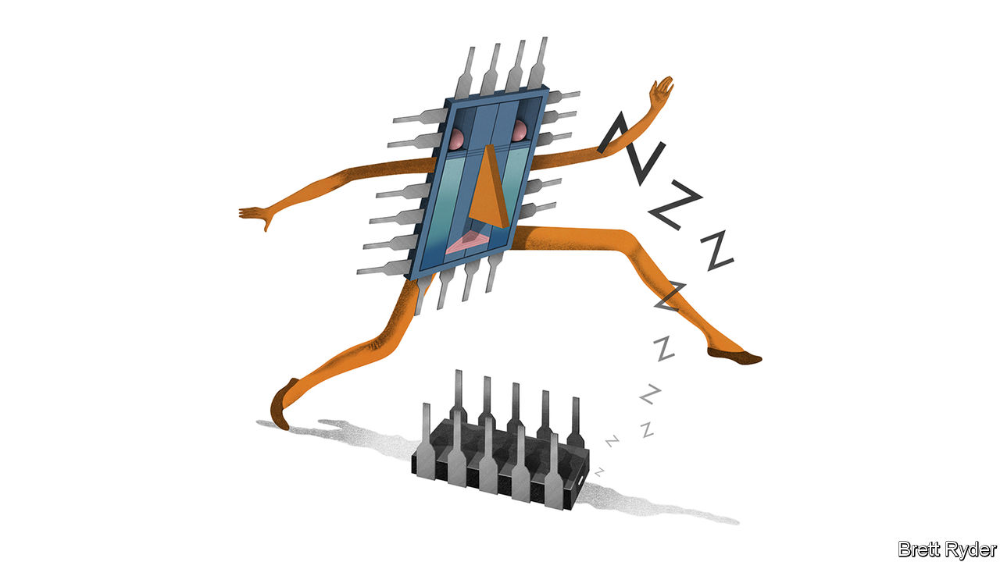

###### Schumpeter

# Samsung should be wary of Intel-like complacency 

##### It is too cosy at the top of the memory-chip market 

 

> Apr 13th 2023 

There is a good tale about Samsung’s entry into the silicon-chip business, which at the time—1983—was dominated by Japanese and American manufacturers. Lee Byung-chul, the founder of the South Korean , announced the new strategy in what he grandiloquently called the Tokyo Declaration. He said that though his country lacked raw materials such as oil, it had an educated and diligent workforce that was well equipped to turn its hand to chipmaking. As Geoffrey Cain recounts in his book, “Samsung Rising”, shortly afterwards some Samsung executives were sent on an overnight march across the mountains from Seoul to toughen them up for the challenge. They arrived at Samsung’s first semiconductor factory, built in a record six months, and signed a pledge before breakfast to make the business a success. Then, without sleeping, they put in a 16-hour work day.

Call it true grit or call it Samsung’s martial-style work ethic. One way or another the company force-marched its way past the competition to dominate the global market for memory chips. For more than 30 years, it has been the world leader in DRAM, used for memory storage in computers and servers, and for more than 20 in NAND flash memory, used in mobile phones. Yet since 2021, memory chips have been at the forefront of a boom-bust cycle in the semiconductor industry, which started with shortages, was followed by a surge in capital spending and has now become the worst slump at least since the global financial crisis of 2007-09. Samsung Electronics, which includes the conglomerate’s semiconductor, display and consumer-device units, is feeling the pain. On April 7th, while projecting a meagre first-quarter profit, it said it would cut memory-chip production. This is an attempt to help reduce oversaturation in the market. 

In the memory-chip business, Samsung’s lead has long been unassailable. Through regular market downturns, it has always been “the last man standing”, says Malcolm Penn of Future Horizons, an industry forecaster. Its size, with revenues last year of $240bn, gives it the economies of scale to ride out price declines for longer than its competitors. Its smartphone business, though not growing as fast as it once did, produces reliable cashflows to help it invest through the troughs of the chip cycle. When others struggled, it gobbled up their market share. That helped whittle down its large competitors from almost a dozen in the 2000s to only two today—SK Hynix of South Korea and Micron of America. Samsung has a cosy lead, with over 40% of global sales. 

In the latest cycle, it had long held out against production cuts. Its capitulation came months after beleaguered SK Hynix and Micron said they would curb output. What was curious, however, was the impact. Samsung’s share price, as well as those of the two rivals, surged. The simple explanation for the rally is that whenever the market leader throws in the towel, it is a sign that the bottom of the slump is nigh. Yet there is a subtler one, too. Samsung’s position at the top of the memory triumvirate may be so cushy that it has no desire to grab more business from its rivals. That might bring stability to the market. It would also signal a sense of complacency that would make Lee blanch. 

There was a hint of that complacency in a presentation to investors last November. Han Jin-man, head of memory sales, acknowledged that memory chips are sometimes seen as commodities, their price swinging in response to volatile capital spending. But he insisted that capital expenditure had stabilised over the past decade, the DRAM trio were investing rationally and the market was now better-balanced. In other words, Samsung seemed content to ride the growth in the overall DRAM market, which it expects to triple to almost $300bn by 2035, rather than go after its competitors’ market share.

Un-Lee-like self-satisfaction is on display in other areas, too. Samsung has lost some of its innovative edge in DRAM and NAND manufacturing technologies to SK Hynix and Micron, reckons Pierre Ferragu of New Street Research, an advisory firm. “When you are not fighting for your life any more, you become complacent,” he says. A similar sentiment knocked Intel, America’s chipmaking champion, off its pedestal in the late 2010s, when it began losing ground in leading-edge “logic” chips for processing data to TSMC of Taiwan and to Samsung itself. 

Samsung’s stated goal of becoming number one in contract manufacturing of logic processors by 2030 does not look on track, either—likewise for reasons familiar to Intel. Sales of non-memory chips are the most valuable component of the world’s $575bn semiconductor market. They are also the most strategically important, with many governments throwing their weight behind chipmaking to serve national-security interests. Last month South Korea’s government announced plans to build the world’s largest semiconductor cluster in Yongin, near Seoul. 

Chipping away won’t cut it

This may not be enough to lift Samsung’s share of logic-chip contract manufacturing above 16%, where the firm has been stuck despite being equal to TSMC in manufacturing prowess and maybe ahead in chip architecture. Rivalling TSMC, which controls up to 58% of that lucrative market, may require a more radical change to Samsung’s model of making semiconductors for itself as well as for others. The potential conflicts of interest scare off customers such as Apple, whose smartphones compete with Samsung’s.

Mr Ferragu does not expect Samsung to forsake its leading position in memory as Intel did in logic. It is the first DRAM-maker to bet heavily on extreme-ultraviolet technology, an advanced manufacturing technique. In logic and memory, it has pledged a combined $230bn in capital spending on new factories over the next 20 years. Still, Samsung would do well to rediscover its inner Lee. Otherwise it risks succumbing to the sense of entitlement that comes with being a national champion. Just look at Intel. ■


