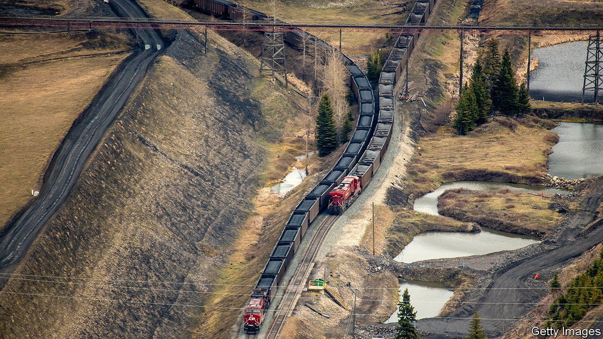
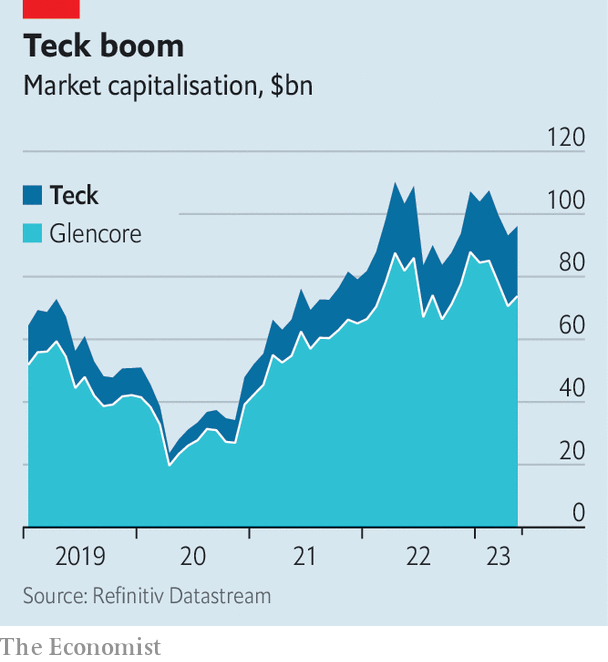

###### To build or to buy?

# The tug-of-war between Glencore and Teck 

##### It is mining’s dilemma in a nutshell 

 

> Apr 13th 2023 

In FEBRUARY TECK RESOUrCES finally announced its slow move into the future. The Canadian miner plans to spin off its relatively dirty steelmaking-coal operations. Under the plan, Teck would focus on mining copper and zinc, while continuing to get the majority of the severed coal company’s profits. Holders of Teck’s super-voting “class A” shares would retain control over the rump firm’s strategic moves for six years. After that its dual-shareholding structure would be scrapped.

Glencore, a much bigger commodity firm based in Switzerland, has something much more radical in mind. It proposes a merger between it and Teck that would then create two giant versions of Teck’s proposed entities. The first would amalgamate Glencore’s and Teck’s metals and minerals businesses. It would be listed in London and have an enterprise value of perhaps $100bn. With copper mining expected to make up roughly half its profits, “GlenTeck” would be a red-metal giant poised to take advantage of a green commodities supercycle. The second company would combine the parent firms’ coal businesses, to be listed in New York. This “CoalCo” would shovel all cash it generates to shareholders as the world weans itself off the black stuff.

 


Glencore publicly announced its unsolicited offer on April 3rd. Its boss, Gary Nagle, said that the deal, with an implied premium of 20% over Teck’s share price, would cut costs and unlock shareholder value. After swiftly rejecting the offer, his opposite number at Teck, Jonathan Price, called the transaction a “non-starter”, complaining that it would expose Teck’s shareholders to Glencore’s thermal-coal business, which may command less enthusiasm from investors than coking coal for steel mills. Mr Nagle fired back on April 11th, offering Teck’s shareholders their quarter of CoalCo in cash rather than shares. If later this month shareholders scupper Teck’s original restructuring plan, which requires approval from supermajorities of both share classes, the firm could be forced to the negotiating table. 

Even then, securing a merger will be difficult. It would be the biggest acquisition of a Canadian miner since 2007. The Keevil family, which owns many of Teck’s super-voting shares, is a hard sell. Norman Keevil, the patriarch and Teck’s chairman emeritus, has made plain his desire to keep the firm in Canadian hands. Canada’s government shares his wariness: it is tightening foreign-investment rules in its critical-minerals sectors.

To placate the Keevils and the Canadian authorities, Glencore promises to keep GlenTeck’s industrial head office in Canada. In addition, it has pledged domestic employment guarantees and a secondary listing on Toronto’s stock exchange. 

If Glencore’s overtures to Teck fail despite all these sweeteners, the Swiss company may still want to put its coal business up for sale. Other mining bosses may be ready to start shaking hands, too. On April 10th Newmont, an American mining giant, raised its takeover offer for Newcrest, an Australian gold miner, to almost $20bn. Years of dwindling capital expenditure and a commodities boom have left miners flush with cash. With their shares often trading close to the replacement value of their assets, buying looks more attractive than building. ■


