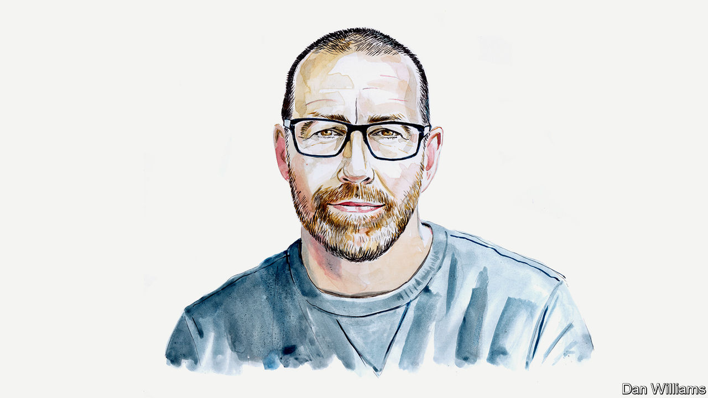

###### The Pentagon leaks

# Intelligence leaks are an opportunity as well as a threat, says Thomas Rid 

##### The scholar of spycraft says the private sector learns a lot from security breaches 

 

> Apr 13th 2023 

OVER THE past dozen or so years, America’s government and its intelligence apparatus has suffered five mega-leaks: the release of diplomatic cables by WikiLeaks in 2010; the disclosures by Edward Snowden in 2013; the publication of National Security Agency (NSA) and CIA hacking tools in 2016 and 2017; and, now, the appearance of large amounts of intelligence reports on Discord, a messaging platform. 

On April 13th Jack Teixeira, a 21-year-old member of the intelligence wing of the Massachusetts Air National Guard, was arrested on suspicion of leaking highly sensitive documents. Whoever made the leak uploaded “hundreds and hundreds” of documents, says Aric Toler of Bellingcat, an investigative group, who interviewed several members of the Discord channel to which the files were uploaded. Most media organisations reporting on the leaks have access to approximately 50 of these documents. About 20 pages of those are so-called “serial reports,” concise one-paragraph missives on world events, prepared by multiple intelligence agencies. The rest are maps and tactical updates relating to the war in Ukraine, some with dazzling levels of detail.

All mega-leaks differ in their causes and details, but they always have two effects. They do damage, sometimes catastrophically so. However, they also offer an opportunity to advance the conversation about intelligence: among the public, among experts, and in the private sector, where some of the best intelligence is produced today. The leaks, in short, have damaged American intelligence in the short run, but improved it in the long run. 

Assessing the damage caused by a big leak is hard, and doing so in a matter of days without access to inside information is especially so. Yet it is probably safe to assume that the Discord leaks are very bad. The disclosures will be damaging to capabilities, to technical access and human sources, and to allied relationships, as South Korea’s insulted reaction illustrated this week. The leak will also be harmful on the battlefield, as some Ukrainian weaknesses are now exposed.

How can governments stop such leaks happening? Preventing unauthorised disclosures is hard, and the risk can only be managed, not eliminated. Some measures are as obvious as they are overdue. One is over-classification. The more documents that are classified “top secret”, the more this level of protection is watered down. Truly sensitive documents may no longer be treated with due caution, as their classification becomes more ordinary. A related problem is a classification marker system and the use of serial numbers that reveal highly sensitive sources to a large number of intelligence consumers—for instance, whether a particular piece of intelligence came from human agents or communication intercepts, thus making disclosures more damaging. 

Then there is over-clearance. In the autumn of 2019, 1.25m Americans had “top secret” security clearance, the highest level, and another 1.7m had “secret” clearance, a 2.7% increase on the previous year. The number is so large that the concept has lost much of its meaning as a filter. One result, it appears, is a culture of lax security. 

CD-drives, USB devices and printers have been used to exfiltrate classified information for the mega-leaks of the past decade. Unplugging most printers and ripping out hardware will not solve the problem, but it might lower the frequency and volume of spillages. The government should work harder to prevent leaks. It should also punish leakers harshly to deter imitators. It remains jarring that the American government has not even identified, never mind charged, the perpetrators of the NSA mega-leaks of 2016 and 2017, known as the “Shadow Brokers”, who masterminded a devastating series of disclosures that led to North Korea and Russia re-purposing the disclosed NSA hacking tools in two of the most costly cyber-attacks in history. 

Nevertheless, once the spillage has happened—and it will almost certainly happen again—intelligence agencies should immediately shift gears: first minimise damage, then maximise utility. 

The mega-leaks of the past decade had a transformative effect on the culture and practice of intelligence more broadly. A large number of private sector “threat hunters” in big technology firms pored over the leaks of the 2010s in great detail in ways that often informed their own investigations. The intelligence agencies of the Five Eyes—America, Australia, Britain, Canada and New Zealand—thus inadvertently showed their private counterparts the art of the possible. Investigators learned about truly advanced capabilities, they better understood how to operate stealthily and how to unmask others doing so. And they saw examples of how world-class intelligence agencies attributed computer network operations to foreign governments. Some were even able to identify “threat actors”—groups of hackers whom they tracked—as Western intelligence agencies, thus maturing and improving their own tradecraft in the process.

When officials from the NSA or GCHQ, its British counterpart, appear at tech conferences today, they get respect from the tattooed hacker crowd. That is because of the leaks. When the American government makes an attribution claim—such as blaming Russia for a particular cyber operation—even without providing any forensic indicators, it has credibility to a large extent because of the spilled secrets of the past decade. They exposed not just extraordinary collection capabilities, but also the ability of the world’s most geeky spy alliance to out-innovate authoritarian opponents. 

The expert conversation on intelligence today is much better informed as a result of the leaks of the 2010s. And the internet generally is more secure because of them. The Snowden leaks, for instance, dramatically accelerated the collective move toward stronger encryption by default.

In spite of this, leaked files are treated as forbidden literature in Washington (in London less so). American regulations are agency-specific, but most cleared personnel and contractors believe they are technically not allowed to see or possess material that remains classified, and if they download—or fail to report—classified material in the open they could jeopardise their security clearance. So some 3m people—and millions more who would like to get clearance one day—assume they cannot look at publicly disclosed files, lest they run into problems with their polygrapher. They avert their eyes from files and screenshots on social media and even from news articles and books that use such material. 

Doing the opposite is in the interest of liberal democracy: learning from mistakes, including our leaks, to become stronger. The world’s strongest intelligence community needs to work in an open society, not a closed one. ■


