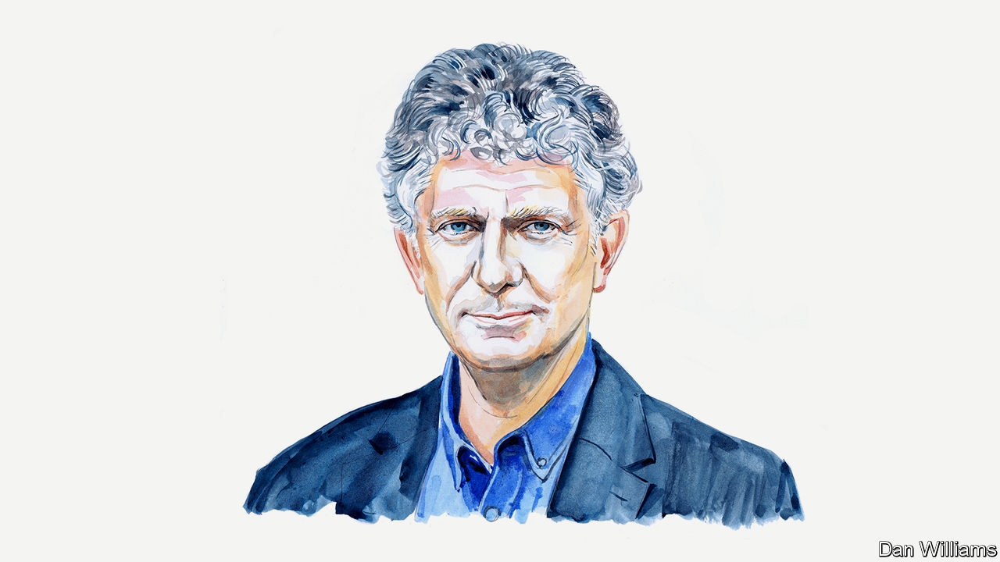

###### Russia and Ukraine

# Jonathan Powell on preparations for peace-making in Ukraine 

##### Tony Blair’s former chief-of-staff says lessons from the Good Friday Agreement can help bring peace 

 

> Apr 12th 2023 

The 25th anniversary of the Good Friday Agreement this month should remind us that even the most intractable conflicts can eventually be resolved by negotiation. Northern Ireland was believed to be insoluble. No one could foresee a zone of possible agreement that could satisfy the Irish Republican Army (IRA), the Protestant Unionists and the British government. But there was one.

Ukraine and Northern Ireland are, of course, different. But we know the Ukraine war, too, will be resolved by negotiation in the end, however impossible it seems now. We know this because the only way to set terms unilaterally would be total victory, as at the end of the second world war. Yet no one is suggesting Ukraine should occupy Moscow, and Russia will remain Ukraine’s larger neighbour with a bigger army whatever happens.

Despite China’s peace initiative, and others from countries such as France, now is not the time for negotiations. Peace talks usually only succeed if there is what academics call a ‘perceived mutually hurting stalemate’ and if there are leaders prepared to take political risks. As Ukraine prepares to launch a spring offensive in the coming weeks, no one should expect a pause until that has played out. And with recent opinion polls showing that more than 90% of Ukrainians expect victory, there is currently no political space for talks.

It is, however, the time to prepare for negotiations. There has been a huge expenditure of blood and treasure on the battlefield but no remotely comparable effort to work out a strategy for talks. Leaders always have a strategy before a political or military campaign, but when it comes to negotiations they just turn up and hope for the best. We know the cost of that from the Minsk agreements in 2014, which punctuated the first Russian invasion of Ukraine that year. They turned out to be unimplementable. 

In terms of the structure of eventual negotiations, it is hard to believe that Vladimir Putin will risk losing control by empowering one state as a mediator. There is a case, however, for establishing groups of friends on both sides, ‘peace clubs’ as they have been described by President Lula of Brazil. President Xi Jinping of China could anchor one group with the other members of the BRICS, a bloc which consists of Brazil, Russia, India, China and South Africa. After all, he has more influence on Russia than anyone else. And America could lead a group of Western countries along with France and Germany, as well as strong supporters of Ukraine like Poland and Britain. These states would not negotiate for the parties, but would each work to support one side and suggest compromises, while countries like India and France cross-fertilise ideas in a form of virtual mediation.

At the moment there is no conceivable zone of agreement between the sides. That is often the case when negotiations start. At the beginning of the talks in Northern Ireland, no one thought the IRA would give up their weapons, but they did in the end. Zones of possible agreement develop as negotiations go on. But to achieve that we need imaginative ideas that go beyond the zero-sum game of territory, and this will need to include a new European security architecture, and security guarantees for Ukraine. 

A ceasefire would be a potential trap for Ukraine, allowing the Russians to regroup and attack again. An armistice or frozen conflict would leave Russia occupying Ukrainian territory and able to exercise leverage on Ukraine and prevent its development as a European nation. From the Ukrainian point of view, it would be better to continue ‘fighting and talking’ at the same time, as President Juan Manuel Santos successfully did in Colombia in negotiations with the FARC guerrillas.

Ukrainians understandably say they cannot trust Mr Putin, given all he has done. But we have seen that problem surmounted before. Governments have to negotiate with terrorists who have carried out heinous crimes against their own people. Trust comes only with the establishment of monitoring mechanisms and guarantees to make sure the other side actually implements what it has promised to do. Those guarantees of implementation could be given by China and America. 

Mr Putin is giving every sign of believing that time is on his side, hoping the approaching elections in America will help him, and that Western unity will fracture. On the other hand, he may be sending a message that he is ready for a long war, in the hope of softening up the West, so that Western countries more readily accept a settlement on his terms. If we are going to succeed in negotiations we have to be as ready for a long war as he is.

The biggest problem in the end may be domestic politics. Even if we get an agreement, how will the sides sell it to their people? Ukraine’s president, Volodymyr Zelensky, has promised a referendum on any deal. Polls show 64% of Ukrainians want to continue until they liberate all Ukrainian territory, including Crimea, even if it means a longer war and even if it means less help from the West. It would be a bold leader who tried to persuade his people, after all their sacrifices, now to make compromises. Mr Putin will have less difficulty selling an agreement to the Russian people, but he will fear the ambitions of the hyper-nationalists.

Finding the space for an acceptable agreement between Russia and Ukraine is going to be exceptionally difficult. But it is not impossible, and we know there will eventually have to be a negotiated peace. While the focus is rightly on prosecuting the war, it should not blind us to the need to start planning now for the peace negotiations that will follow. ■


