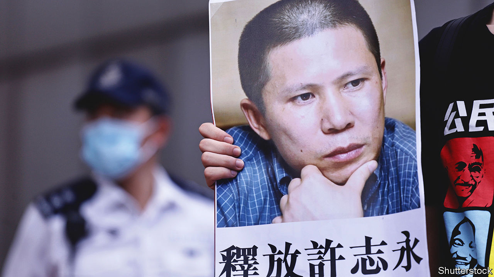

###### What passes for justice

# China throws the book at two prominent human-rights lawyers 

##### While an infamous human trafficker gets a lighter sentence 

 

> Apr 13th 2023 

To understand what China’s rulers really care about, look at who they punish. On April 10th, after more than three years in detention, two prominent human-rights lawyers—Ding Jiaxi and Xu Zhiyong—were sentenced to 12 and 14 years in prison, respectively. Their crime, according to prosecutors, was the “subversion of state power”. Mr Xu’s indictment claims that he was plotting a “colour revolution”.

The men’s actual offences were trivial. They were arrested for organising a private meeting of around 20 fellow activists in 2019. This was no revolutionary cell. Mr Xu and Mr Ding are part of the “New Citizens’ Movement”. The loosely organised group calls on Chinese citizens to consider the rights they have under the constitution, such as freedom of speech, and how they are trampled on by the government. In the long run, the movement hopes for a peaceful transition to constitutional democracy. It has also sought to expose official corruption and improve access to education.

In 2012, shortly after Xi Jinping became the paramount leader of China, Mr Xu wrote him an open letter. Back then, some thought that Mr Xi might tolerate groups like the New Citizens’ Movement. “I hope you show your courage and wisdom to lead China to the right path of democracy and constitutionalism,” wrote Mr Xu. “I hope you will be a citizen like us.”

But Mr Xu’s hopes were soon dashed. In 2013 he and Mr Ding were arrested over protests calling for the state to provide social and educational benefits to migrant workers in Beijing. Mr Xu was sentenced to four years in jail, while Mr Ding received three-and-a-half years. A wider crackdown in 2015 saw some 250 activists and human-rights lawyers detained. Before his most recent arrest, while on the run from police, Mr Xu wrote another open letter to Mr Xi, calling for him to step down.

Mr Xu and Mr Ding claim to have been tortured while in custody. Human Rights Watch, a pressure group, has called their sentences “cruelly farcical”. What makes them even more so is the relatively lenient sentence given three days earlier to one of China’s most infamous criminals. Dong Zhimin bought a woman called Xiaohuamei from human traffickers in 1998. Over the next two decades he abused her. Xiaohuamei gave birth to eight children during this time. In 2022 she was discovered chained by the neck in a shed. A video of her went viral. On April 7th Mr Dong was sentenced to nine years in jail. 

The Communist Party is much more concerned about political crimes. Some of those who protested against the government’s zero-covid policy last November remain in detention (though the policy itself was scrapped in December). They could face up to five years in prison for “picking quarrels and provoking trouble”, a vague offence often used by the authorities to criminalise peaceful protests and dissent. In February a tech and political blogger called Ruan Xiaohuan was sentenced to seven years in prison for “inciting subversion of state power”.

Much of the police and judicial activity in politically charged cases happens in secret. The closed-door trials of Mr Xu and Mr Ding took all of two days last June. Mr Xu was probably not allowed to make a statement to the court during his sentencing. But he dictated one, to be released by his lawyers. In it he asks, “Why is it subversion to aspire to be real citizens?” ■


