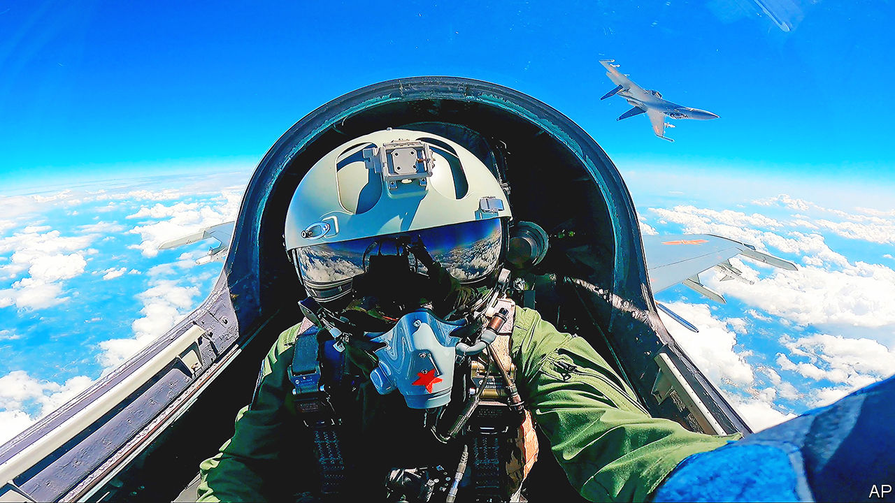
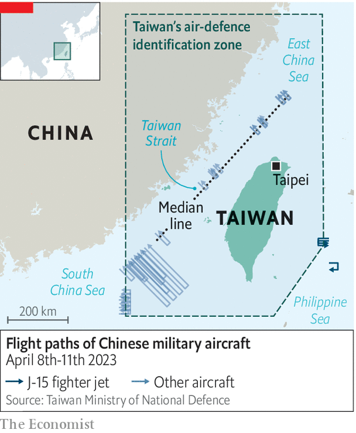

###### Moderate exercises

# What to make of China’s military drills around Taiwan 

##### They could have been worse 

 

> Apr 13th 2023 

Restraint may not be the first word that springs to mind when Chinese warplanes and naval ships simulate an attack on Taiwan. But the three days of drills that ended on April 10th were on the milder end of the spectrum of China’s potential responses to a meeting between Taiwan’s president, Tsai Ing-wen, and the speaker of America’s House of Representatives, Kevin McCarthy, in California on April 5th. Most important, China did not fire missiles over or around Taiwan, as it did after the previous speaker, Nancy Pelosi, visited the self-governing island in August.

China’s reaction thus far appears to reflect a renewed focus on diplomacy, especially with European governments, to offset its widening fissure with America. It may also signal concerns about inflaming public opinion in Taiwan ahead of its presidential election in 2024, which Chinese officials hope will lead to friendlier ties with the mainland. Even so, the drills included several new indicators of how China could try to take the island by force. And there were fresh signals, too, about how America and its allies might respond. 

 


One surprise was the involvement for the first time in such drills of a Chinese aircraft-carrier, the . While other Chinese forces approached Taiwan from its north, south and west, the  was deployed around 320km to the east, serving as a platform for J-15 fighter jets to probe the island’s air-defence identification zone. Taiwan said that it tracked 19 of those fighters, with several making such incursions, between April 9th and 10th.

Chinese military experts said that the aim of the drills was to practise pre-invasion strikes on high-value targets, and that the  could be used to deter foreign forces and hit military assets on Taiwan’s east coast, which is protected by a mountain range. Completion of more Chinese carriers in the coming years would create “a stronger siege and strike potential”, said Senior Colonel Zhao Xiaozhuo of China’s Academy of Military Sciences. 

China currently has two operational carriers and some experts are sceptical about their utility in a war over Taiwan. They would be soft targets for America if venturing east of the island and would not provide much additional capability closer to China’s shores, as aircraft can reach Taiwan from mainland bases. China also has little experience of operating carriers, having launched its first—based on an old Soviet hull bought from Ukraine—in 2012. 

Still, the ’s deployment suggests progress in practising carrier operations. As a symbol of military might, its appearance “is a form of coercion and political warfare”, says Drew Thompson, a former Pentagon official. China’s carriers could also be effective if it imposes a partial blockade or takes other action short of war, making it harder to justify American intervention. A larger Chinese carrier should be operational by 2024 and two more could be ready by 2031.

Also of note was that Japan played an unusually active role in monitoring the . Japan’s Self-Defence Forces dispatched two destroyers and scrambled fighter jets to gather intelligence on the carrier and other Chinese navy ships escorting it. They observed about 120 take-offs and landings from the carrier, including 80 by fighter jets and 40 by helicopters, according to Japan’s defence ministry. It published photographs of the vessel, as well as a map showing its movements. 

Japan, America’s closest Asian ally, has deployed military assets to monitor Chinese drills before, but this was one of its most robust responses. That is probably an indication of closer co-ordination between America and Japan in preparing for a war over Taiwan. It may also signal America’s desire to avoid a confrontation between its own forces and China’s during such drills. An American carrier, the , was nearby too, but no public statement was made about it monitoring the exercises. 

America has instead highlighted efforts to galvanise Asian alliances. Shortly before the Chinese drills, the  did exercises with South Korean and Japanese forces. On April 11th America began its biggest ever exercises with the Philippines, featuring live-fire drills at sea for the first time. In February America gained access to four additional bases in the Philippines, which Pentagon planners hope could be used as a launch-pad to help defend Taiwan.

Among America’s European allies, meanwhile, there are signs of disunity over Taiwan. In an interview published after a three-day visit to China, French President Emmanuel Macron suggested that Europe should not follow America’s lead on Taiwan, lest it be swept into “crises that are not ours”. Yet in the midst of China’s drills, a French frigate sailed through the Taiwan Strait. China, which often protests such transits, kept quiet. Still, it is not easing pressure on Taiwan. Since the drills ended, it has resumed daily patrols nearby. ■


