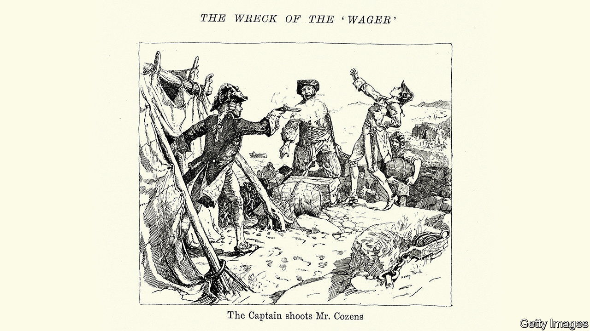

###### Horror on the high seas

# A thrilling account of a shipwreck in the Pacific in 1741 

##### “The Wager” may be David Grann’s best book yet 

 

> Apr 13th 2023 

 By David Grann.

A largely forgotten chapter of a little-remembered war between England and Spain provides the setting for this gripping study of human nature in extremis. , a British frigate, crashed onto rocks off the coast of Patagonia while pursuing the enemy into the Pacific in 1741. The seas in that remote part of the world are infamous. “Below forty degrees latitude, there is no law,” went a sailors’ adage. “Below fifty degrees, there is no God.”

A non-fiction account of the chase, the wreck and what followed might have been told as a typical maritime adventure. Those who love yarns involving cannon fire, sea-chests, plum duff and mainmasts will find “The Wager” riveting, as will those less intrigued by the age of sail. In the hands of David Grann, the story transcends its naval setting. The author, whose previous bestsellers include  and “The White Darkness”, is a master of exciting tales in far-flung places. He has produced a volume so dramatic and engrossing that it may surpass his previous books. 

The tale revolves around three complex figures. ’s captain, David Cheap, began to lose sway over the men as soon as the ship foundered. The crew became castaways on a small island in the Golfo de Penas (“Gulf of Pain”). Just over half the original complement of 250 had survived outbreaks of typhus and scurvy onboard. Aloof and slow to adapt, Cheap derived his authority from the chain of command rather than natural charisma. But he was also physically brave and loyal to the mission, at one point single-handedly facing down a band of armed mutineers without a weapon of his own. 

By contrast, John Bulkeley “emerged as a leader on his own merits”. A working seaman whose job, as gunner, was to oversee the ship’s cannon, he started foraging food, constructing shelter and bartering supplies from the moment his feet touched land. Others began looking to him for answers. Mr Grann writes that little is known about Bulkeley except that he was a devout Christian who swung hard in a fight. Yet he was no brute: he kept a detailed journal of ’s travails, peppered with verse. 

 


John Byron, a midshipman, bore witness to the ensuing power struggle. Sixteen years old when he volunteered for naval service, the young gentleman came from one of the oldest noble families in Britain. (His grandson would be the poet .) Mr Grann deftly shows how the trainee officer’s allegiance shifted between the captain and the gunner, swayed by notions of pragmatism, duty, survival and, above all, decency. Like Bulkeley, Byron kept a journal that proved an important source for Mr Grann’s book. 

The marooned crew feuded over where to assign fault and how to get home. They soon split into bitter factions. An indelible scene portrays Cheap and Bulkeley shaking hands as they part ways, never again to reunite. The privations that the men endured over the following months and years are almost unimaginable. After the ravages of shipbound disease and a desperate rounding of Cape Horn, they faced starvation, cannibalism, exposure, abandonment and return journeys to civilisation in small, unseaworthy boats. Only a fraction survived. “I believe no mortals have experienced more difficulties and miseries than we have,” wrote one of their number. 

The story’s astonishing conclusion ought not to be spoiled, but “The Wager” echoes several other recent tales that have pitted bearded men against each other in harsh times and places. Both  by Michael Punke and “The North Water” by Ian McGuire are fictional antecedents. “The Wager” may be bound for similar success as, like those books, it looks headed for the screen. Apple Original Films has bought the rights, with Martin Scorsese attached to direct and Leonardo DiCaprio to star. (The pair is also behind “Killers of the Flower Moon”, based on another of Mr Grann’s books; the movie will have its premiere at Cannes Film Festival next month.) Expect to hear more about the captain and the gunner. ■


