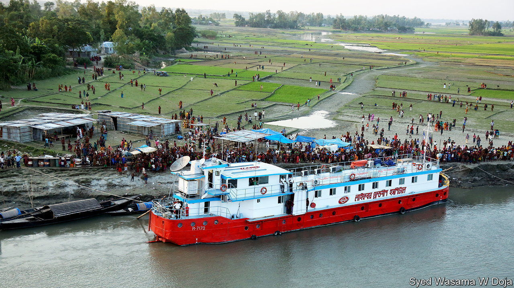

###### Walking on water

# Bangladesh’s riverine villages are benefiting from clever design 

##### Architectural innovations and adaptations are helping to bring permanence to a flood-prone land 

 

> Apr 12th 2023 

Towards the end of the dry season, Gaibandha, a rural district in northern Bangladesh, is a flurry of activity. In the densely cultivated landscape, villagers are harvesting winter vegetables and bundling up rice seedlings ready for transplanting. Once the monsoon rains come, the paddy fields will erupt in emerald green. 

Just beyond the fields, one channel of the Jamuna, as the mighty Brahmaputra river is known in Bangladesh, flows past. The soils of Gaibandha are rich with the silt that the river has carried down for millennia. The Jamuna’s waters are a crucial reassurance during times of drought.

Yet on reaching the river, about a kilometre wide here, you see a worrying contrast. Standing on its banks are two-dozen villagers who look palpably worse off and under more strain than the others. When asked about their land, they point, across the extending shallows, to where it was. There, they say, their bamboo huts and their fields stood before  in 2021 swept all away. An anchored existence one year was gone the next. Even in this low season, sections of the friable bank fall into the ochre water.

In Bangladesh water makes and breaks. Three powerful rivers—the Jamuna, the Padma (the main distributary of the Ganges) and the Meghna—merge to form the world’s largest delta. Right now spring melt from Tibetan glaciers is beginning to charge the Jamuna’s watercourse. Far out to sea an even more formidable phenomenon is brewing: the . 

As summer approaches, the vast Indian subcontinent warms faster than the seas around it. Hot, dry air rises and draws in a moist maritime wind from the Bay of Bengal. This warm, wet air races towards Bangladesh, rises in turn and condenses to fall as rain, while also releasing energy which further drives convection. The Himalayas to the north act as a rampart, thereby intensifying the whole process.

Between June and October, the rivers will burst their banks; the largely flat countryside can sit underwater for weeks. At times, the currents run at over ten knots (18.5kph). Riverine islands made of silt and sand known as some several kilometres long—form, vanish and reform in an endless cycle of erosion and accretion. Now  is making weather patterns more unpredictable and the downpours more powerful.

More than 7m people live in the districts of Bangladesh, along a crease between water and solidity, seeking out of impermanence its opposite. In the past, government and international organisations hoping to help these people have built concrete embankments that either quickly fail or divert waters to worry another part of the river bank. 

Stilt houses are another obvious idea, but a flawed one. For a start, you need to build raised structures able to house a family as well as its livestock. There is a risk that young children will fall in the water. Only concrete structures with deep pilings stand much chance against floods—and they are prohibitively expensive, in part because they do not use building materials to hand in the delta.

It is better to site settlements on raised plinths of densely compacted alluvial earth. Some aid organisations have encouraged the construction of settlements in a long, thin line parallel to the flow of the river. The current can flow from unpredictable directions, however, and quickly punch a hole in the berm’s side. A blocky, square-shaped plinth is vulnerable, as the waters hit these with irresistible force. The block’s uncompromising shape creates eddies on the downstream side that can also eat away at the back of the structure.

Friendship, a non-profit organisation, takes a more intuitive approach, one that was inspired by a seaplane trip to the remoter by the company’s founder, Runa Khan, and Kashef Mahboob Chowdhury, an architect. Mr Chowdhury, who won the prestigious RIBA International Prize in 2021, has said he was struck by the current-formed contours of the themselves. Looking at them from above, he could see “they had comet shapes, and left a trail.” The best design, he deduced, would be “a teardrop-shaped island which has a rounded elliptical front”. This layout would allow water to pass by quickly with minimal damage to the island.

Mr Chowdhury’s plinth design is a boat-like form about three metres high, 113 metres long and 73 metres wide (see picture above). Villagers’ huts line the rim. Since flood water is not safe to drink, in the centre of the plinth village is a hole for rainwater; in the dry season when the pond is low, planted gourds and squash clamber up the sides. Latrines are situated away from the settlement. It is a simple design of genius.

Two-dozen such plinth villages have now been built in the districts, each costing about $50,000. The waters took two early examples, but the others flourish. The most impoverished families get first dibs to live on the plinths. When the waters rise, outlying families come up with their livestock to join them. 

At a plinth village surrounded by fields of sweetcorn a few kilometres upstream from Gaibandha, Sadaf shares a bamboo-and-corrugated-iron home with her mother, four-year-old daughter, a cow and four goats. After being forced by the waters to move a dozen times over the years, she says, they have a degree of security they have never enjoyed before.

Often security is ensured, strangely, by mobility. It is no good growing vegetables on a if you do not have the means to take them to market. When Friendship was set up two decades ago, Ms Khan says, its first step was often to help villages get a boat. Denied one, growers have to wait for others to come to them to buy their produce—and accept unfavourable prices. A small, lean boat cleaving the current leaves as light a footprint as it is possible to imagine. It is often the first obvious structure to benefit impoverished communities, especially if built by locals in Bangladesh’s “country boat” tradition.

 


Other, less traditional, vessels followed. Three hours’ chug upstream, moored to the opposite bank, looms one of Friendship’s two hospital ships, converted with Mr Chowdhury’s involvement from a flat-bottomed steel barge. Many communities are cut off even from primary health care, so the hospital comes to them. 

It moves up and down the rivers on an advertised schedule, staying at each spot for weeks. Corrugated-iron shelters are set up on land for patients awaiting treatment, or recuperating after it. Each year the ships’ 72 doctors, nurses and pharmacists treat 105,000 patients: they deal with everything from skin infections to cooking-fire burns, and also administer vaccines.

The concept has been extended by other non-profit organisations to floating schools: glorious timber-and-bamboo arks bringing the classroom to schoolchildren when, floodbound, the youngsters cannot get to the classroom. For generations, dwellers have learned to cope in a land that gives and ruthlessly takes away.  and adaptations may help them thrive for generations more. ■


