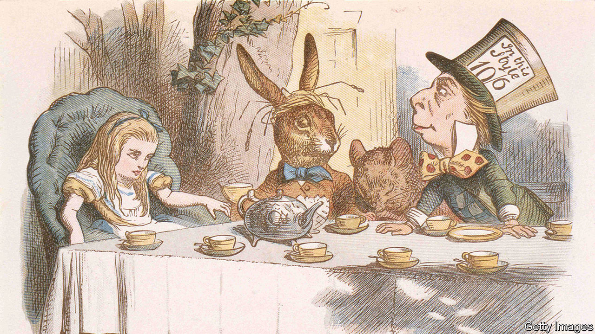

###### Common denominators

# Paying attention to numbers can open up meaning in books 

##### Sarah Hart, a professor of geometry, looks at works including “Moby Dick” and “War and Peace” 

 

> Apr 12th 2023 

By Sarah Hart. 

THE MEMBERS of Oulipo—an abbreviation of , or “workshop of potential literature”—gathered in a café in Paris in November 1960. The avant-garde group sought new ways to tell stories; they revelled in constraint. In 1947 Raymond Queneau, the collective’s co-founder, had imagined a single short story in 99 different ways in his “Exercises in Style”. In 1969 Georges Perec wrote a novel that omitted the letter “e”. Three years later he produced a novella in which “e” was the only vowel used. 

Sarah Hart describes the work of Oulipo in “Once Upon a Prime” as part of a wide-ranging analysis of the links between maths and literature. The author—who in 2020 became the first woman to hold the position of Gresham Professor of Geometry, thought to be the oldest maths professorship in Britain—seeks to prove that the disciplines are profoundly intertwined. “The perceived boundary between them is a very recent idea,” she says. 

Professor Hart argues, convincingly, that paying attention to numbers can open up meaning in novels and poems; she explores the role maths plays in literary works such as “Jurassic Park”, “Life of Pi” and . Mathematical allusions can provide insight into a writer’s psyche, too. In “War and Peace” Tolstoy “uses calculus as a metaphor for understanding the whole of human history”. 

Some novelists make maths the theme of their work. Lewis Carroll, a lecturer at Oxford University, combined fantastical escapades with references to puzzles, sums and numerical games in “”. Alice uses a “proof by contradiction” to expose the Mock Turtle’s lies about studying arithmetic. The theme of “Through the Looking-Glass”, the sequel, was chess; Carroll included descriptive notation as part of the front matter. His abiding interest was in “the power and possibilities of logic”, Professor Hart writes. 

Amor Towles, a banker turned bestselling author, gave his novel “A Gentleman in Moscow” a unique, “accordion-like” structure inspired by the power of two. The book covers a period of 32 years. The story starts on a summer solstice—the midpoint of a year—and returns to the characters in roughly doubling time spans (one day after, two days, five days, ten days, and so on) until the midpoint of the story. From there, the time frames grow shorter again: from eight years to four years, two years, and beyond. The effect, Professor Hart avers, is to mimic “the way human memory works, and how we experience the passage of time”. 

“Once Upon a Prime” analyses the “counting, pattern, and therefore mathematics” involved in rhyme schemes and points out writers’ love of prime numbers. (Consider the three witches in “” and Snow White’s seven dwarves.) The book shows how seemingly random dates or figures can contain hidden clues for the reader or hint at the theme of a story. It makes for illuminating prose and the reader may feel better equipped to tackle the books on their nightstand afterwards.

Professor Hart’s book is also good fun, written in a light and accessible style. The author explains why giant spiders such as Aragog in “Harry Potter” cannot exist and why the Olympics in 2008 opened at eight minutes past eight o’clock on the eighth day of the eighth month of the year. She furnishes her reader with tongue-in-cheek advice about how to break the record for writing the most limericks, how to optimise a pick-your-own-adventure story and how to decipher encrypted messages. 

The book offers answers to some creative conundrums, too. Is  to everything, as “The Hitchhiker’s Guide to the Galaxy” suggested? How big would Jorge Luis Borges’s library have to be to contain every possible book on Earth? Professor Hart tackles these questions with the rigour of a mathematician—and the wit and creativity of a writer. ■


