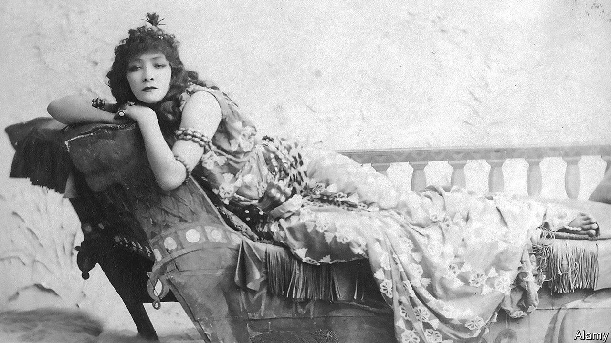

###### Home Entertainment

# Sarah Bernhardt was the first modern celebrity 

##### The actress, who died 100 years ago, was a publicity guru 

 

> Apr 13th 2023 

“There are five kinds of actresses,”  once wrote. “Bad actresses, fair actresses, good actresses, great actresses—and then there is Sarah Bernhardt.” No one was, or ever had been, quite like her. The French performer was celebrated not only for her enchanting voice, but also as “the queen of the pose and the princess of the gesture”. She played the greatest roles written by Dumas, Molière and Shakespeare and is thought to have inspired the character of La Berma in Proust’s . A new exhibition in Paris, “And the woman created the star”, marks the centenary of Bernhardt’s death in March 1923. 

Bernhardt had been acting from a young age, but did not break out until her late 20s, when she played Phèdre in Racine’s tragedy at the Comédie-Française. The theatre company was prestigious, yet soon it was Bernhardt the public was flocking to see. After a successful tour of Britain she cut them loose and embarked on the first of several lucrative tours of America. She travelled in a manner appropriate to a modern-day diva, making use of a personal train carriage which carried her maid, cook and leading man. 

The public was as enraptured by her  as it was by her skill on the stage. Bernhardt was unapologetically, and publicly, promiscuous. It is thought her lovers included Victor Hugo—when she was 27 and he 70—Gustave Doré and the Prince of Wales, as well as a number of her fellow actors. She proudly raised her son, whom she claimed was fathered by a Belgian aristocrat, as a single mother. 

She owned a vast menagerie of exotic animals which included a cheetah and an alligator, and kept a satin-lined coffin in her bedroom in which she sometimes slept. It was Bernhardt herself who provided the press with a photograph of the coffin, for she understood the importance of self-mythologising. She cannily took advantage of the latest technology to disseminate her image around the world. 

She was photographed by Félix Nadar, considered the first celebrity photographer, and employed , an artist, to create posters of her using the new technique of lithography. Her name was used to sell everything from Pears Soap to Columbia bicycles. A short documentary made by France Culture, available on YouTube, argues that Bernhardt should be considered the first influencer.

Unsurprisingly, she was drawn to the medium of film when it emerged. In 1900 a short recording was made of her turn as Hamlet, in which she can be seen duelling with Laertes. She starred as Queen Elizabeth I in a hit silent film of 1912, and it made her the first international movie star at the age of 68. A few years later she was the subject of one of the earliest “celebrity at home” documentaries.

When Bernhardt died in 1923, at the age of 79, hundreds of thousands of people lined the streets of Paris as her coffin was transported to Père Lachaise cemetery. The monument was engraved only with her name. Nothing else was needed. The world knew who she was. ■


