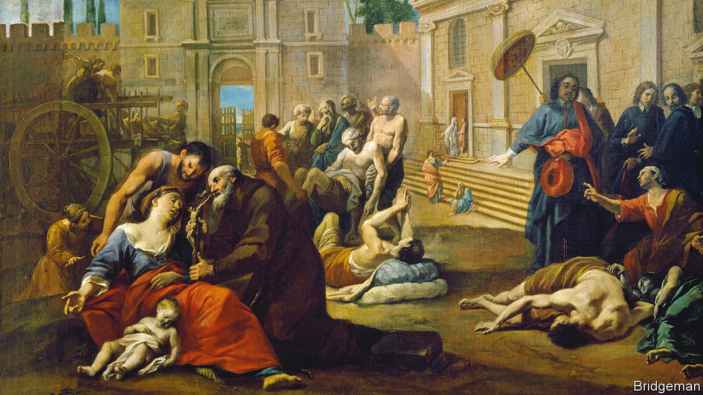

###### Bugs in the system

# The role of bacteria and viruses in world history 

##### Microbes maketh man, says Jonathan Kennedy 

 

> Apr 12th 2023 

 By Jonathan Kennedy. 

For the first 250,000 years after  evolved, they existed on Earth alongside several other species of human in Africa, Asia and Europe. Around 50,000 years ago, however, left Africa and migrated across the world; around the same time, all the other species began to disappear. The fossil record shows that the last Neanderthals died out roughly 39,000 years ago, leaving only . 

Why the other humans perished may be the biggest conundrum of the early Palaeolithic age. The prevailing explanation is that  was more intelligent. In his book “Sapiens”, , a historian, argued that the species went through a kind of “cognitive revolution” between 70,000 and 30,000 years ago, probably after a genetic mutation transformed how they thought. Since  was brainier than other species, these humans had better communication skills and, presumably, better fighting ability. 

According to Jonathan Kennedy, the author of “Pathogenesis”, there is a better explanation for why prevailed: their  were superior. As their populations boomed, genetic diversity increased and, since they lived in Africa, much closer to the equator than other humans,would have been exposed to a greater array of animals carrying a variety of microbes. Some of those microbes would have been pathogenic. (Indeed, the majority of bugs that infect humans are —ie, they jump the species barrier from other animals.) 

As moved across the world, they would have been protected against the diseases carried by the other humans they met. The converse was not true, however, meaning Neanderthals and other humans were less resistant to the diseases carried by .

From there, Mr Kennedy goes on to rewrite much of the history of life, with microbes at the forefront. “It’s a bacterial world”, he writes, “and we’re just squatting here.” Infections have shaped fundamental elements of mammalian biology, for example. When animals first evolved, they laid eggs in order to reproduce. But a few hundred million years ago, a shrew-like creature developed the ability to grow young inside her body. Geneticists argue that this ability did not evolve naturally, but was suddenly acquired when a virus inserted its DNA into the creature’s genome. Without that infection, humans might be hatching from eggs today.

Human civilisations have been shaped by disease, too. Multiple plagues afflicted  and Mr Kennedy argues that the death and devastation not only led to the collapse of that empire, it also set in motion the societal changes that allowed Christianity to dominate the world. 

Some of his most striking stories come from the Spanish conquest of the Americas. The prevailing story here is that the Europeans had better technology and weapons with which to subdue the less advanced societies in the Americas. That’s not entirely true, Mr Kennedy says. 

The introduction of infectious diseases from Europe, he writes, resulted in a 90% fall in the population in the Americas, from about 60.5m in 1500 to 6m a century later. If Europeans brought disease to those in the Americas, why didn’t American pathogens have a similar effect on the invaders? Many of the diseases Europeans had immunity to had originated in domesticated herd animals such as cows, pigs and sheep. In the Americas, people had also domesticated animals—alpacas, guinea pigs and llamas—but “unlike the ancestors of Eurasian farm animals, alpacas and llamas hadn’t lived in vast herds prior to domestication, limiting the opportunities for diseases to emerge and become endemic.” People in the Americas would not have been exposed to as many microbes from their farmed animals.

There is a hint of formula about this book: as soon as a new set of characters is introduced, you know infection looms. But that is a minor quibble in a compelling account of the role of bacteria and viruses in world history. Mr Kennedy marshals a dizzying range of material, from the transition from feudalism to capitalism in Europe to the rise of the slave trade to the defeat of the British army by American revolutionaries in Yorktown in 1781.

It helps that Mr Kennedy’s epidemiological writing is leavened with pop-culture references: “The Lord of the Rings”, “2001: A Space Odyssey” and Monty Python provide on-ramps for some of the complex tales Mr Kennedy tells. Despite the sweeping ideas, therefore, his book is an entertaining read. “Emphasising the role that infectious diseases play doesn’t exclude the possibility that humans can have an impact on the world,” he concludes. “It’s just that very often we don’t make history in circumstances of our own choosing, but in circumstances created by ​microbes.” ■


