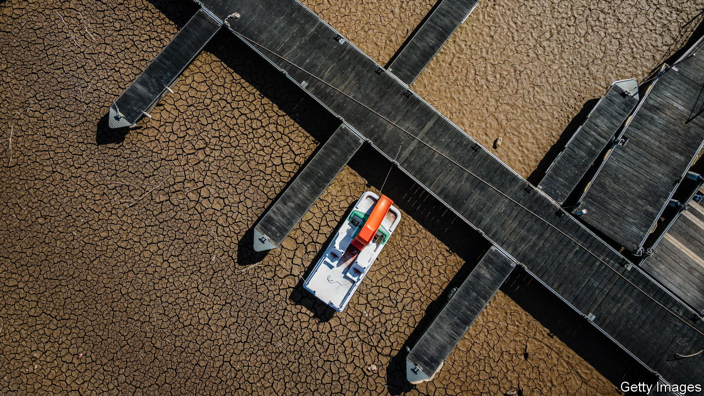
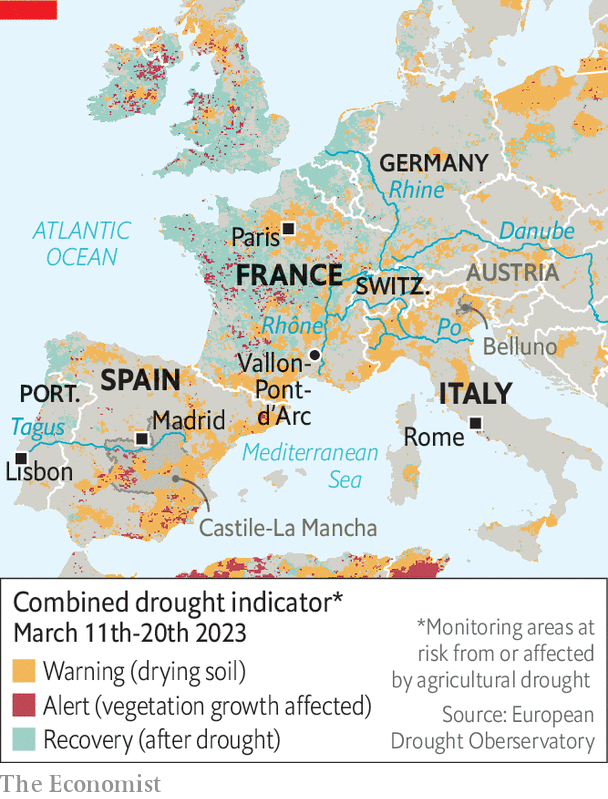

###### Not waterproof

# A winter drought grips southern Europe 

##### After Russia cut off its gas Europe’s latest shortage is of water 

 

> Apr 13th 2023 

The small town of Vallon-Pont-d’Arc in southern France sits on the winding Ardèche river, just before it enters a deep limestone gorge. Fringed by red-tiled two-storey new-build homes, it has a gently growing population, which is boosted in the summer months by an influx of tourists and their kayaks. After yet another period of low rain, however, concern about dwindling water supplies has prompted Thierry Devimeux, the local prefect, to limit not just the use of water, but the expansion of the town altogether. It makes Vallon-Pont-d’Arc the 22nd in the surrounding  in which all new building has been banned. 

Southern Europe is experiencing its second major drought in less than a year. This time it is an unusual one: a winter drought. For 32 consecutive days in January and February no rain fell anywhere in France—the longest dry spell in winter since monitoring began in 1959.

 


In Italy the areas on either side of the river Po, which is carrying 61% less water than usual at this time of year, account for about a third of the country’s agricultural output. Skiers have found that the snow cover in the Alps this season has been even patchier than in the already disappointing previous one, with Switzerland reporting record snow lows on many of its slopes.

The Alps are Europe’s water-tower. They provide 25-50% of the water running through the continent’s main rivers, the Danube, the Po, the Rhine and the Rhône. With so little snow to melt in the coming months, river levels are likely to be unusually low, and with them water supplies for the people and plants along their banks. Politicians realise the danger. On March 30th Emmanuel Macron, France’s president, chose to make his first visit outside Paris after recent protests against his pension reform to a depleted reservoir, the country’s biggest, in south-east France. There he unveiled a 53-point plan to save 10% of water consumption by 2030. 

On April 6th Italy’s cabinet set up a crisis group to frame an emergency programme of action and gave it 30 days in which to report back. The country’s water networks certainly need a lot of work. Last month, the Italian environment minister, Gilberto Pichetto Fratin, said that pipeline leakage averages a whopping 37% nationwide; he called it “a waste we can no longer afford”. In the province of Belluno in the north-east, 70% of the water, collected from springs, is lost on the way to consumers. Farmers in the north are already planning to plant less rice, which requires more water than other crops.

Spain’s history has taught it some hard lessons in water management. The country is both high and dry, and has experienced drought throughout its recorded history. Researchers have dated the country’s dry spells by noting in which years Muslim caliphs in al-Andalus and bishops in Christian Spain instructed clergy and the faithful to pray for rain. The country’s familiarity with the scourge of drought has led it to prepare better. During the reign of Spain’s dictator Francisco Franco (1939-1975) reservoir storage was expanded (with what many Spaniards remember as brutal efficiency) by a factor of ten.

That means Spain can just about cope, for now. But most of its water is in the north. In Spain’s southern parts, which are separated by mountains from the wet north, reservoirs are running low. Those southern regions also produce much of the country’s olive oil and a large share of Europe’s vegetables, and will struggle to do so without water from the north.

Such transfers are often unpopular. Three Spanish regions are taking the central government to court over cuts to an existing water-transfer scheme, in part because it would lead to the loss of 12,000 hectares-worth of agricultural output, according to one government agency. But the inauguration in March of a new water transfer from the Tagus river to La Mancha, a white windmill-dotted region in southern Spain, showed that water-sharing for human consumption is less controversial than for agriculture. 

Whether the next months will provide any relief for southern Europe is still unclear. “Seasonal climate predictions show a warmer than usual spring-early summer, but how wet it will be is still very uncertain,” says Andrea Toreti of the Copernicus European Drought Observatory, an EU research body. A dry spring could hit agriculture hard, raising food prices again. Depleted waterways may have to be closed to big barges, increasing transport costs. 

Low rainfall could also cause problems at Europe’s hydroelectric plants, which produced a lot less in 2022 because of last year’s drought. Their reservoirs are well filled in Spain, France and Switzerland, in part because governments intervened last year to keep levels up in case energy became scarce during the winter. The exception is Italy, where water for power generation is as low as it was in March last year, but with less snow in the Alps to refill the reservoirs as it melts. As droughts become more frequent, Europe has a long way to go before it is waterproof. ■


