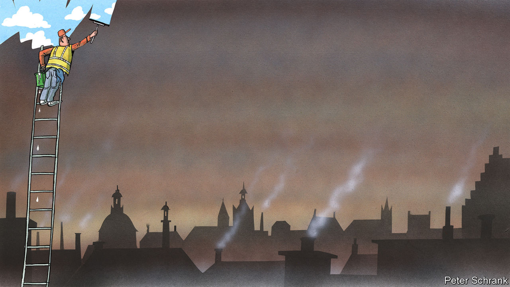

###### Charlemagne

# How Europe is spluttering its way to better air quality 

##### Most Europeans living in cities still breathe foul air 

 

> Apr 13th 2023 

As autumn arrived last year, the residents of Nowy Targ, a market town in southern Poland, were given an unusual tip to keep their homes warm in the midst of soaring energy prices. “One needs to burn almost everything in the furnaces,” said Jaroslaw Kaczynski, head of the ruling Law and Justice party, “aside from tyres and similarly harmful things, of course.” On a recent visit on a crisp spring day, with snow lingering on the ground, the evidence of locals having taken up Mr Kaczynski’s advice could be both seen and sniffed. Judging from the acrid smoke coming out of some chimneys, a few households may have even skipped the admonition about tyres. As the afternoon progressed and workers returned home to refill home furnaces ahead of chilly evenings, the mountains that skirt the town disappeared behind a dull haze. A bakery by the side of the road to the train station emitted a scent not so much of local delicacies as of combusted leather boots.

Europe prides itself as a green kind of place, the land of 15-minute cities where residents bike from work to yoga classes. But many bits of Europe still stink—literally. Those virtuous cyclists weave their way through streets thronged with diesel engines. Farmers spew ammonia, a pungent gas, into the air. What industry remains is the source of sulphur compounds that harm nature. Perhaps most worryingly, generating energy from fossil fuels to keep homes heated results in invisible clouds of particulate matter which clogs human lungs. Across the EU, over 300,000 people die prematurely from poor air quality every year, according to the EU’s environmental arm. That is nearly half the number of excess deaths caused by covid-19 in its first 12 months.

True, Helsinki is not Beijing, and nor is Paris anything like as bad as Delhi. But 96% of all urban dwellers in the EU live in cities whose air quality is worse than levels recommended by the World Health Organisation (WHO). Of the 17 cities with more than 3m inhabitants located in the G7 club of rich countries, nine are in Europe—and they include the six most polluted ones. Thanks in large part to denser living, few towns in Europe can match the air quality of similarly-sized places in America. 

Plans are afoot at European level to clear the air, one harmful gas at a time. This would build on steady improvements in recent decades: premature deaths are already down by nearly half since 2005, a quiet policymaking triumph. But even so, the EU admits there is little hope for most Europeans to breathe air within WHO guidelines for the foreseeable future. 

In Europe as elsewhere, air quality is a result of geography and economics. The EU’s most polluted big city is Milan, which sits in a river basin, hemmed in by the Alps and surrounded by lots of industry. The other pollution hotspot in the EU is around the border of Poland, the Czech Republic and Slovakia. For decades coal deposits in the region meant energy was cheap. Communist-era industrial complexes would guzzle the black stuff; enough coal by-product was left over to be fed into home furnaces. Known as smokers, and for good reason, these let locals heat their houses cheaply. Even as industry disappeared, the poorly insulated homes remained. Bits of Europe flipped to gas as an energy source, much of which was sourced from Russia. In Poland, coal was once a home-drilled marker of energetic virility—but then stocks dried up and came to be imported from Russia, too.

As countries get richer, voters demand better air, for example no longer tolerating belching factories on their doorstep. Central Europe is at the top end of a pollution-income trap: rich enough to buy lots of cars, say, but not rich enough to afford electric ones. Still, the region is on a clear trajectory to easier breathing. Take Krakow, a rich city a two-hour train ride away from Nowy Targ. It used to be known for its air “so thick you could taste it”, says Andrzej Gula of Polish Smog Alert, which tracks air quality. A decade ago the group led a campaign to ban the use of wood and coal for home heating, which came into force in 2019. Subsidies were brought in for less polluting technologies, such as heat pumps. Now, says Mr Gula, the air is clean enough for you to smell the stink of diesel cars, once hidden by other foul scents. The new plan is to ban the most polluting vehicles from the city, too. 

Other bits of Poland, with fewer tourists and less money, have followed the same path, thanks to a patchwork of local, national and EU-level edicts. Of late, the war in Ukraine has taken the wind out of the sails of better-air campaigners. Many measures to combat pollution have been suspended or postponed as energy prices soared, for example limits on the sales of the smokiest coal grades. Even as prices have come down, few think the measures will be reintroduced before elections in the autumn—just as the home smokers are rebooted. 

Take a deep breath

Perhaps Europe’s still-bad air is an opportunity for green-minded policymakers. For much of what is needed to de-smog the air is the same as what would bring down planet-boiling fumes, too. The EU speaks of cleaner air as a “co-benefit” of its flagship policy of cutting carbon emissions to “net zero” by 2050. Voters in central Europe generally see less urgency in combating climate change, which is viewed as a luxury concern imposed on them by nagging Scandinavian types. But a policy that can be shown to make local air cleaner is an easier sell. 

Making the case for cleaner air has been hard recently. But even a cloud of throat-burning smog has a silver lining. The energy crisis will cause a bump in unhealthy air in the short term—but catalyse a faster fall thereafter, as cheaper renewables, heat pumps and the like are deployed faster than they would otherwise have been. The mayor of a town a little down the road from Nowy Targ complained about the dearth of rubbish being collected this winter, as waste gets diverted to home furnaces instead. Let’s hope Europe’s next energy crisis will be less pungent. ■


