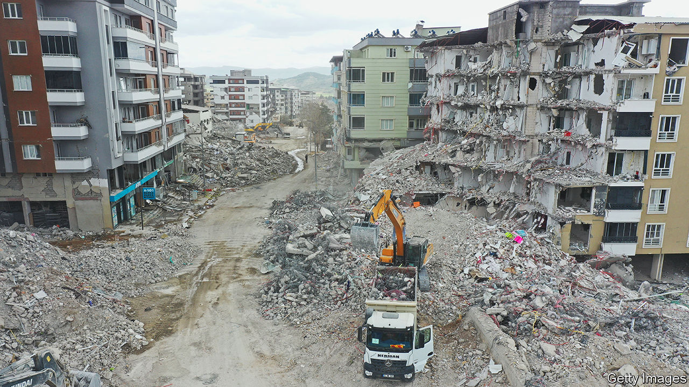

###### The ground beneath his feet

# Recovery from Turkey’s earthquake will take years 

##### But Recep Tayyip Erdogan is running out of time 

 

> Apr 13th 2023 

ALONG a road that snakes through the pine-covered hills north of Nurdagi, one of the towns devastated by the earthquake that struck Turkey in early February, bulldozers claw into the ground, clearing the way for new public housing. Once completed, the homes will accommodate some 450 displaced families. But much more will be needed. The tremors brought down over a thousand buildings across Nurdagi. The remainder are too damaged to remain standing. Not a single one of the larger buildings is safe, says a local official. Before it can rise again, the town as a whole, home to 40,000 people on the eve of the quake, will have to be torn down.

“We will rebuild from the ground up,” Turkey’s president, Recep Tayyip Erdogan, pledged when he toured the disaster zone in February. “Give us a year.” Two months later, a fair share of the 200m tonnes of rubble that covered the area has been removed, and construction has begun on the outskirts of some towns, a drive across the region reveals. But the looming challenge is more daunting than Mr Erdogan suggests. Assuming he survives the coming presidential elections, scheduled for May 14th, Turkey’s leader will need much more than a year, and plenty of outside assistance, to make good on his promise. 

Across 110,000 square kilometres, an area roughly the size of Bulgaria, over 300,000 buildings have been destroyed, damaged beyond repair, or are slated for demolition. More than 50,000 people are dead, and another 3m have been displaced. A recent report by Turkey’s strategy-and-budget office puts the cost of reconstruction at $104bn, or 11% of GDP, and predicts the disaster will shave at least one percentage point off the growth rate this year. 

No one considers Mr Erdogan’s timetable realistic. The number of houses that need to be built exceeds the number of housing permits issued across all of Turkey last year, says Burcu Aydin Ozudogru, a researcher at TEPAV, a think-tank. In places like Antakya, a city of 400,000, now mostly emptied of residents and populated instead by destroyed homes and heavy machinery, the clean-up alone will take another six months, reckons Mustafa Ozcelik, head of the local chamber of architects. Only about half of the rubble has been cleared. Much of the old city remains impenetrable, even on foot, with streets and alleyways choked by debris. Reconstruction will need up to five years, analysts say. 

Reconstruction costs will widen the budget deficit, which looked set to reach 3.5% of gdp this year even before the earthquake, by at least a couple of percentage points. Mitigating the impact of future disasters, especially in Istanbul, where the risk of a big quake is alarmingly high, will require yet more spending. Quake-proofing the city’s ageing housing stock, especially the 90,000 buildings most at risk of collapse, could cost upwards of $19bn, reckons the mayor, Ekrem Imamoglu.

Much of the money for reconstruction will have to come from abroad. The EU and other foreign donors have pledged about $7.6bn, on top of $1.6bn in loans from the European Bank for Reconstruction and Development and $1.8bn from the World Bank. But for a government that has scared away foreign investors by dismantling the central bank’s independence, slashing interest rates in the face of galloping inflation and burning through its foreign reserves to control the exchange rate, coming up with additional financing will be costly and hard. Turkey can still borrow on international markets, but at a high price. Foreign investors can get yields of above 9% on dollar-denominated Turkish bonds. 

Mr Erdogan could choose to try and squeeze some money out of domestic lenders. Over the past year, the government has forced Turkish banks to buy treasury securities at laughably low rates. It can do so again to help foot the bill for reconstruction. That would leave banks badly overstretched, however, and cover only a fraction of the government’s needs. “We need external financing,” says Kamil Yilmaz of Koc University. “But with the current policies in place, this cannot happen.”

Mr Erdogan has a month before voters decide whether to entrust him with the construction effort. He must be feeling the pressure. In late March, he presided over what was billed as a groundbreaking ceremony for a new hospital outside Antakya. It later turned out that the tender for the hospital had not yet taken place. ■

