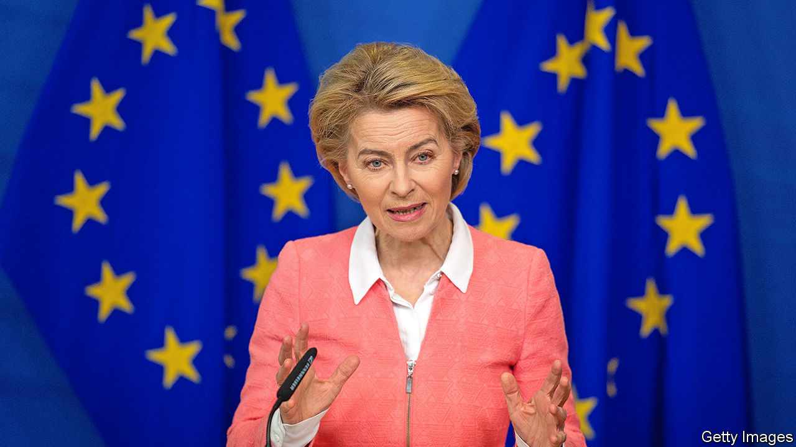

###### A changing continent

# The woman at the heart of Europe 

##### Ursula von der Leyen speaks to us about Russia, China and more 

 

> Apr 9th 2023 

Just days after  returned from a controversial visit to China on April 7th, she had been due to fly to South America to nudge a trade deal along. In a small act of mercy, the meeting with the Brazilian president has had to be postponed. She probably needs the breather. In the past four months her diary has included a visit to President Joe Biden in Washington, an address to the Canadian parliament, tea with King Charles, a guest appearance at a German cabinet meeting, repeat summits of the EU’s 27 national heads in Brussels and trips to see the leaders of Britain, Estonia, France, Italy, Norway, Sweden and Ukraine. Next month she will jet off to attend the G7 summit in Japan.

These jaunts are no grandstanding indulgence. The EU is in the . War in Europe has forced a recasting of its six-decade peace project. Mrs von der Leyen is shaping the response to the challenges buffeting the EU, from missing Russian gas to anaemic defence spending. Its economy, only just out of covid-19, is on a new set of tracks, the better to counter America’s protectionist green subsidies, lessen its over-reliance on China and deal with the imperatives of climate change.

Previous crises, such as the euro-zone miasma a decade ago, had threatened to tear the EU apart. A growing debate over how to handle China is the latest source of stress. But facing the covid pandemic, then Russia’s war, has created a new . Europe has rallied around its blue-and-gold-star EU flag, a row of which flutter outside the commission’s headquarters in Brussels. In her cavernous office on its 13th floor, Mrs von der Leyen tells : “We’ve shown this unity because we’ve understood from the very beginning that this Russian war in Ukraine will change Europe.”

Her appointment in 2019 had come as a surprise. A longtime ally of Angela Merkel, the former centre-right chancellor, she had survived rather than thrived in the tricky defence brief for five years. The top job in Brussels suited the multilingual Mrs von der Leyen: she grew up in Brussels, her father having been a senior EU official in the bloc’s formative years. “I’m very much born European,” she says.

Three quirks amused Eurocrats in her early days. The first was Mrs von der Leyen’s unusual path to power—she studied economics before becoming a medical doctor, then juggled a political career and seven children. The second was her decision to turn part of her Brussels office into a studio to live in, to cram in long days and nights of work (some predecessors had been less diligent). The third was a habit of describing herself from the outset as heading a “geopolitical” commission. Running the EU’s 32,000-strong executive in Brussels is more often the stuff of grinding technocracy, not high politics. 

Yet discreetly, under her leadership, the political fabric of the continent has been rewoven, with far more power flowing to the commission she heads. Covid-19, which hit soon after she took office in 2019, provided an early challenge. Mrs von der Leyen fought to keep barriers between EU countries from re-emerging. Her staff was put in charge by national governments of procuring vaccines for 447m Europeans—a task it was ill-prepared for, and pulled off only after costly initial delays.

The 64-year-old speaks of the commission having “to grab the opportunity and to show leadership”. One example was a €750bn ($820bn) pandemic recovery fund, a federalising leap. Cleverly, the money can be disbursed only according to priorities set in Brussels—which has used the fund to bludgeon countries felt to fall short of EU rules. Poland and Hungary, who are deemed to have hobbled their judiciaries, have still not seen any cash.

War catalysed further changes. The EU responded to the invasion of Ukraine by orchestrating ten rounds of sanctions against Vladimir Putin’s regime, and has delivered €38bn in financial assistance. It has even paid for some €3.6bn-worth of arms, once very much a taboo. The cutting off of Russian gas that ensued raised questions about Europe’s reliance on the outside world. Mrs von der Leyen speaks of “resilience”—a concept not too far removed from the “strategic autonomy” preferred by France’s Emmanuel Macron, with whom she has just travelled to China. 

That trip provided an illustration of the tricky power dynamics in Europe, where national leaders still hold sway. Just before the visit Mrs von der Leyen had warned in a hawkish speech that “China has now turned the page on the era of ‘reform and opening’ and is moving into a new era of security and control”. Officials in Beijing made sure she played second fiddle to the far more doveish French president, granting her much less face-time with President Xi Jinping. Those looking for divisions in the EU’s approach to China found it easy. Mr Macron then made matters worse by telling reporters he thought Europe ought not to become a “follower” of America’s in the event of a crisis over Taiwan. 

The heavier burden

Whether keeping its lights on, developing weapons or building electric cars, Europe increasingly wants to stand on its own two feet. EU rules that had kept its economies among the most open in the world are thus out of favour. A new economic model with a far bigger role for the state—including the Brussels bureaucracy—is now emerging. In part that is a result of the only aspect of her original agenda to have survived contact with events: Europe is on track to reduce carbon emissions by 55% from 1990 levels by 2030, and has a plausible chance of reaching net zero by 2050. 

What might come next? Mrs von der Leyen’s five-year term ends in 2024. She has her critics, who accuse her of centralising power in a small team of aides. Others gripe that she merely channels the collective interest of the bloc’s national governments, rather than pursuing some higher European ideal. Perhaps for that reason most countries seem minded to give her a second term. But the arcane process for divvying up top EU jobs (they will be decided after the European elections in spring 2024) could trip her up. Rumours she could end up as the head of NATO, also based in Brussels, are probably just that. Asked about her intentions, she yields nothing beyond a seasoned politico’s wry smile.

The twin tragedies of covid-19 and war were freakishly suited to a doctor-turned-defence minister. But it was a challenge that could easily have been fumbled, and it has not been. Keeping Europe united is “a constant work in progress”, she says. It is the source of the EU’s unexpectedly strong influence in recent times—and of her own. “It’s something…you have to work for day after day after day.” ■

