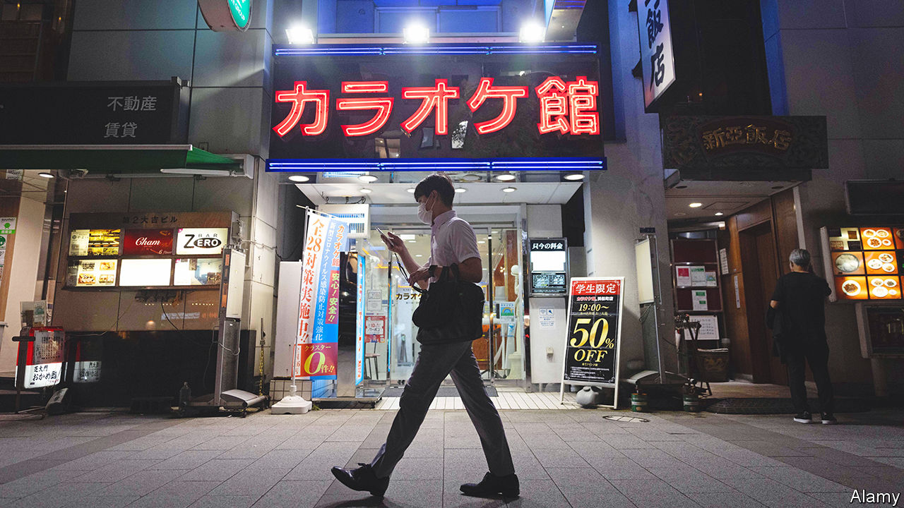

###### 28 years later

# After decades of stagnation, wages in Japan are finally rising 

##### But not by enough to satisfy the Bank of Japan 

 

> Apr 13th 2023 

Kasahara yoshihisa, boss of Higo Bank, a lender in Japan’s south, beams with pride as he explains plans to lift wages. The firm’s workers will see a 3% boost, as well as regular increases for seniority. But a sheepish look crosses his face when asked about the last time staff saw such a rise. “Twenty-eight years ago,” he admits.

Higo Bank is no outlier. Annual nominal wages in Japan rose by just 4% from 1990 to 2019, compared with 145% in America, according to the oecd, a rich-country club. Unions emphasise job stability over raises; bosses are reluctant to lift pay amid poor productivity growth. This has hampered efforts to escape deflation or low inflation. Thus the Bank of Japan (boj) has maintained a doveish policy stance despite headline inflation topping 4% this year. 

But recent data suggest change may be on the way: this year’s wage negotiations point to the fastest pay growth in 30 years. Daniel Blake of Morgan Stanley, an investment bank, calls it “the biggest macro development in Japan in a decade”. For Ueda Kazuo, who took over as boj governor on April 8th, the data will be a crucial factor in deciding whether to tighten policy. 

Parsing Japanese wage figures requires understanding local quirks. Wages are set when firms and unions meet for yearly negotiations known as  or “the spring offensive”. Headline figures consist of two parts: scheduled seniority-based increases and “base pay”. The latter has more impact on household spending, and thus potential to influence inflation. 

According to figures released by Japan’s confederation of labour unions on April 5th, base pay will rise by 2.2% and headline wages by 3.7% this year, compared with 0.5% and 2.1% last year. Blue-chip firms have been particularly generous. Fast Retailing, a clothing giant which owns brands including Uniqlo, gave its regular workers increases of as much as 40%. More data will trickle in until July, as medium- and smaller-sized firms report results. Goldman Sachs, a bank, reckons the final figure will settle at 2% growth in base pay, the highest since 1992.

Consumer prices have risen at a pace not seen in four decades. Although most of the rise comes from cost-push factors, such as imported food and energy, higher headline numbers have raised expectations and placed pressure on bosses. As Mr Kasahara puts it: “Companies have a responsibility to provide wages that match inflation—and not just big firms in Tokyo.” Tight labour markets have also played a role: Japan has compensated for its shrinking, greying population by bringing more women and elderly into the labour force in recent years, but these opportunities are close to being maxed out. 

For both workers and the boj, the question is whether the raises are a one-off event or a step change. Even this year’s big gains may not be enough to assuage policymakers. Kuroda Haruhiko, the boj’s former governor, has said that still higher wage growth will be needed to hit the 2% inflation target. At his final press conference as governor, Mr Kuroda said that although wage negotiations were encouraging, easing should continue. At his first press conference on April 10th, Mr Ueda sounded much the same note. ■


