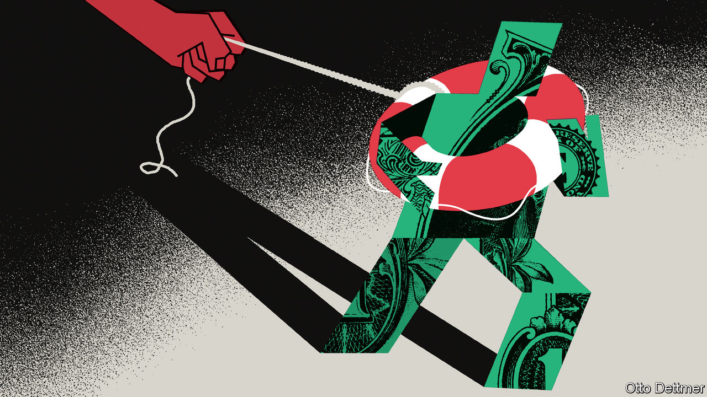

###### Free exchange

# How the state could take control of the banking system 

##### Technology and regulation are making the government’s role in finance explicit 

 

> Apr 12th 2023 

America’s banking conflagration may have died down, but the clean-up continues. Small and midsized banks have lost about $260bn in deposits this year. The  continues to plug much of the gap, having lent nearly $150bn to banks via its emergency schemes. Next year the Fed must decide whether to prolong them. By May 1st the Federal Deposit Insurance Corporation (fdic) will produce a menu of options for Congress about how to reform or expand the backstop the regulator provides, which is currently capped at $250,000 per depositor. Many blame the limit for the run which brought down .

As happens after every banking panic, the safety-net is being remade. And so regulators must again confront a profound question: how far into finance should the hand of government reach? 

Banks are inherently unstable. They offer deposits that are instantaneously redeemable while holding long-dated, illiquid assets such as mortgages and business loans. The mismatch means even well-managed institutions are vulnerable to a run that might be sparked by a misunderstanding. The fragility of banks is matched by severe consequences if they fail: runs tend to be contagious events that can cause credit crunches and recessions. 


Despite the danger banks pose, governments tolerate their existence. The transformation of liquidity and maturity is thought to enable a greater provision of credit and faster economic growth than would be possible under the alternative: a system of “narrow banks” in which deposits are fully backed by only the safest assets.

Government props make the system more stable. But every leg of support requires fiddling to stop bankers exploiting the taxpayer. Take deposit insurance, which was established in America under the Glass-Steagall Act after the Depression. Although President Franklin Roosevelt signed it into law and is often credited as its inventor, he in fact tried to have it stripped from the bill, warning it would “lead to laxity in bank management and carelessness on the part of both banker and depositor”. Roosevelt may have lost the argument; it is nevertheless true that the more generous the deposit insurance, the less vigilant the depositor and the more it falls to regulators to ensure banks are not taking excessive risks.

Another leg of support comes from central banks, which are meant to stop self-fulfilling panics by acting as a lender of last resort. In a crisis, central bankers follow a dictum attributed to Walter Bagehot, a former editor of , to lend freely, secured by good collateral and at a penalty rate of interest. This means deciding what good collateral is, and how much of a “haircut” (discount) to impose when valuing it. Precisely which assets the Fed or other central banks agree to lend against in a crisis will affect what assets banks choose to hold in normal times.

Central bankers have long been aware of the perils of offering too much support. In 2009 Sir Paul Tucker, then of the Bank of England, warned about central banks becoming the “lender of second resort”, freeing banks from having to worry about the liquidity of their assets, so long as these were deemed eligible collateral. Yet central banks are getting more generous. The Fed’s latest facilities barely seem Bagehotian at all, valuing long-term securities at par even when the market has heavily discounted them, and imposing an interest penalty of a mere tenth of a percentage point.

The logical accompaniment to the expansion of the banking safety-net would be rules to ensure that the wider net is not exploited. After the global financial crisis of 2007-09 regulators deemed long-term government bonds to be safe and liquid assets, which they assumed would be a source of liquidity for bankers to tap before they turned to the central bank when the next crisis arrived. Now the risks of long-dated assets have been made abundantly clear by rising interest rates, and the Fed and the fdic carried the can after all. Regulators could respond by redefining the highest-quality liquid assets as bonds that are both short-dated and issued by the most creditworthy sovereign borrowers. To do so, however, would be to take a step towards narrow banking, in which every deposit is backed by such an asset.

This trade-off—between the safety of the banking system and the power of regulators—used to be murky. Some central banks were deliberately ambiguous about what collateral they would accept in an attempt to keep banks on their toes. But new technology seems to be forcing the government’s role into the open. Many blame mobile-banking apps and social media for the speed of the run on SVB. If runs are now more likely, so are emergency central-bank loans, making collateral policy still more important.

At the end of Lombard Street

Another looming change is the issuance of central-bank digital currencies, which could give the public another alternative to bank deposits. In recent years economists have worried about the risk of such currencies becoming de facto narrow banks that drain the legacy system. But some argue banks would work fine if the public switched their deposits for central-bank digital currencies, so long as the central bank stepped in to replace the lost funding. “The issuance of [such currencies] would simply render the central bank’s implicit lender-of-last-resort guarantee explicit,”  in 2019. This scenario seems to have partly materialised since the failure of SVB, as deposits have fled small banks for , while the Fed makes loans to banks.

The prospect of banks becoming de facto government-funded should alarm anyone who values the role of the private sector in judging risk. Yet the difference between deposit financing underwritten by multiple layers of the state and funding that is provided directly by the state itself is getting harder to distinguish. A more explicit role for governments in the banking system may be the logical endpoint of the road down which regulators have been travelling for some time. ■


