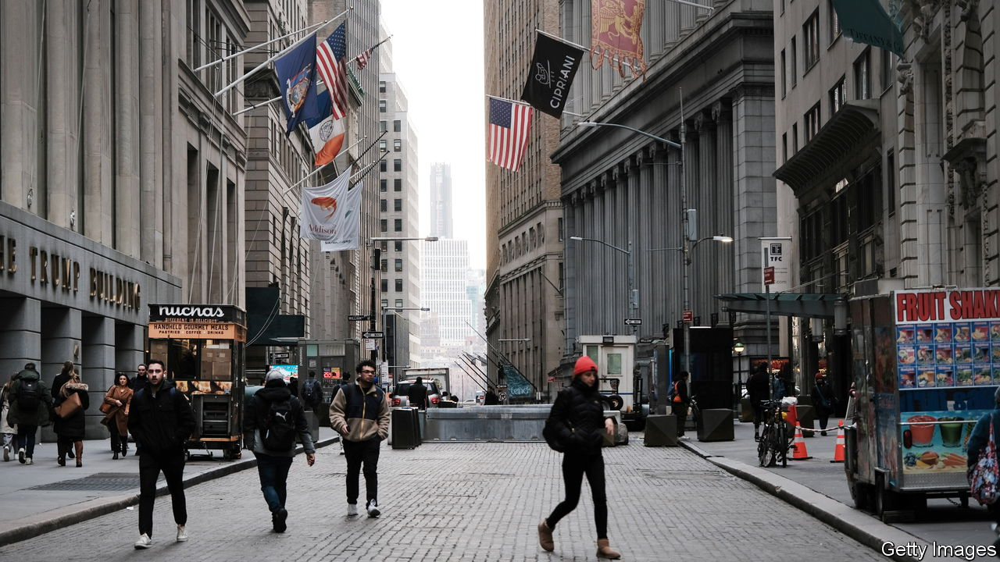
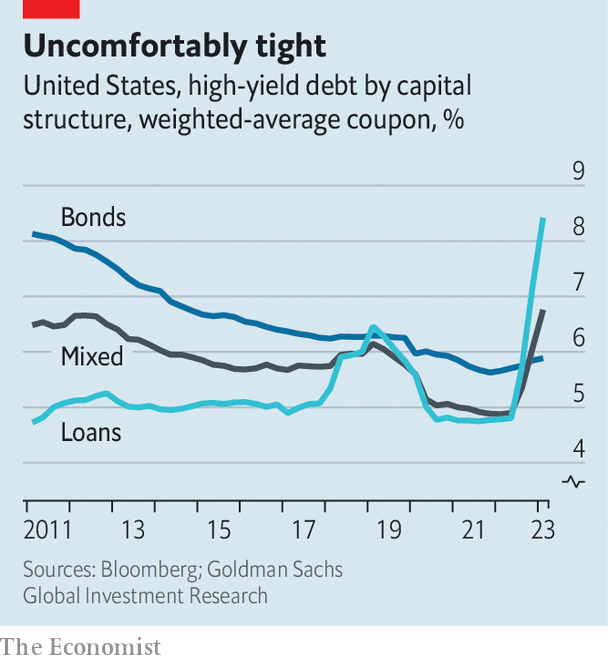

###### The big squeeze

# Life is getting tough for borrowers. Where will the pain be felt? 

##### Ramifications from the fall of Silicon Valley Bank 

 

> Apr 11th 2023 

After american regulators seized control of a collapsing  (svb), the fallout felt unpleasantly familiar. The biggest bank failure since 2008 was swiftly followed by others. Signature Bank fell two days later. Another week and fleeing investors had forced Credit Suisse, a 167-year-old Swiss bank, into a  with its rival ubs. Fifteen years ago a cascade of such failures prompted a global credit crunch, as financial institutions drastically tightened lending standards in an attempt to protect themselves, which was followed by the worst downturn in generations. Was a repeat under way?

A month on, the answer appears to be a merciful “no”—or, at least, a “not yet”. Investors are shunning bank shares. Those of some regional American lenders have been brutalised: one, First Republic, has seen its stock price plunge by more than 90% since February. For six days after svb’s collapse the bond market was in effect closed, with no new bonds issued by American firms.

 


Then, in the second half of March, the shutters reopened and both borrowers and lenders rushed back in. All told, investment-grade issuers sold $103bn of debt in March—around last year’s monthly average, despite the week-long hiatus. For such issuers, yields have fallen, and “the market’s wide open”, says Lotfi Karoui of Goldman Sachs, a bank. “The market really hasn’t embraced the idea that [the events of March] will morph into a financial crisis.” By the end of the month, even the riskiest issuers were again able to raise debt. 

Yet even if the risk of a crisis seems to have passed, borrowers still face a squeeze. The most obvious source of pressure is the , which since March last year has raised its interest rate from close to zero to between 4.75% and 5%. For the firms that have borrowed $1.5trn in loans, which tend to have floating interest rates, the increase has quickly translated to higher debt-servicing costs. For issuers of high-yield bonds, who have borrowed a similar amount and tend to pay fixed interest coupons that only rise when the bond is refinanced, the full effect is yet to be felt. Although the market expects interest rates to be cut by a percentage point this year, the median Fed governor projects an end-of-year rate of above 5%. The more the threat of a financial crisis fades, the more likely the Fed’s forecast is to prove correct.

Banks were reluctant to lend even before svb fell. Mike Scott of Man Group, an asset manager, notes that by the end of 2022 surveys already showed lending standards had tightened to levels that, in previous business cycles, preceded recessions. Last month’s ructions, which in America focused on small and midsized banks, are likely to have turned the screws further. 

Analysts at Goldman Sachs estimate that banks with less than $250bn in assets account for 50% of commercial and industrial lending, and 45% for consumers. For small firms employing 100 people or fewer, the figure rises to 70%. It is these businesses—which employ more than a third of America’s private-sector staff and produce a quarter of its gross output—that will be most sensitive to the forthcoming credit squeeze. Peter Harvey of Schroders, another asset manager, predicts that the outcome will be “stronger covenants, higher [interest] spreads, lower issuance volumes, smaller borrowing sizes and tighter controls on lenders’ sectoral exposure”.

The final source of stress will be firms’ own liquidity, which has deteriorated markedly over the past 12 months. After covid-19 struck, corporate borrowers accumulated huge cash buffers, aided by rock-bottom interest rates and floods of newly created money from central banks. In 2020 the median American investment-grade firm held cash worth 6.5% of its assets, more than at any time in the past 30 years. 

This figure has since been eroded to 4.5%, or around the same level as in 2010, after the global financial crisis. As a result, firms now have less scope to run down their existing cash reserves if interest rates stay high, and are more likely to need to borrow in response to future shocks. The banking industry’s March madness might not have triggered a repeat of 2008. Life for borrowers is nevertheless becoming increasingly difficult. ■


