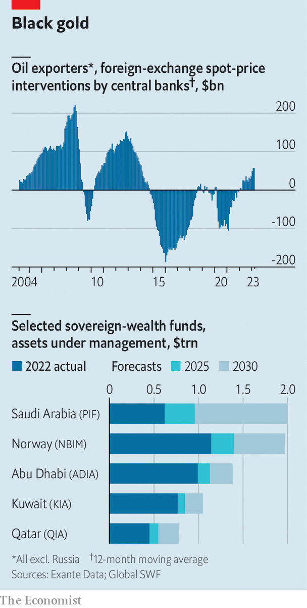
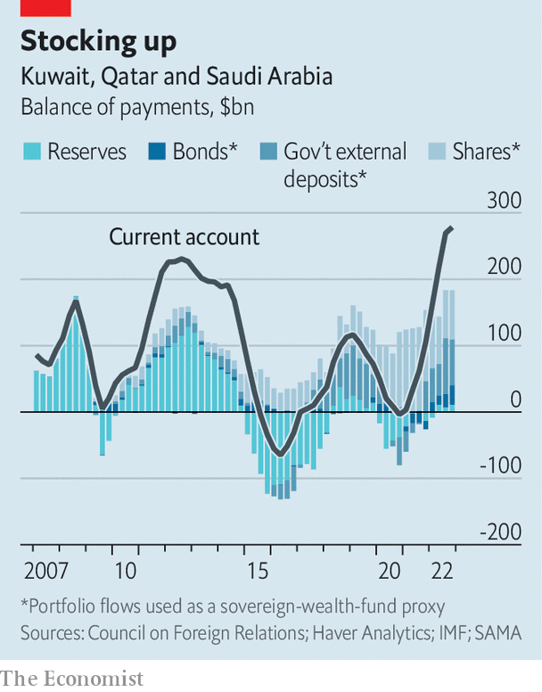
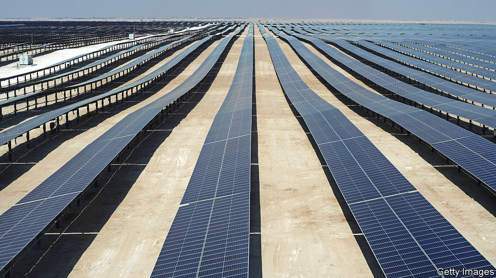

###### Sovereign-stealth funds

# Welcome to a new era of petrodollar power 

##### What are the hundreds of billions of oil riches being spent on? 

 

> Apr 9th 2023 

A pack of hungry headhunters has descended on Europe’s financial quarters. Over coffee in the mid-morning lull, they tempt staffers at blue-chip investment funds with tax-free jobs, golden visas and gorgeous vistas at the firms’ clients: sovereign-wealth funds in the Gulf. 

A decade in Doha was once a hard sell, but the roles are juicy enough that many would-be recruits volunteer for desert-bound “business trips” to see headquarters. In October recruiters nabbed the second-in-command at Amundi, Europe’s biggest money manager, to deploy artificial intelligence at the Abu Dhabi Investment Authority (adia), which oversees assets worth $1trn. Now they are chasing others to invest in infrastructure for the Qatar Investment Authority (qia) and oversee finance for Saudi Arabia’s Public Investment Fund (pif). Together these two funds manage another $1trn. 

War and sanctions have buoyed hydrocarbon prices, meaning fuel exporters are swimming in money. During previous booms they would recycle the proceeds in Western capital markets, snapping up pedestrian, uber-liquid assets via banks based offshore. Underpinning this was an unspoken agreement: America would offer military aid and buy oil from Saudi Arabia and friends, in exchange for which they would plug Uncle Sam’s gaping current-account deficit with petrodollars. The talent-hunting party suggests the deal is crumbling. Uncle Sam, now a major oil exporter, is a less watchful partner. Gulf states, lured by Asia and eager to mend ties with Israel and, lately, Iran, no longer feel compelled to woo the White House. On April 2nd Saudi Arabia and its allies angered America by deepening crude-output cuts to nearly 4m barrels a day, equivalent to 4% of global production, which helped lift prices. They also feel freer to use their mountains of cash however they wish.

We estimate that in 2022-23 the current-account surplus of the Gulf’s petrostates may hit two-thirds of a trillion dollars. Yet outside central banks, which no longer collect much of the bounty, the region’s treasure troves are notoriously opaque. To map where the money is going,  has scrutinised government accounts, global asset markets and the deal rooms of companies tasked with investing the windfall. Our investigation suggests that less of the money is returning to the West. Instead, a growing share is being used to advance political aims at home and gain influence abroad, making global finance a murkier system. 

The Gulf is not alone in enjoying a windfall. Last year Norway, which cranked up gas exports to Europe as Russia cut supplies, earned a record $161bn in tax from hydrocarbon sales, a 150% jump from 2021. Even Russia, under sanctions, saw such revenue rise by 19%, to $210bn. But it is the Gulf states, which benefit from low production costs, spare capacity and convenient geography, that are hitting the jackpot. Rystad Energy, a consultancy, reckons they pocketed $600bn in tax from hydrocarbon exports in 2022. 

Not all of them are in a position to truly benefit. Governments in Bahrain and Iraq are so bloated that even as higher revenues flow in, they barely break even. Most of the bounty is instead being accrued by the four biggest members of the Gulf Co-operation Council (gcc): Kuwait, Qatar, the uae and Saudi Arabia. Alex Etra of Exante, a data firm, estimates their combined current-account surplus in 2022 was $350bn. Oil prices have fallen since last year, when Brent crude, the global benchmark, averaged $100 a barrel. Yet assuming it stays near $85—a conservative bet—Mr Etra reckons the four giants could still pocket a $300bn surplus in 2023. That makes a cumulative $650bn over the two years.

In the past the majority of this would have gone straight into central banks’ foreign-exchange reserves. Most members of the gcc peg their currencies to the dollar, so they must set aside or invest hard currency during booms. This time, however, central-bank reserves seem to be hardly growing. Interventions on foreign-currency markets have also been rare, confirming that the usual guardians of state riches are not getting the surplus. 

So where have the elusive billions gone? Our research finds they have been used in three novel ways by a variety of actors that include national governments, central banks and sovereign-wealth funds. These are to pay back external debt, lend to friends and acquire foreign assets.

Start with debt. Between 2014 and 2016 a petroleum glut fuelled by America’s shale boom caused the oil price to fall from $120 a barrel to $30, the steepest decline in modern history. In 2020, as covid-19 lockdowns depressed demand, prices cratered again, to $18 in April. To withstand the earnings shock, Gulf states liquidated some foreign assets and their central banks sold part of their foreign-currency stash. But this was not enough, so they also borrowed a lot of hard currency on Western capital markets. 

Now some petrostates are taking advantage of higher prices to shore up their balance-sheets. Abu Dhabi, the uae’s richest emirate, has repaid $3bn since the end of 2021—about 7% of the total outstanding, according to Alexander Perjessy of Moody’s, a ratings agency. Qatar’s load has shrunk by $4bn, or about 4%. Kuwait’s has halved since 2020. This broad deleveraging is a new phenomenon: gcc countries had little debt in the late 2000s, when the previous oil boom got going. 

Gulf states are also lending a hand to friends in need—the second use of the new oil money. In early 2022 the central bank of Egypt, a big food importer squeezed by high grain prices, received $13bn in deposits from Qatar, Saudi Arabia and the uae. In recent years, Saudi Arabia has also allowed Pakistan to defer payment for billions of dollars in oil purchases. This money is more conditional than in the past. Eager to see at least some of its cash return, Saudi Arabia recently demanded Egypt and Pakistan implement economic reforms before giving them more help. Some of the Gulf support also comes in exchange for stakes in state-owned assets these embattled countries are putting up for sale.

So pumped

The real novelty in this regard is Turkey. When squeezed, Ankara used to turn to the imf, or European banks, for emergency-cash injections. Recently, as surging inflation and earthquakes have pushed the country to the brink, it is Gulf states that have been holding the syringe. The support takes various forms. On March 6th Saudi Arabia said it would deposit $5bn at the country’s central bank. Qatar and the uae have also set up $19bn in currency swaps with the institution, according to an estimate by Brad Setser of the Council on Foreign Relations, a think-tank. All three have pledged to participate in Turkey’s forthcoming auctions of government bonds. 

Qatar is a long-standing ally of Turkey. Saudi Arabia and the uae, which until recently had a frosty relationship with the republic, are now competing for influence. All sense an opportunity to gain sway over Recep Tayyip Erdogan, the country’s president, who faces a tough election in May. The Turkish case sets a precedent. As more neighbours face crunches, bilateral credit will become core to gcc statecraft, predicts Douglas Rediker, a former imf official. 

Yet for all their geopolitical significance, such loans account for only a fraction of the oil jackpot. That leaves the main escape channel: foreign investments. 

In past booms the central banks of the world’s two largest petrostates—Russia and Saudi Arabia—did much of the recycling, meaning that the assets they purchased were labelled as reserves. All these countries wanted was stable yields and few surprises. Most often they parked the cash at Western banks or bought super-safe government bonds—so many that Gulf appetite, along with China’s, is credited for helping to create the loose monetary conditions that fed the 2000s sub-prime bubble. Only Qatar, known then as the “cowboy of the Middle East”, did anything more daring: buying a football club here, a glitzy skyscraper there. 

 


Today the Russian central bank’s reserves are frozen. And since 2015, when Muhammad Bin Salman (mbs) became de facto ruler, the Saudi central bank has received far less money than pif, which mbs chairs. In just a few years pif and its peers across the region have swelled in size. If hydrocarbons stay expensive, and more of the bounty flows to them, they could grow much bigger still. Everything indicates that their way of recycling riches is very different. It is more adventurous and political, and less Western-centric.

Figuring out what Gulf sovereign-wealth funds have been up to is much more difficult than it would be for, say, Norway’s fund. The Gulf institutions do not update their strategy, size and holdings live on their websites, as the one in Oslo does. But there are clues. Data from the Bank for International Settlements, a club of central banks, suggests that, initially, most of the cash was parked in foreign bank accounts. In the Saudi case, such deposits were worth $81bn in the year to September, equivalent to 54% of the current-account surplus over the period, calculates Capital Economics, a consultancy. 

Perhaps sovereign-wealth funds have been waiting for interest rates to peak before piling into bonds. More likely they are after less conventional assets, which take time to select. Data from the Treasury International Capital system, which tracks flows into American securities, suggest oil exporters have been buying fewer Treasury bonds than would previously have been expected. But they have been hungrier for stocks—and such numbers understate their appetite, because Gulf sovereign-wealth funds often buy American shares through European asset managers. An executive at one such firm says his Gulf clients have topped up their American-stock accounts copiously in recent months. 

 


Sovereign-wealth funds largely invest in stocks via index funds, which are low cost and offer diversification. But they also like riskier bets. Today “alternative assets”—private equity, property, infrastructure and hedge funds—represent 23-37% of total assets for the three largest funds in the Gulf, according to Global swf, a data firm. These shares have jumped at the same time as war chests have grown.

Although such investments are often done through funds, “direct” investments—private-market deals, or acquisitions of stakes in listed companies—are growing very fast, says Max Castelli of ubs, a bank. pif’s alone reached $18bn in the year to September, against $48bn for more classic “portfolio” investments. Sovereign-wealth funds have also begun to provide debt to finance large takeovers, including by buy-out groups. On April 4th pif disclosed that it had acquired dozens of stakes in private-equity firms themselves. 

Sovereign-wealth funds can do all this because they now have the ability to manage investments. “Unless we have something extraordinary, we are forbidden from pitching anything to them,” says a European asset manager. adia has cut its workforce from 1,700 to 1,300 since 2021, but new recruits include a group of maths whizzes co-led by an Ivy League professor. The current hiring offensive suggests funds will grow more independent, retaining investment firms only for specific services and market intelligence. 

Since last year sovereign-wealth funds have been dumping European stocks, to the benefit of America. But locals notice a newer eastward tilt. Gulf funds have created specialist teams to survey China, India and South-East Asia. “This is where they’re going to sell more oil, so they want to invest in industries that will use that oil,” says the boss of a large investment-banking franchise. And at a time when others are walking back from China, nervous of rising tensions with America, they are doubling down. “Our Gulf clients see an enormous opportunity to take space away from Western investors,” says the boss of a private-markets giant. 

All of which points to an important plank in the sovereign-wealth funds’ new approach: advancing Gulf states’ strategic goals. One such objective has been to project soft power. pif may have lost a big chunk of the $45bn it invested in 2016 in the Vision Fund, a gigantic vehicle for tech investments that has been rocked by bad bets and market shocks. But the mammoth cheque did a great deal to raise Saudi Arabia’s profile among global investors, says one who recently opened an office in Riyadh. Funds are also setting aside capital to shower on neighbours, boosting their regional sway. pif has set up subsidiaries in Bahrain, Egypt, Iraq, Jordan, Oman and Sudan to deploy $24bn in the Arab countries. 

 


Greater standing opens up fresh opportunities to invest in firms in “strategic” industries, including renewable energy. In October Mubadala, an Emirati sovereign-wealth fund, splashed $2.5bn on a German offshore-wind developer. qia bought 10% of rwe, a German utility, to help it acquire a solar business in America. These investments are often made with a view to reimporting knowledge or capital. 

Last year Lucid, an American electric-car maker, some 61% of which is owned by pif, said it would build its first overseas factory in Riyadh. The fund plans to splash $38bn on gaming to try to bring entertainment to Saudi Arabia. Not all such bets turn out well. Saudi National Bank, owned by pif, lost 80% of its investment in Credit Suisse when the firm was acquired by ubs, undermining the Kingdom’s ambition to steer a global banker. Some sovereign-wealth funds are also being leant on to invest at home, so as to help economies cut their reliance on oil. pif is bankrolling futuristic Saudi settlements, including Neom, a new city in the desert, which the Kingdom’s rulers dream will one day be home to a floating industrial complex, global trade hub and luxury holiday resorts.

The best illustration of the sovereign-wealth funds’ evolving strategy is Abu Dhabi. Insiders say that adia, the uae’s oldest and starchiest fund, is getting less of the oil windfall than it used to enjoy. Instead, the lion’s share is going to adq, a four-year-old $157bn fund which snaps up firms in energy, food, transport and pharma—industries the emirate deems core to its security. Other cash is going to Mubadala, which had just $15bn in assets in 2008 but now oversees nearly $300bn. Originally heavy on commodities, its portfolio favours renewables and tech. Two-thirds of its investments are in private markets; a quarter are domestic. “There is no limit to their ambition,” says a dealmaker. 

Blended finance

These shifts are blurring the line between ruling families’ personal wealth and that of the sovereign. The fastest-growing funds tend to be run by royals, or members of their clan. In March Sheikh Tahnoon bin Zayed, the uae’s national-security adviser, was made chairman of adia (he already chairs adq; his brother will soon run Mubadala). More money is going on pet projects, often through special-purpose vehicles. New “family offices”, which manage the private wealth of the mega-minted, have joined the deal-fest. Armed with war chests “in the ten digits”, they routinely buy $500m-1bn stakes in single firms, says a local banker. It is becoming ever harder to see where oil money goes. 

All this is bad news for the West. That it gets less of the bounty is the smaller problem. A murkier financial system makes it easier for funds to move around unnoticed. Financial sleuths reckon that a share of Russia’s oil earnings is deposited into banks in the Gulf, where it is mixed with dollars owned by others so as to become untraceable. More geopolitically astute petrostates also create the chance for wavering countries, like Turkey, to get financing outside of Western-led institutions, giving them an extra degree of freedom. Two decades ago, when sovereign-wealth funds became fashionable, many in the West worried they might be used to pursue political agendas. At the time, such fears were overblown. They now seem more reasonable—but few are paying attention. ■


