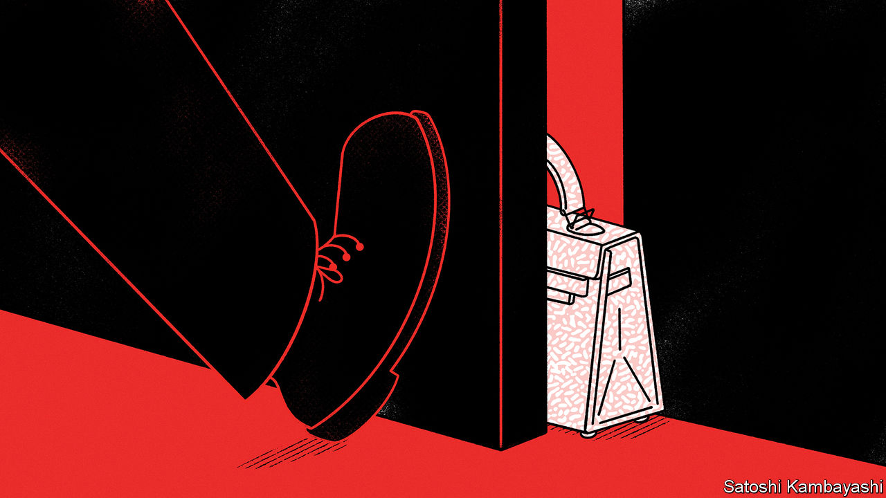

###### Buttonwood

# What luxury stocks say about the new cold war 

##### Investors and security hawks live in different universes 

 

> Apr 13th 2023 

Is it in Europe’s interests to follow America into a conflict over Taiwan? The suggestion by Emmanuel Macron, president of France, that perhaps it is not provoked anger on both sides of the Atlantic. But many French business leaders will quietly agree with Mr Macron’s intention: to defuse tensions between China and the West. After all, the French stockmarket closed at a record high on April 12th, with strong Chinese demand the most obvious cause.

lvmh, a luxury-goods giant, is the largest stock in France’s cac 40 index, making up 13% of market capitalisation. On April 12th the company reported a 17% year-on-year jump in sales in the first quarter. Hermès International, Kering and Pernod Ricard, other luxury brands, account for another 8%. The companies make money not only from Chinese outlets, but from Chinese tourists in Europe. All have benefited enormously from the end of the Chinese government’s zero-covid approach. 

If the performance of France’s China-exposed stocks had been unique, it would have been down to Mr Macron’s stance. But if you look at valuations in rich-world stockmarkets, you would never know relations between China and the West are at a 50-year low. The msci World China Exposure index, which tracks 50 firms with high Chinese revenues, is up by 7% this year—no less than rich-world stocks overall and beating the more modest 3% rise of the msci China index. In the past five years, as China’s relations with the West have deteriorated, China-orientated, rich-world stocks have offered annualised returns of 16%, relative to 9% for rich-world stocks overall and -4% for Chinese shares.

In part this reflects concrete realities. Whatever happens to diplomatic relations, rich Chinese consumers are unlikely to cease buying handbags. Some firms with lots of Chinese exposure, including bhp Group and Rio Tinto, two miners, have weathered geopolitical disputes. Although the Chinese government can shuffle the source of its commodities, as a recent short-lived ban on Australian coal demonstrated, such tweaks are ultimately limited by the commodities the country must import.

The three largest companies in the China-exposure index are Qualcomm, Texas Instruments and Broadcom. Not only do these three American firms make between one-third and two-thirds of their revenues in China, they are also all semiconductor companies, operating precisely where spats over advanced tech are likely to be fiercest. Their stock prices have seen double-digit percentage rises this year. They are also beating the s&amp;p 500 index of big American firms, and have done so comfortably over the past five years.

Tasty net-income margins of between 27% and 44% are a big part of the three firms’ success, sitting well above the 11% margin of the s&amp;p 500 as a whole. Semiconductor companies will also benefit from support Western governments are now offering to tempt them to build closer to home. Yet if the worst came to pass, and the firms had to leave China, offsetting such large revenue shares would require gargantuan new sources of demand. What is more, only Texas Instruments is a physical manufacturer of chips—the kind of company most likely to benefit from subsidies. 

These firms sit at the top of any list of those that will suffer if Sino-American relations worsen. If they are planning for life after China, they are disguising it well. Last month, Texas Instruments doubled down on a commitment to invest more in the country. Qualcomm has partnerships with China Mobile, a telecommunications giant, and a range of Chinese handset manufacturers.

The surprisingly strong performance of Western firms exposed to China suggests two things. The first is that even with the threat of conflict, foreign companies with Chinese exposure are still a much better way to benefit from Chinese economic growth than the domestic stockmarket, which is heavy on state-owned firms and debt-laden property developers. The stockmarket is a third below its level at the end of 2007, despite the country’s rapid growth.

The second is that the gap between security hawks and doveish global investors is only growing. It is hard to find any discount for firms with big Chinese revenues. Investors do not believe, or do not want to believe, that businesses with significant exposure to both China and the West will face problems. One of the two views—the increasingly bleak outlook of diplomats, or investors’ sanguine approach—will prove to be wildly wrong.■


