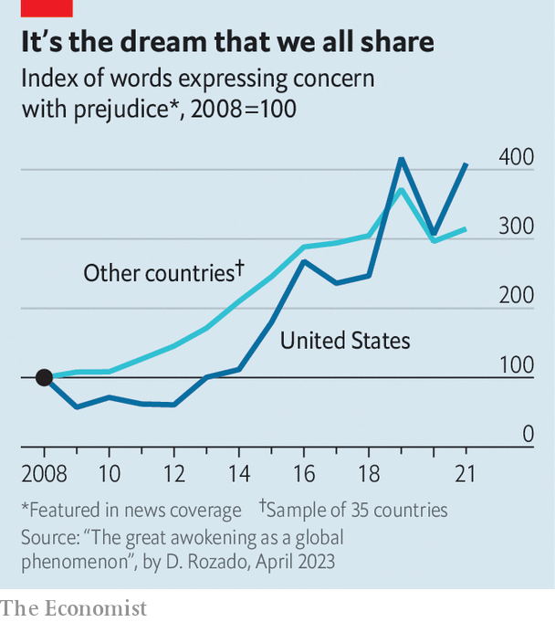

###### Grievance culture

# Where did woke ideas start to spread? 

##### A new paper suggests the phenomenon may be global—not American 

 

> Apr 13th 2023 

“Team america: world police”, a comedy puppet film, pokes fun at American self-importance. The theme song boasts of the things the country has created: McDonald’s, the nfl and rock-and-roll; also, less plausibly, liberty, Christmas and books. New work by David Rozado of Te Pukenga–New Zealand Institute of Skills and Technology suggests something else that Americans did not invent: the “woke” phenomenon. 

The term refers to a loose constellation of ideas that have changed how educated, left-leaning folk view the world. It says all disparities between racial groups are proof of structural racism; that norms of free speech, individualism and universalism are camouflage for discrimination; and that injustice will persist until systems of privilege are dismantled. The conventional wisdom says that woke ideas began in the social-science departments of American universities, migrated to the country’s newspapers and spread elsewhere. 

 


This was always a partial story. The godfathers of woke ideas, including Michel Foucault and Jacques Derrida, philosophers who argued all social relations were really about power, were based largely in France. Mr Rozado’s new paper takes things further. He analyses 98m news articles, tracking words such as “transphobic”, “racist” and “sexist”. The phenomenon, it seems, did not begin in America (see chart). Countries such as Australia, Canada and Sweden in fact led the charge. 

Why did America lag behind? Maybe genuine prejudice suddenly became worse outside America, though this seems unlikely. Another possibility relates to the economy. America’s recovery from the global financial crisis of 2007-09 was faster than elsewhere. Anger at the system may have been more acute in other places. A third possibility concerns politics. America has historically been less receptive to left-wing ideas. It is perhaps no surprise that woke ideas were slower to take hold. 

Researchers will have quibbles with the methodology: it is hard to rigorously quantify something as slippery as wokeness. Nonetheless, the phenomenon is undoubtedly global. Wherever you go, it is hard to escape social-justice warriors. World police, indeed. ■


