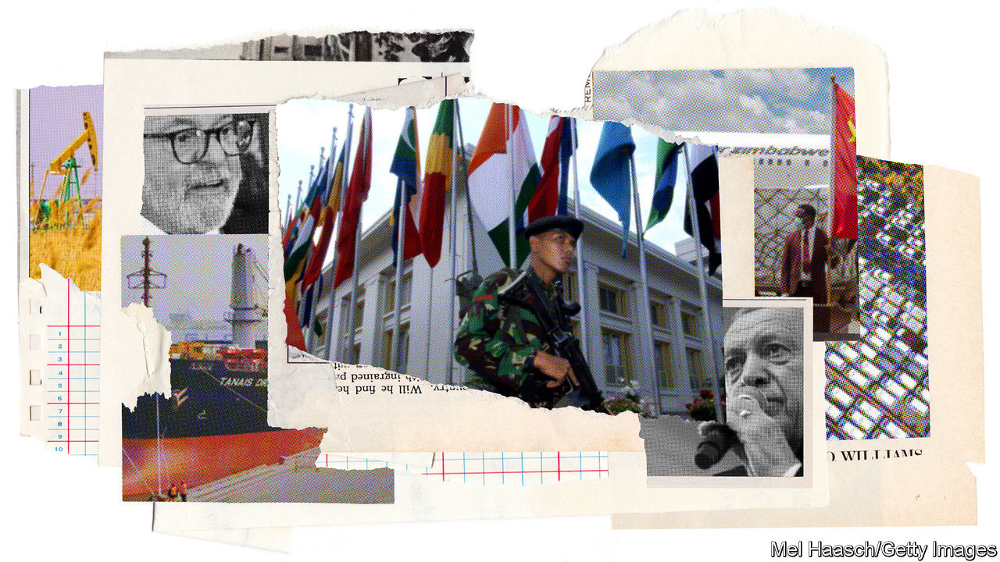
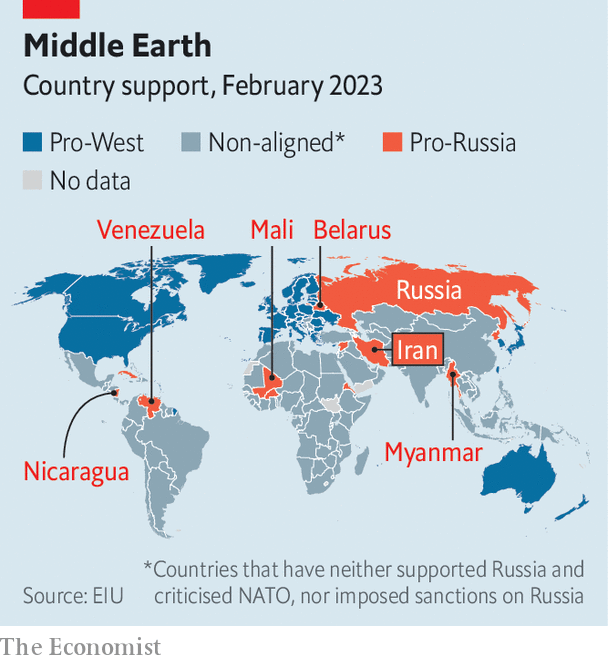

###### The new non-aligned

# How to survive a superpower split 

##### We analyse the crafty countries that don’t want to pick sides 

 

> Apr 11th 2023 

Caught between America, China and , many countries are determined not to pick sides. As the American-led order in place since 1945  and economic decoupling accelerates, they seek deals across divides. This transactional approach is reshaping geopolitics. 

One way of capturing the sheer scale and heft of these non-aligned powers is through a Russian lens. Our sister organisation, eiu, has analysed countries based on their economic and military ties to Moscow, their diplomatic stances including votes at the un and whether they support and implement sanctions. Although 52 countries comprising 15% of the global population—the West and its friends—lambast and punish Russia’s actions, and just 12 countries laud Russia, some 127 states are categorised as not being clearly in either camp (see map). 

 


To get a handle on what non-alignment really means  has also looked at a narrower panel of the 25 biggest economies that have sat on the fence on the Ukraine war, or wish to remain non-aligned in the Sino-American confrontation, or both. The members of this group—call them the transactional 25 (t25)—are hugely varied in terms of wealth and political systems, and include giant India and tiny Qatar. Yet they have some common ground. They are brutally pragmatic and have collectively become more powerful. Today they represent 45% of the world’s population and their share of global gdp has risen from 11% in 1992 to 18% in 2023, more than the eu’s. Their strategy of neutrality involves big risks and opportunities. Whether they succeed will influence the world order for decades. And needless to say, both America and China will work to win them over. 

In the 20th century non-alignment meant different things to different countries at different times. At conferences in Bandung, Indonesia in 1955 and Belgrade, Yugoslavia in 1961, leaders presented a “third world” apart from the West and the Soviet bloc. From the late 1960s these countries increasingly focused on economic inequality between the “global south” (a less loaded term for the third world) and the industrial north. A formal institution, the Non-Aligned Movement, was joined by nearly every African, Asian and Latin American state. With the end of the cold war it became, in the words of an Indian academic, “a moribund organisation in need of a decent burial”.

Today, non-aligned countries are not defined by their membership of an institution, but rather by their characteristics and behaviour. These middle powers are pragmatic and opportunistic. In a recent book Jorge Heine, a former Chilean diplomat, contends that in the 20th century countries often passively drifted into one or other of the superpowers’ orbits. Today there is more “active” evaluation of the best means to achieve particular ends, he says. Some call it “minilateralism” (as opposed to multilateralism)—the targeted use of discrete alliances or groupings, rather than lumping your lot in with one bloc.

Non-aligned countries also usually think Western leaders are hypocrites. Some $170bn in aid was pledged to Ukraine in the first year of the war—equivalent to about 90% of spending on all global aid in 2021 by the oecd’s Development Assistance Committee, a group of 31 Western donors. To the West, such generosity shows solidarity with a fellow democracy; to others it shows that rich countries cough up if it serves their interests. “Europe has to grow out of the mindset that Europe’s problems are the world’s problems, but the world’s problems are not Europe’s problems,” declared Subrahmanyam Jaishankar, India’s foreign minister, last year.

Such stances are broadly in line with public opinion. A report by Cambridge University last year found that in liberal democracies 75% hold a negative view of China, and 87% do of Russia. But the picture is almost the reverse among the 6bn people who live elsewhere. A gap is opening up between how the West sees the world and how the rest sees it. In a poll published earlier this year by the European Council on Foreign Relations, a think-tank, a plurality of Indians (48%) and most Turks (51%) said the future world order will be defined by multipolarity or non-Western dominance. Just 37% of Americans, 31% of people in eu states and 29% of Britons agreed. The West thinks it is watching a sequel of the cold war; the rest of the world sees an entirely new film. 

Wheeling and dealing

So who makes up the t25? The diverse group encompasses some of the world’s most populous countries and two of its largest democracies, India and Indonesia, alongside Vietnam, Saudi Arabia and Egypt, which are all run by autocrats of various flavours. Large wealth disparities exist, too. In Saudi Arabia gdp per person is more than $27,000, on a par with some European countries, while in Pakistan it still lingers around just $1,600.

 


As globalisation has spread, the trade pattern of the t25 has become multipolar. Some 43% of merchandise trade is with the Western bloc, 19% with the China-Russia bloc and 30% with countries in neither of those camps (see chart). Perhaps unsurprisingly given its location, 77% of Mexico’s total trade occurs with the West; over 60% of Israel’s and Algeria’s trade also does. More than a third of Chile’s is with China, a higher share than any other t25 country (but 40% of its trade involves the West). More than half of Argentina’s trade, and almost half of India’s, is with other non-aligned countries.

Arms imports also show a complex mesh of loyalties. India hedges its bets. Between 2018 and 2022 its main supplier was Russia, which provided 45% of its arms, but it got another 29% from Europe and is likely to seek more self-reliance, with help from America. India’s rival China, which supplies its arch-enemy, Pakistan, is out of the question. Israel, Morocco, Saudi Arabia and South Africa look instead to America for the vast majority of their arms imports. 

There is no coherent governing body that represents non-aligned countries and their interests. None is expected to emerge. Instead a variety of disparate organisations, such as the g20, provide platforms of varying effectiveness for the major non-aligned countries. The brics group of countries—Brazil, Russia, India, China and South Africa—is a forum for middle powers that wants to expand: it is discussing whether to let Iran and Saudi Arabia join. At un climate talks a broader group of more than 130 countries, including China, has negotiated together.

Despite their differences, the non-aligned countries share a common aim: to make expedient deals in a fluid environment. For two decades many were able to simultaneously build relations with the West, China and Russia. No longer. The West is imposing sanctions on Russia and restricting Chinese access to technology. 

 


For many this is a grave threat. Sanctions on Russia saw energy and food prices soar globally, prompting a backlash across the non-Western world. More recently Janet Yellen, America’s treasury secretary, has encouraged American companies to move their supply chains into friendly states. Investment shifts are under way (see chart). Beijing and Moscow, meanwhile, are drawing closer together. New research by the imf notes that since 2018 geopolitical alignment, measured by similarity in un voting patterns, has become ever more important in determining the location of foreign direct investment. Under the imf’s scenarios for fractured trade, the impact in emerging markets could be more than twice as bad as in advanced ones. 

But many in the non-aligned world bet that they can win from economic decoupling and political fragmentation, by hedging their relations between the big powers and by influencing other countries themselves. To understand this transactional strategy, look at the approach of some of the big countries caught in the middle. Brazil is a good case study. It opposes what Mauro Vieira, foreign minister, calls “automatic alignments”. Luiz Inácio Lula da Silva, who began his second stint as Brazil’s president in January, sees President Joe Biden as an ally on climate change; at their meeting in Washington, dc, in February they re-established joint environmental institutions abandoned under Jair Bolsonaro, Lula’s predecessor. America classes Brazil as a “major non-nato ally”, a legal status that entitles enhanced co-operation with America’s armed forces. 

Yet Brazil is also hedging between the superpowers. Like others in its region, it has declined Western proposals to give old Russian-made equipment to Ukraine in exchange for new arms.  on April 14th will underscore China’s economic importance. Trade between Brazil and China was nearly $153bn in 2022, a 37-fold increase in two decades. Partly this reflects how Brazil took advantage of tit-for-tat us-China tariffs to increase agricultural exports to China at America’s expense. 

Brazil is also making forays of its own. Lula will soon visit Africa to revive Brazil’s influence there. During his first stint in office, trade with Africa rose from $6bn in 2003 to $25.6bn in 2012, and South Africa was welcomed into the brics bloc. Then Lula’s predecessor made no visits to Africa. Lula evidently thinks it worthwhile to renew the effort.

India’s fear of China has pushed it closer to the West in some respects. In March the prime minister of Japan, which like India, America and Australia, belongs to the “Quad”, an Indo-Pacific security forum, visited Delhi in a landmark visit. In the 2021-22 financial year India’s trade with America overtook that with China. Yet India still purchases weapons and cheap oil from Russia and is unlikely to break its longstanding ties unless Vladimir Putin’s regime were to use nuclear weapons. 

Practical, not partisan

Like Brazil, India is asserting itself more abroad: only China imports and exports more with sub-Saharan Africa. The average annual stock of fdi from India was $0.8bn in 2004 to 2008 (less than half of Sweden’s) but $31bn a decade later (more than Germany’s and Japan’s combined). Last month India hosted representatives from 31 African countries for war games. India promises to use its chair of the g20 this year to be the “voice of the global south”.

Turkey also wants more clout across the global south. It has security agreements with 30 African states and its defence exports to Africa rose more than five-fold from 2020 to 2021. Advisers to Turkey’s president say the “New Turkey” can select its partners. That may explain its ostensible neutrality over the war in Ukraine, which Turkey has used to leverage its ties to Russia. Turkish exports to Russia reached $7.6bn in 2022, a 45% increase on the previous year. 

Saudi Arabia is reducing its reliance on its historical ally, America, by tilting towards China, which is now the kingdom’s largest trading partner. Consider decisions this month and in October by the Organisation of the Petroleum Exporting Countries, which Saudi Arabia dominates, to slash oil production. Last month Saudi Arabia signed a Chinese-brokered deal with Iran and joined the Shanghai Co-operation Organisation, a Eurasian talking shop. China says it wants to establish a free-trade deal with the Gulf “as soon as possible”. 

Gulf countries’ relations with Africa were once confined to energy, agriculture and the politics of the Horn of Africa. Today Saudi Arabia and the United Arab Emirates hunt for minerals deals; dp World, a Dubai-based ports operator, is emerging as a critical logistics firm on the continent; and Qatar is playing novel diplomatic roles. Last month it was involved in brokering the release of Paul Rusesabagina, a jailed Rwandan dissident (and the inspiration for the film “Hotel Rwanda”). 

African countries have long looked to both superpowers. The West has generally been their preferred source of “software”: support for schooling, health and, should a government want it, human rights. China offers “hardware”: bridges, roads, ports—and the loans to build them. Between 2007 and 2020 America’s main development agency lent less than a tenth of the total of China’s two major development banks ($1.9bn v $23bn) for sub-Saharan African infrastructure projects. 

In some parts of Africa the West’s promises to ensure security have rarely seemed as hollow. “Americans need somewhere for their troops and agents to sleep. But the security relationship does nothing for development,” explains a former adviser to an African president. “That’s why we need China.” In August the last French troops left Mali after a nine-year deployment; the Wagner Group, comprising Russian mercenaries, now helps prop up the ruling junta.

The non-aligned countries want to avoid taking sides. But the big powers, America and China, are keen to draw them into their orbit. Beijing sees asserting leadership of the global south as a way of bolstering its resistance to American pressure. It positions itself as a model for others within a broad family of developing countries. It draws a contrast with the West, which it says prefers smaller clubs (like the g7). “China shows up where and when the West will not,” says Yemi Osinbajo, Nigeria’s outgoing vice-president. 

Eastern friends, western pals

China is the main trading partner of around 120 countries and the lender of first and last resort for many. Between 2007 and 2020 it provided more infrastructure financing in sub-Saharan Africa than the next eight lenders combined. It will be pivotal to resolving sovereign-debt crises. Analysis of 73 developing countries by the imf notes that in 2006 China held just 2% of this group’s external debts, with the mostly Western “Paris club” group of creditors accounting for 28%. By 2020 the respective shares were 18% and 10%. 

Those in the West have reason to roll their eyes. China’s “win-win” rhetoric masks its ruthlessness. “Banking on Beijing” (2022), by Bradley Parks of AidData, a research outfit, and co-authors, shows how China uses its economic tools for political ends. It often skews its funding towards incumbent leaders’ home districts—and is more likely than the West to lend to corrupt and autocratic countries. AidData also finds that a 10% increase in voting similarity with Beijing at the un is associated with an increase in Chinese projects in that country. Chinese loans come with unusually strict clauses on confidentiality and collateral. But Chinese development projects are associated with boosts to gdp per person, notes Mr Parks. 

In the face of China’s efforts, America and its allies are trying to recalibrate their message to the non-aligned world. America understands that other countries’ consent bestows legitimacy on the international order it leads. “Countries don’t want to choose, and we don’t want them to,” Jake Sullivan, Mr Biden’s national security adviser, told the  earlier this year. America is pursuing diplomacy in places it has neglected. Kamala Harris, America’s vice-president, Ms Yellen and Antony Blinken, its secretary of state, have all visited Africa in 2023. Mr Biden will soon follow. 

America has also bolstered security partnerships with influential non-aligned countries. In November Lloyd Austin, its defence secretary, met his Indonesian counterpart for the fourth time; in January American and Indian officials agreed to deepen co-operation on cutting-edge defence technologies. In total America maintains 88 defence “partnerships” (excluding formal alliances such as its one with nato), though some are limited in scope.

Though America and the eu have in recent years launched rival schemes to the bri, the perception remains that, if you want infrastructure that can help transform your economy, your first call is to Beijing. After Ms Harris released a soundtrack featuring African artists to accompany her recent visit to the continent, one senior African official noted, dryly, that Chinese visitors bring loans and engineers while Americans bring playlists. 

A political paradox

The Biden administration is widely seen as embracing a two-tier foreign policy: first come relations with its core democratic allies in Europe and Asia (which it hopes might one day include India)—and then those with creaking global institutions. These mediate meet the needs of a broader group of countries, including most non-aligned ones, whether on development, debt relief, security or finance. 

That presents three challenges. First, Western unity must hold. Yet that is not a given. During his recent visit to China Emmanuel Macron, France’s president, said that Europe’s states should not become “followers” of American policy on Taiwan, nor “adapt to the American rhythm”.

The second is that China can undermine global institutions by, for instance, opting for bilateral debt relief rather than fully participating in co-ordinated efforts. Chinese creditors’ obstinacy at the imf is hampering what flexibility it can offer to countries struggling with debt.

The final challenge concerns the mistrust of the West that is fed by its broken promises. Take climate finance, for example. In 2009 rich countries said they would channel $100bn to poorer ones per year by 2020; the annual total has never been higher than $85bn.

By drawing on their liberal values and shared history, America and its allies were able to rally behind Ukraine after Russia’s invasion. They have shown newfound resolve against authoritarian China, too. The risk is that this coming together deepens the estrangement of the global south from the international order. It would be a tragic result if, in uniting the West, America alienates the rest.■


