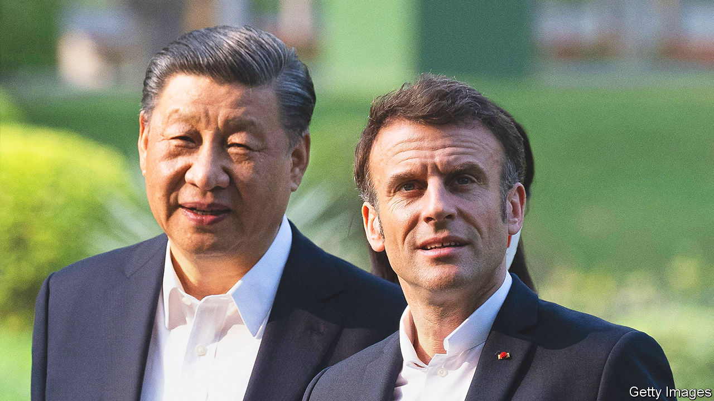

###### Europe, China and America

# Emmanuel Macron’s blunder over Taiwan 

##### The French leader has made a dangerous situation worse 

 

> Apr 12th 2023 

CHINESE WARSHIPS on April 8th once again , and fighter jets simulated strikes on the island. Asia is at risk of an  that could draw in America, and engulf the region in a confrontation with even greater ramifications than the one raging in Europe. It is a moment of , when diplomatic words uttered by transatlantic allies need to be weighed with the utmost care. 

Yet it was one of Europe’s most experienced leaders, Emmanuel Macron, who chose to mark his departure from China, just as this military drill began, by declaring that it was not the continent’s business “getting caught up in crises that are not ours”. In the name of “strategic autonomy”, he said, Europe should not be “followers” of America on a crisis like Taiwan. 

Mr Macron’s comments, made to a small number of journalists, were worse than unhelpful: they were diplomatically dangerous and conceptually wrong. Though he later corrected them in Europe, the damage had been done to his credibility and the West’s unity.

France’s president was not wrong to visit Beijing. It is reasonable, too, for Europe to conduct its own policy towards China, however tricky it is to agree on a message. Having alerted fellow Europeans back in 2019 to the strategic threat, Mr Macron is fully aware of the danger that an authoritarian China poses. Yet he fell head first into two traps, presumably to the delight of China’s president, Xi Jinping.

Mr Macron’s first error was to further China’s ambition to divide Europeans and peel Europe from America. The choreography of the trip contributed to both. He had hoped to display European unity, insisting to the Chinese that he bring with him Ursula von der Leyen, head of the European Commission. But that idea collapsed under the weight of Chinese protocol and the doveish Mr Macron’s desire to spend hours tête-à-tête with Mr Xi. Mrs von der Leyen, who arrived after making a hawkish speech, got an hour or so in their company. 

Mr Macron’s comments reflected a worrying failure to measure their broader impact. At a time when liberal democratic powers need a co-ordinated show of strength, he rounded off his visit to an authoritarian ruler by stressing that in such crises Europe should not be dictated to by Washington.

The second error was to undermine allied support for Taiwan. Diplomacy alone will not lower the risk of war. The West also needs to bolster deterrence, without provoking the very conflict it seeks to avoid. France, with bases in the Indo-Pacific, contributes more militarily to such efforts than any other European Union power. This weekend, amid China’s drills, it sailed a frigate through the Taiwan Strait. That is to be commended. But what could have been a display of allied unity and resolve was undermined by Mr Macron’s suggestion that Taiwan is not Europe’s problem.

What happens to Taiwan matters to Europe. If some Europeans do not want to fight a war, or are reluctant to impose sanctions should China invade, that is for closed-door talks among allies, not public musings. Moreover, by emphasising Europe’s autonomy from America, Mr Macron has made life harder for those Americans defending their country’s support for Ukraine against domestic critics who wish the money were spent elsewhere. 

At stake in Taiwan is the future global balance of power, as well as the protection of democratic freedoms and advanced technologies critical to global trade. Those interests are shared by Americans and Europeans alike. Mr Macron seems to think that he can successfully defend them by working independently. That is a delusion. Together, America and Europe may or may not prevail. Apart, they will usher in a Chinese century. ■

