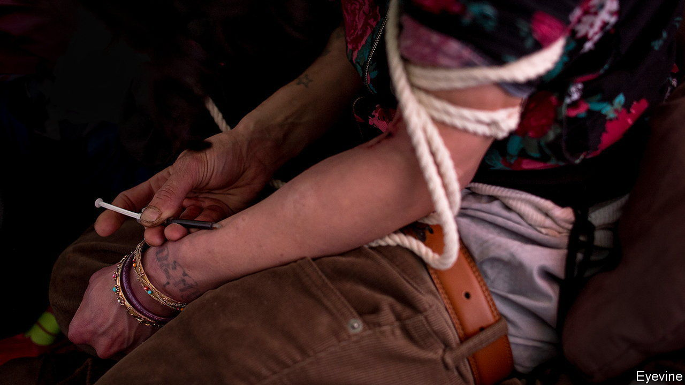

###### Addiction

# Oregon botches the decriminalisation of drugs 

##### It failed to prepare the ground 

 

> Apr 13th 2023 

AMERICA’s WAR on drugs has been a disaster. More than  have died of overdoses since the government started counting in 1999. No wonder a growing number of states are interested in trying something different. Nine of them are contemplating decriminalising the possession of a small amount of drugs. This newspaper has long championed more liberal laws, but before rushing ahead, reform-minded states—in America and beyond—would do well to consider the experience of , the only American state so far to enact decriminalisation. It has had a rocky start.

Removing  for possessing some drugs makes sense. It can reduce prison numbers and the perils of addiction. Portugal decriminalised the possession of drugs for personal use in 2001. In subsequent years overdose deaths and HIV rates fell, and public drug markets disappeared. 

Oregon had hoped for a similar success. In a ballot in 2020, 58% of voters backed decriminalisation. As a result, having a small amount of fentanyl, methamphetamine, heroin or LSD now warrants a punishment on a par with a speeding ticket. In the two years since the new law took effect, drug arrests are indeed down. However, overdose deaths in Oregon have risen sharply, far beyond the increase recorded nationally. 

Under the old scheme, possession charges were a tool to get people into , because punishments could be dropped if offenders agreed to seek help. However, the thinking in Oregon was that treatment was likelier to work better when it was voluntary. The citations for possession that have replaced charges come with a fine of up to $100, which can be waived with a call to a health hotline. The hope was that offenders could then be steered into rehab. But less than 5% of police actions have actually resulted in that phone call.

Worse, even if people do chose addiction treatment, they may not be able to receive it. Recent analysis found that Oregon state has just half the addiction services it needs. The same ballot measure that decriminalised possession also increased funding for some recovery services, but the money started to flow long after the reform entered into force. Even now, the extra funding will not close the yawning gap in services.

Learn before you leap

Oregon’s experiment may yet prove a success, but its lessons are clear. First do not rush. The Australian Capital Territory is also in the midst of decriminalising the possession of drugs but, wisely, it is taking a year to prepare and train front-line responders. It is especially important to ensure that treatment is available before moving ahead. The “Field of Dreams” approach to drawing addicts into treatment will not work if you do not actually provide enough places in clinics. And building them is not cheap.

Second, pressure is a necessary part of the policy mix. Many addicts would choose never to walk into a treatment centre. British Columbia, in Canada, is undergoing its own decriminalisation trial and, like Oregon, it has opted not to compel treatment. Yet, with accidental fentanyl overdoses so common, waiting for addicts to hit rock bottom can all too easily prove lethal. 

It is better to adopt the sort of approach pioneered in Portugal, where people found with drugs have to appear before dissuasion commissions and are shepherded into treatment. The process is laborious, and that alone can discourage casual drug-taking. Italy, which has also decriminalised drug possession, can suspend the driving licences of frequent offenders.

Drug epidemics have no quick fixes. But the  facing America today is so great that even small improvements are worth striving for. Done correctly, decriminalisation could help people go clean by sparing them the millstone of a criminal record and prevent many deaths from overdoses. That is why it is important to heed the lessons from Oregon. ■

