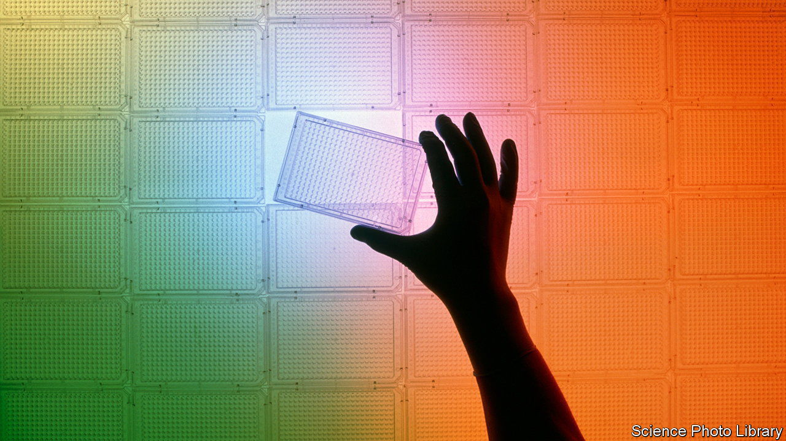
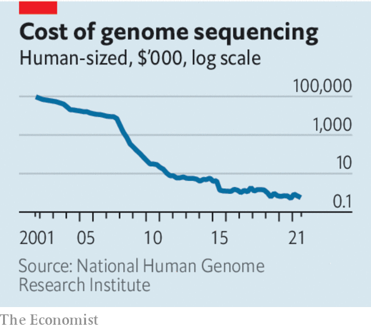

###### Big science

# The Human Genome Project transformed biology 

##### Yet for genomics to become a part of everyday medicine, the hard work is still ahead 

 

> Apr 13th 2023 

Twenty years ago the  unveiled a mostly complete sequence of the roughly 3bn base pairs of DNA found in every set of human chromosomes. The project was , but also heralded the rapid improvements and dramatically lower costs of sequencing. This fed the success of the burgeoning field of genomics, which has —and still holds plenty of promise. 

Genomics has added a new dimension to the study of life and evolution. It has helped scientists understand genes and proteins, and how they govern the growth and function of cells. CRISPR gene editing—a way to precisely modify the DNA in cells—gives researchers a handle on cellular function and dysfunction. The first treatments based on gene editing could be approved within a year. Plant scientists have acquired ways to create disease- and heat-resistant crops. 

 


The era of cheap genome sequencing opened the doors to biology as a data science. The data and findings from the hgp came close to being hidden behind patents. Instead they were opened up to the public, which proved crucial—a useful lesson for other big projects. Biologists’ databases now hold the sequences of millions of people and other organisms. This has helped draw links between genes, traits and diseases and also enhanced scientists’ understanding of evolution. 

Most of the revolution’s tangible effects have been in medicine. Screening for serious but treatable genetic diseases is already possible. Cancer is largely the result of genetics gone awry. Sequencing the genome has become a routine part of treating many tumours. Doing so allows doctors to work out which mutations the cancer has and therefore which course of treatment is likely to work best. 

Genomics will increasingly inform doctors’ decisions. Starting later this year, 100,000 babies in England will have their genomes sequenced and screened for around 200 conditions. Each disease is rare; together, they affect nearly one in 200 children. Early detection means early treatment, and a higher chance of a better outcome. The hope is that, in time, the precise variations in many hundreds of locations on a person’s genome will guide doctors. They seem likely to become a factor in assessments of whether a patient is likely to develop conditions such as cardiovascular disease and type-2 diabetes.

Yet for the genomics revolution to realise its potential, plenty more can be done. Sequencing has fallen in cost from over $50m a genome at the end of the HGP to a few hundred dollars today, but making it even cheaper and more convenient would allow it to be more widely available. People’s genetic sequences need to be integrated into their medical records, requiring data infrastructure, digitised records, and the setting of robust security and privacy standards. Scientists must also continue to collect more diverse data, beyond those of patients in the rich world. That will help them understand variations in the genome. Some projects, such as the Three Million African Genomes and GenomeAsia 100k, are already under way. 

The science will need to progress further, too. Researchers now have a decent understanding of diseases that are affected by single genes. But they do not yet have a good grasp of how genes interact with each other. And much is unclear about the interplay between groups of genes and people’s environments. Nature versus nurture was once a popular debate in genetics but these days is largely seen as a false dichotomy. With genomes as with much successful research, the more you find out, the more you realise that you do not have the whole story. ■

