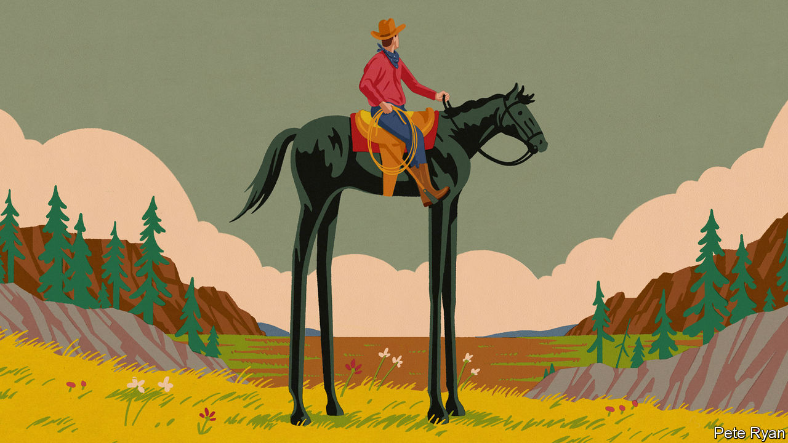

###### Riding high

# The lessons from America’s astonishing economic record 

##### The world’s biggest economy is leaving its peers ever further in the dust 

 

> Apr 13th 2023 

If there is one thing that Americans of all political stripes can agree on, it is that the economy is broken. Donald Trump, who saw trade as a rip-off and his country in decline, came into office promising to make America great again. President Joe Biden is spending $2trn , hoping to build it back better. . Nearly four-fifths tell pollsters that their children will be worse off than they are, the most since the survey began in 1990, when only about two-fifths were as gloomy. The last time so many thought the economy was in such terrible shape, it was in the throes of the global financial crisis. 

Yet the anxiety obscures a stunning success story—. America remains the world’s richest, most productive and most innovative big economy. By an impressive number of measures, it is leaving its peers ever further in the dust.

Start with the familiar measure of economic success: gdp. In 1990 America accounted for a quarter of the world’s output, at market exchange rates. Thirty years on, that share is almost unchanged, even as China has gained economic clout. America’s dominance of the rich world is startling. Today it accounts for 58% of the g7’s gdp, compared with 40% in 1990. Adjusted for purchasing power, only those in über-rich petrostates and financial hubs enjoy a higher income per person. Average incomes have grown much faster than in western Europe or Japan. Also adjusted for purchasing power, they exceed $50,000 in Mississippi, America’s poorest state—higher than in France. 

The record is as impressive for many of the ingredients of growth. America has nearly a third more workers than in 1990, compared with a tenth in western Europe and Japan. And, perhaps surprisingly, more of them have graduate and postgraduate degrees. True, Americans work more hours on average than Europeans and the Japanese. But they are significantly more productive than both. 

American firms own more than a fifth of patents registered abroad, more than China and Germany put together. All of the five biggest corporate sources of research and development(R&amp;D) are American; in the past year they have spent $200bn. Consumers everywhere have benefited from their innovations in everything from the laptop and the iPhone to artificial-intelligence chatbots. Investors who put $100 into the s&amp;p 500 in 1990 would have more than $2,000 today, four times what they would have earned had they invested elsewhere in the rich world. 

One retort to this could be that Americans trade higher incomes for less generous safety-nets. America’s spending on , as a share of gdp, is indeed a great deal stingier than other countries’. But those benefits have become more European and, as the economy has grown, they have grown even faster. Tax credits for workers and children have become more generous. Health insurance for the poorest has expanded, notably under President Barack Obama. In 1979 means-tested benefits amounted to a third of the poorest Americans’ pre-tax income; by 2019 these came to two-thirds. Thanks to this, incomes for America’s poorest fifth have risen in real terms by 74% since 1990, much more than in Britain.

For the world as a whole, America’s outperformance says much about how to grow. One lesson is that size matters. America has the benefit of a large consumer market over which to spread the costs of R&amp;D, and a deep capital market from which to raise finance. Only China, and perhaps one day India, can boast of purchasing power at such scale. Other countries have sought to mimic it. But even those in Europe, which have got the closest, have struggled to become a true single market. Differences in bankruptcy laws and contractual terms, together with a variety of regulatory barriers, prevent bankers, accountants and architects from touting services across borders. 

The size and the quality of the workforce matters, too. America was blessed with a younger population and a higher fertility rate than other rich countries. That may not be easily remedied elsewhere, but countries can at least take inspiration from America’s high share of immigrants, who in 2021 made up 17% of its workforce, compared with less than 3% in ageing Japan. 

Another lesson is the value of dynamism. Starting a business is easy in America, as is restructuring it through bankruptcy. The flexibility of the labour market helps employment adapt to shifting patterns of demand. Already many of the workers in America who were laid off from Alphabet and other tech firms at the start of the year are applying their sought-after skills elsewhere, or setting up their own businesses. In continental Europe, by contrast, tech firms are still negotiating lay-offs, and may think twice about hiring there in future. 

Americans should find the economy’s performance reassuring. If history is a guide, living standards will continue to go up for the next generation, even as the country bears the costs of decarbonising the economy. Yet, resilient as the growth record has been, there are shadows. The middle class has seen its post-tax incomes rise by less than those of both the poorest and the richest. A group of people have fallen into hard times. The share of prime-age American men who are not in work has been rising for years and is higher than in Britain, France and Germany. And life expectancy in America lags shamefully behind others in the rich world, mainly on account of too many younger people dying from drug overdoses and gun violence. Tackling such problems should be easier when the economy as a whole is growing. But America’s poisonous politics are no help.

In addition, the more that Americans think their economy is a problem in need of fixing, the more likely their politicians are to mess up the next 30 years. Although America’s openness brought prosperity for its firms and its consumers, both Mr Trump and Mr Biden have turned to protectionism and the politics of immigration have become toxic. Subsidies could boost investment in deprived areas in the short term, but risk dulling market incentives to innovate. In the long run they will also entrench wasteful and distorting . The rise of China and the need to fight climate change both confront America with fresh challenges. All the more reason, then, to remember what has powered its long and successful run. ■


