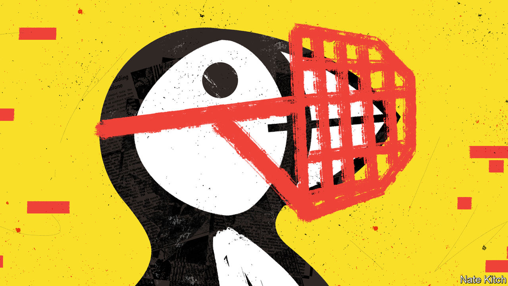
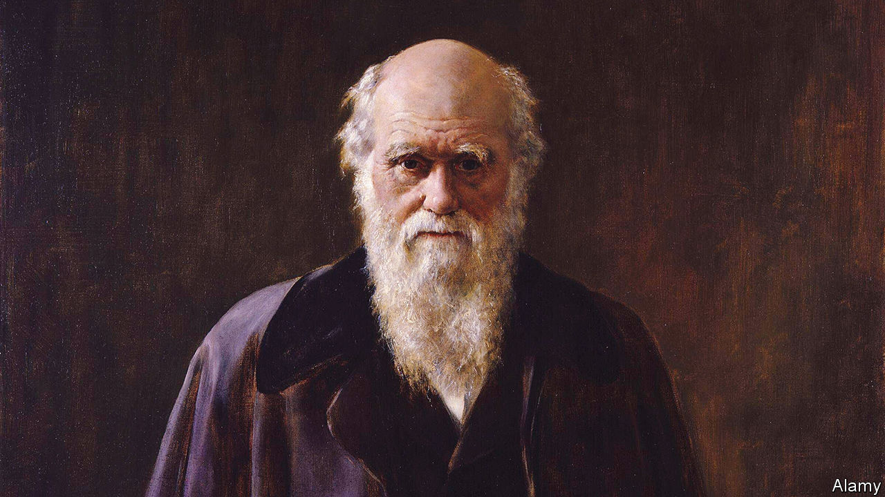
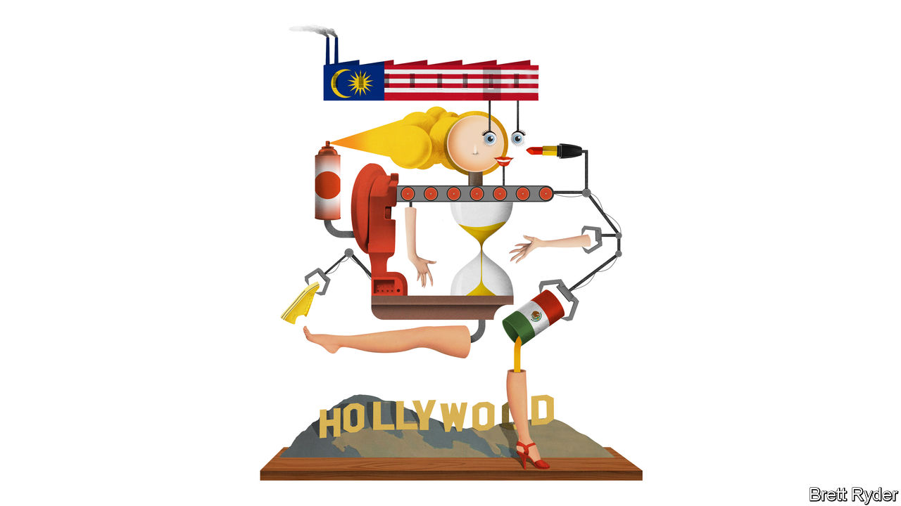

###### On China and Ukraine, George Orwell, science and religion, video games, “Barbie”, height

# Letters to the editor 

##### A selection of correspondence 

 

> Apr 13th 2023 


China and Ukraine

By supporting Russia’s catastrophic and illegal war in Ukraine (“”, March 25th) China is also in breach of the China-Ukraine Treaty of Friendship and Co-operation, under which Beijing assured Kyiv in 2013 that it would help Ukraine defend itself. Through the treaty Ukraine recognised that “there is only one China in the world” and the People’s Republic of China “is the only legal government representing China”. Ukraine agreed that “Taiwan is an inseparable part of China”. In return, China supported efforts to protect the territorial integrity of Ukraine. Article 6 went further, stating that neither country shall take actions that damage the sovereignty of the other or permit third countries to damage either countries’ territorial integrity.

China’s violation of this treaty is the thin end of a dangerous geopolitical wedge. Western democracies should be under no illusion about the scale of China’s implicit ambition in cultivating a weak Russia. It is precisely that ambition to which President Xi Jinping was referring when he told Vladimir Putin in Moscow that, “Change is coming that hasn’t happened in 100 years and we are driving this change together.”

That change includes Beijing’s ambition to dominate the world. This includes a new concept of conflict across a spectrum of information war, cyberwar and high-end hyper-war. In Mr Xi’s worldview, treaties are merely instruments to constrain and confuse adversaries. Therefore, if China and its vassal Russia succeed there will be a return to the kind of world which preceded both world wars and the destruction of the very institutions which, since 1945, have helped to militate against extreme state aggression.

It would thus be helpful now to remind President Xi of China’s responsibilities and its obligations under the China-Ukraine treaty, and to encourage him to cease his further support of Russia’s illegal endeavours in Ukraine. In dealing with Mr Xi’s China the West must speak softly and carry a big stick. 

Air-marshal Sir Christopher Harper

Former director-general of the NATO International Military Staff


Dr Sarah Kirchberger

Head of Asia-Pacific strategy and security

Institute for Security Policy

Kiel University


Professor Julian Lindley-French

Chairman 

Alphen Group


 


Censoring “Animal Farm”

I appreciated Bagehot’s article on self-censorship in British publishing, pegged to the editing of Roald Dahl’s books for sensitivity (). The column noted that many publishers rejected George Orwell’s anti-Soviet masterpiece, “Animal Farm”, out of fear of giving offence. Yet it is worth remembering that more traditional censorship played a role as well. One publisher, Jonathan Cape, rejected the manuscript on the advice of Peter Smollett, an official at the British Ministry of Information. Smollett was later revealed to be a Soviet agent. What looks like self-censorship can have surprising, sometimes Orwellian, origins. 

Judge Glock


 


Science and religion

Much as I agree that science and religion need not be in conflict, I must cite a fascinating exception to Nicholas Spencer’s claim that neuroscience stands little chance of “finding…morality in an MRI scan” (”, March 18th). Joshua Greene, Jonathan Cohen and others carried out an ingenious experiment using functional MRI which demonstrated that our inborn sense of right and wrong depends on particular circumstances (published in  in 2001). 

Using the hypothetical “runaway trolley” dilemma volunteers were asked about the morality of sacrificing one person to save many others. They gave contradictory answers depending on the context. If asked if it is moral to throw a switch so that a runaway trolley kills a few repairmen on the track to save a much larger number of passengers, the majority said yes. But if asked if it was moral to push one obese person onto the track to save the many the majority said no. The MRI scans showed that only the second scenario activated brain centres involved in emotions and moral choices.

Richard Waugaman

Clinical professor of psychiatry

Georgetown University

 

Pierre Teilhard de Chardin is among the most important scientists to have tackled this problem. As both a scientist and a Jesuit, he showed how scientific theories, among them the Big Bang and Charles Darwin’s work on evolution, could lead to the existence of God, and to another world for humanity. But he also wrote about the evidentiary irrelevance of some Christian dogmas, such as original sin. He used science to give a stronger basis for Christian faith. Needless to say some members of the Catholic church thought he was a heretic and some of his writings were not published until after his death in 1955.

Denis Apvrille

Member of the Association des Amis de Teilhard de Chardin


 


Subversive creativity

I read your leader on the future of video games with a groan (“”, March 25th). Video games have long been an escape for Western youth. For Generation Z they are an excuse to go wild, create fantasy lands, and be beyond the reach of parental supervision. The corporate push to consolidate and moderate content is another sign that the presence of “the man” (our parents, anyone over the age of 35), is going to dampen the creative chaos and cathartic relief that video games provide.

The business successfully survived attempts in the 1990s and 2000s to censor games like “Grand Theft Auto”, in part because the game became a sign of teen rebellion and mostly because video-game developers did not have to pander to parents, who were not GTA’s audience or the developer’s market. Now that older generations have been co-opted into video gaming its rebellious nature will suffer as developers try to create games that appeal to little Johnny, Uncle Jimmy and all.

Kellen McGovern Jones


 


Barbie girls and boys

Schumpeter should not be embarrassed by his excitement about “Barbie” (). It is eagerly awaited among cinephiles. I will watch it before Christopher Nolan’s “Oppenheimer”, which comes out the same day. We’ve seen plenty of atomic bombs on the big screen; Margot Robbie and Ryan Gosling playing toy dolls is uncharted territory.

James Jiang


It’s no small thing

As a man standing five feet and five inches I can assure you that height plays a significant part in a man’s ability to find dates and partners (, March 25th). Ditto to being America’s president. And probably everything in between. I am a married attorney, by the way. 

BRIAN SHEPPARD


