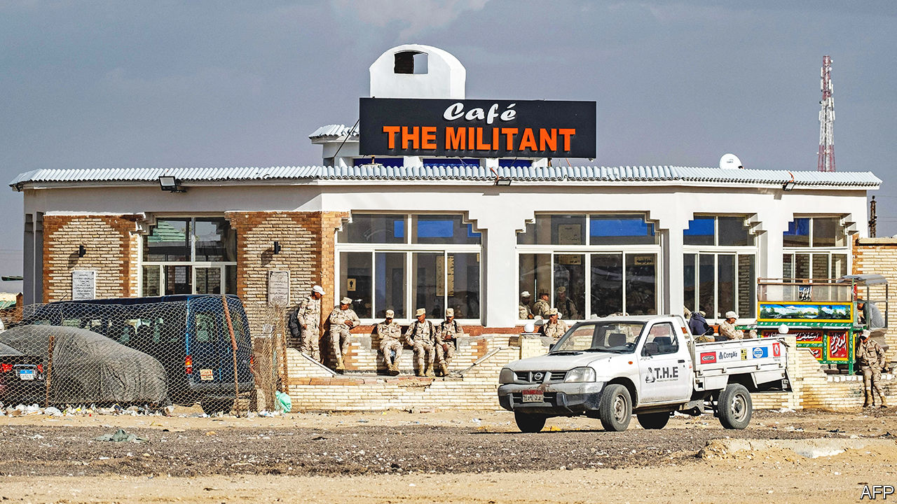
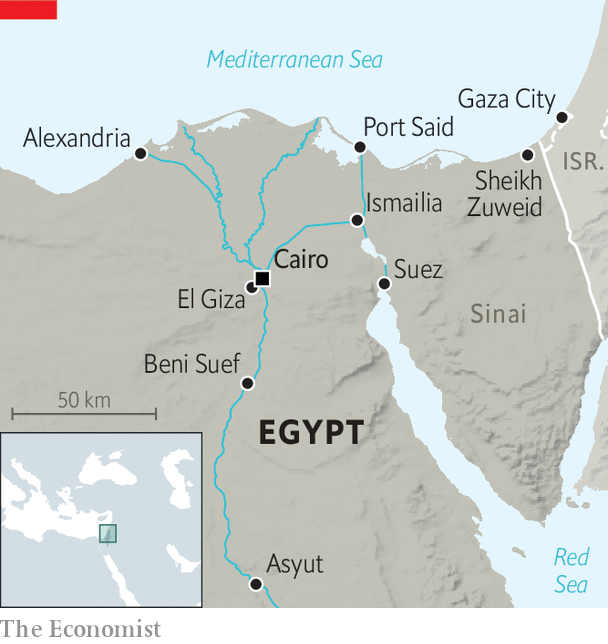

###### Of militants and money-changers

# Egypt’s army seems to want to make pasta as well as war 

##### Even as it struggled to assert control on Sinai, it seized large parts of the economy 

 

> Apr 13th 2023 

THE WAR was not going well. The enemy had made three major advances in barely a year. The population was demoralised. Abdel-Fattah al-Sisi needed to show leadership. His motorcade zipped across a desolate landscape until it reached an army checkpoint, where Egypt’s president sought to rally the troops. “Don’t think this crisis will remain,” he told a clutch of camouflage-clad conscripts. “A day will come, and this crisis will become history.”

The tone and ambience were martial. But the enemy, in this case, was not rebels or invaders: it was the dollar, against which the Egyptian pound has lately lost almost half its value. Mr Sisi was not urging the troops to fight harder but rather exhorting them, and the rest of his 105m subjects, to endure a . It was a curious scene that says much about the past decade of his rule.

 


His visit on April 1st to the Sinai peninsula, a vast moonscape that is home to less than 1% of Egypt’s population, was also a declaration of victory. The area’s Bedouin natives had been marginalised for decades, barred from decent jobs and pushed off their lands. Some  after the overthrow in 2011 of Hosni Mubarak, the longtime dictator. In 2014 they linked up with the jihadists of Islamic State. The following year they briefly took over the town of Sheikh Zuweid, on the coast (see map).

The army struggled to quash the insurgency with a scorched-earth strategy that worsened local grievances. Human Rights Watch, a New York-based monitor, said that in 2013-20 it destroyed at least 12,000 buildings and razed 6,000 hectares of farmland. Perhaps one-quarter of North Sinai’s 450,000 people were displaced.

The turning-point came only when local tribes entered the fray. After years of being kidnapped, extorted and killed, they started working alongside the army to secure Sinai. The region is calmer today, though in December militants claimed responsibility for a raid on a checkpoint in the city of Ismailia, their first attack on the Egyptian mainland in three years.

That was the backdrop to Mr Sisi’s visit. Terrorism, he said, was all but defeated in Egypt. There would soon be grand celebrations, and perhaps a museum to commemorate the army’s sacrifice. “Terrorism,” Mr Sisi told his troops, “ended with you.” 

Mr Sisi is fond of invoking the memory of Egypt’s post-revolutionary chaos to justify his autocratic rule. As the economy sinks, though, many of his subjects have soured on him. After investors pulled out capital last year, Egypt has had to devalue its currency by almost 50% since March 2022. The central bank has almost doubled interest rates over the period, including its most recent increase of two percentage points (to 18.25%) on March 30th.

Investors are still wary. The pound seems to have further to fall: on the black market, it trades some 16% below the official peg. Interest rates remain dwarfed by inflation, which hit an annual rate of 32.7% last month. The price of food and drink rose by 62.9% from a year earlier.

With real rates deeply negative, investors have little appetite for Egyptian debt. On April 3rd the government sold only 1.1m pounds ($35,275) in bonds at an auction, just 0.04% of the 3bn-pounds-worth on offer: would-be buyers wanted much higher rates than the state was willing to provide. 

The government reached a $3bn deal with the IMF in December. Its commitments to the fund include a pledge to shrink the army’s economic empire, which crowds out private business. The men in khaki manufacture pasta and cement, build roads and bridges and produce television shows. Yezid Sayigh, a fellow at the Carnegie Middle East Centre, a think-tank in Beirut, estimated in 2019 that the army oversees a quarter of public spending on housing and infrastructure.

Egypt is not keeping its promise. The National Service Projects Organisation (NSPO), a military-owned firm, is building new factories to make fertilisers, irrigation machines and veterinary vaccines. An army-linked company recently won a contract to renovate the Cairo zoo.

The government has talked for two years about selling stakes in Safi, a bottled-water company, and Wataniya, which operates petrol stations. Both are run by the army. Officials said this month they had received offers for each of them. Even this step, though, may be less significant than it seems. A visitor to Cairo in recent months might have noticed a growing number of Wataniya franchises rebranded as ChillOut stations, which offer retail and fast food along with petrol. Wataniya and ChillOut are both subsidiaries of NSPO. The army looks to be stripping assets from a firm it might sell and transferring them to one it will keep, which is presumably not what the IMF had in mind.

Both Egyptian officers and foreign observers say the Sinai campaign exposed real weaknesses within the army. Waves of poorly trained conscripts were shipped to the front, sometimes without basic equipment; hundreds returned home in coffins. After a decade of Mr Sisi in charge, the army still struggles with its core task of securing the country—even as it pursues an ever-expanding campaign to seize control of the economy. ■

