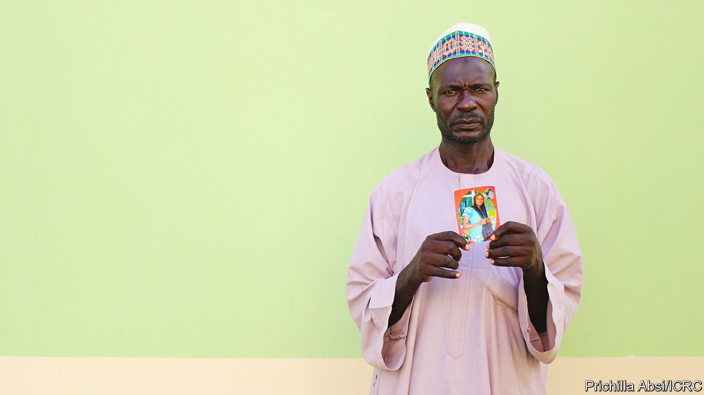

###### Missing people

# Many thousands of Africans have disappeared in conflict 

##### The Red Cross tries hard to find them 

 

> Apr 13th 2023 

When The jihadists of  attacked Lydia Adamu’s village in north-east Nigeria in 2015, her parents and their six children fled—with nothing. At first they seemed relatively lucky, reaching the safety of Yola, a city hundreds of kilometres to the south. When word came that their village was quiet, her parents ventured back to salvage a few belongings. What happened next is murky. All Ms Adamu knows is that “armed men came again, shooting. They seized my parents on motorbikes and disappeared.” She has never seen them again and has no idea if they are dead or alive. 

Her parents are among some 24,000 missing people in Nigeria registered by the International Committee of the Red Cross (ICRC), a global NGO. That is a tiny fraction of the true number in Nigeria, says Anne-Sofie Stockman of the ICRC in Abuja, the capital. Short of cash, the committee focuses on the north-east, where the  across swathes of territory. Yet the ranks of the missing are swelling elsewhere in Nigeria, because of kidnappers, separatists and clashes between farmers and herders. Even in the north-east, countless cases are never registered. 

Across Africa the ICRC has registered some 71,000 people as missing; here, too, the true number must be far bigger. Perhaps 40% of them are children. “If one person is missing, you can imagine the number of family members that are traumatised,” says Joshua Audu, whose brother-in-law was last seen brushing his teeth moments before jihadists overran Mubi, a market town in the north-east, in 2015. 

Not knowing if loved ones are alive is excruciating. Ms Adamu, softly-spoken and shy, was in her twenties when her parents were taken. Suddenly she had to look after five distraught siblings. The youngest, only five at the time, “kept on asking where his parents are”. 

Those left behind often become destitute, especially if the breadwinner has gone missing. In Nigeria there is no legal definition of a missing person. After seven years the family can apply to the high court to declare a person presumed dead. Until then, his or her bank account, pension and inheritance cannot be touched. Land may not be divided up or sold. Spouses cannot get a divorce or remarry. 

A few African countries such as Burkina Faso, Ivory Coast and Senegal can legally declare a person as missing, though it can take several years. But almost all African countries lack the legal protections of countries such as Colombia, where there is a national registry of missing people, a commission to search for them and state support for those left behind. 

In Nigeria NGOs try to plug the gaps. Mr Audu and Ms Adamu took part in an ICRC programme that provides mental-health support, guidance on legal troubles and help with finance. “It has healed my trauma,” says Mr Audu. “I’ve been able to draw a line now, to say I can start again.” 

The ICRC also tries to find the missing. If they have a lead, they send volunteers to knock on doors, asking questions. In cold cases they go to communities near where people who went missing were last seen and read out lists of their names. Yet for 80% of the cases registered in Yola it is still too dangerous to visit. 

Reunifications are rare. There were only 15 last year in Nigeria. “Today brings more joy to me and my wife than the day he was born,” says the father of a 15-year-old reunited with his family in February. The boy had been missing for more than a decade. He fled across the border into Cameroon, aged five, after jihadists attacked his uncle’s village where he had been attending a religious school. His uncle was killed. 

The boy was reunited with his parents only five months after he contacted the ICRC, which is unusually fast, partly because he could remember enough to draw a map showing their house. Few young children can do that. “When you ask them what’s the name of your mum, they will tell you we call her mama,” Fatima Halilu Ibrahim of the ICRC in Yola sadly explains. 

The ICRC cannot do it all. Mr Audu has been campaigning in Yola and Abuja for the authorities to step up. “But nobody came to us except the Red Cross.” ■

