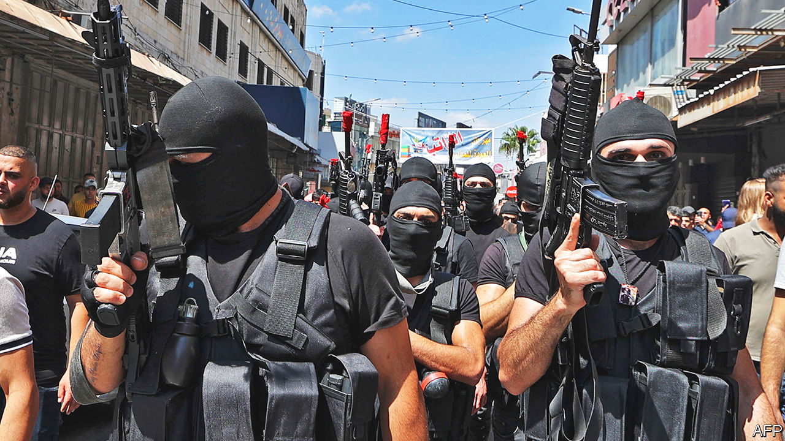
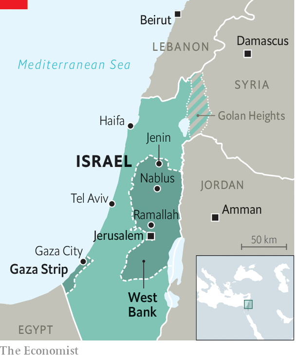

###### Israel and the Palestinians

# The Palestinian Authority is being eclipsed by radical militants 

##### Surprisingly, most Palestinians are rather pleased 

 

> Apr 11th 2023 

The Muslim holy month of Ramadan and the Jewish holiday of Passover, which coincide this year, ought to be a time when two of the three Abrahamic religions reflect on their common beliefs and shared destiny in the Holy Land. Instead, the conflict between Israelis and Palestinians is at risk of a dangerous escalation.

In just five days from April 5th Israel was hit by . The ostensible trigger was clashes between Palestinians and Israeli police forces who had entered the , one of Islam’s holiest sites. Videos showed police beating people inside the mosque, while young Palestinians shot fireworks at them. 

In all this, one actor is noticeably absent: the Palestinian Authority (PA), which was set up under the Oslo accords almost 30 years ago as an interim administration to lead the Palestinians into statehood. Now the body headed by  87, is becoming irrelevant as the last vestige of a moribund peace process. Undemocratic, ineffectual and mired in corruption, it is losing touch with Palestinians.

This was laid bare last year when Palestinian security forces arrested Musaab Shtayyeh, a low-level Hamas financier, in the West Bank city of Nablus. The arrest sparked a day of violence in Nablus, as local armed groups rioted, demanding his release from Palestinian custody. They clashed, not with Israeli soldiers, but with Palestinian security forces.

From the outset the PA’s legitimacy rested on it being a partner in a peace process that was meant to create a Palestinian state alongside a Jewish one. But with talks frozen for decades, the PA faces an . A study last month by a leading Palestinian pollster, Khalil Shikaki, found for the first time that a majority of Palestinians (52%) said the PA’s collapse or dissolution was in their interest.

There are several reasons why Palestinians are losing faith in the PA, but a key one is that it looks hapless in response to the continued construction of Israeli settlements on Palestinian territory. Moreover, the PA has also been unable to protect Palestinians from violence inflicted on them by Israeli settlers, who rampage from time to time through Palestinian towns and fields, beating people and destroying their orchards and vines. This violence has only increased since Binyamin Netanyahu returned to office as Israel’s prime minister  with the backing of right-wing parties, including those led by Jewish supremacists. The PA’s authority is further undermined when Israel carries out bloody raids in Area A, which largely comprises Palestinian cities under the control of the Palestinian security forces. 

Since the collapse of the peace process, many Palestinians have begun to reconcile themselves to the PA morphing from the harbinger of an independent state into something of a glorified municipality that merely provides basic services. Now it is failing even in that role. Public services are paralysed by strikes over unpaid wages. Schools in the West Bank have barely been running since 20,000 teachers went on strike in early February. Hospitals are short of key medicines. “The PA cannot honour its obligations,” says Raja Al Khalidi of the Palestine Economic Policy Research Institute in Ramallah, the Palestinians’ administrative capital. “That’s a form of collapse [even if] it’s not a physical collapse.” 

 


Prickly Palestinian officials argue that Israel’s occupation of the West Bank makes it almost impossible for them to govern. They are also short of cash, not least because Israel has withheld some 4bn shekels ($1.1bn) in customs revenues that it collects on the PA’s behalf. Israel says this is because the PA is not keeping its side of the deal by maintaining security. It is also furious that the PA makes payments to the families of those killed carrying out attacks on Israelis, many of them civilians. Yet the issue goes beyond money. “It’s not just about salaries,” says Youssef Joha, a leader of the teachers’ strike. “There’s an issue of trust with the PA.”

The PA’s budget troubles and crumbling administrative capacity are affecting its security services too. A senior officer says at any time some 2,500 of the force’s 83,000 members fail to turn up because they are supplementing their salaries with jobs in construction or hospitality in Israel. This is because a major-general in the Palestinian security forces has a salary of just 12,160 shekels a month, while a private would get just 1,900 shekels. By contrast, a Palestinian doing manual labour in Israel can earn at least 6,000 shekels a month.

In recent months the PA has largely lost control of security in the West Bank’s main cities such as Jenin and Nablus, where armed groups have emerged, such as the Lions’ Den. These are thought to be responsible for attacks against Israeli targets in the West Bank, including against civilians. 

Though the PA has come under international pressure to regain control of Nablus and Jenin, it is in a bind. If it sends in the troops, as it did last year in the case of Mr Shtayyeh, it will be further delegitimised in the eyes of Palestinians. Yet if it holds back, Israeli forces are more likely to intervene, often with deadly results.

Its crisis of legitimacy is not helped by its undemocratic ways. The last time Palestinians got to vote for members of the legislative council was in 2006. Mr Abbas, who was elected president in 2005, is in the 19th year of a four-year term. He shows no desire to leave his presidential palace, which polls suggest would happen if he were to put his name on the ballot. In 2021 Mr Abbas cancelled legislative elections after polls indicated his Fatah party faced defeat. Many Palestinians glumly accept that there will be no elections until he dies.

International donors are frustrated by the PA’s lack of democracy, transparency and legitimacy. “There has been a tightening of the screws,” says a European diplomat, noting that foreign aid increasingly goes to NGOs or directly to hospitals. “We barely deal with the PA any more.”

Most older Palestinians oppose the resumption of an armed struggle because they do not want a repeat of the second intifada, or uprising, which claimed more than 3,000 Palestinian and 1,000 Israeli lives between 2000 and 2005. Yet attitudes are changing. A poll issued last month by Mr Shikaki found that 54% of Palestinians thought violence was the best way to end Israel’s occupation; 68% favoured forming armed groups such as the Lions’ Den, which the PA does not control.

Mr Abbas and the PA must shoulder much of the blame for the authority’s predicament. But Israel, which relies a great deal on its co-operation in security, has done much to weaken the PA. Were it to disintegrate further, it would leave a vacuum that would probably be filled by violent factions that have given up entirely on the peace process. As deeply flawed as the PA is, many may come to rue its passing. ■

