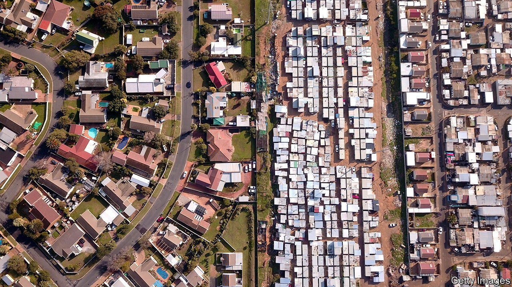

###### All right for some

# Why Africa is one of the most unequal continents in the world 

##### Income inequality varies widely across countries 

 

> Apr 13th 2023 

“Night and day my heart is bleeding,” sings the Zimbabwean artiste Winky D on his new album. “When I look at the poor and needy, everything gone with the greedy.” It seems the authorities do not share his concern. Last month the police stormed the stage mid-performance and shut down his gig.

Singers sometimes do a better job of chronicling African than economists. With patchy data, measures of income distribution have long been little more than guesswork. But researchers are starting to peer through the statistical fog and uncover new evidence about inequality—past and present. They describe a continent that is staggeringly unequal in some parts and far less so in others.

Most data come from household surveys, which tend to play down the extent of inequality. One reason is because questionnaires often ask people how much they consume, rather than how much they earn—and the rich rarely spend all their income. Another is that top-earners are less likely to be sampled. Some surveys in Ivory Coast, for instance, leave out French and Lebanese residents entirely. 

In a newly published paper, Amory Gethin and his colleagues at the Paris School of Economics contrast evidence on income and consumption, cross-check survey responses with tax records, then adjust the raw numbers accordingly. Their method applies big assumptions to sparse data, but makes it easier to compare Africa with other continents. If their estimates are right, then the pre-tax income of the top tenth of Africans is 54% of national income. For the bottom half it is just 9%. The ratio between the two is larger in Africa than any other region in the world. 

 


Just as striking are the differences between African countries (see map). , where the richest tenth gobble 65% of the cake, is in a league of its own. Inequality tapers off in western and northern parts of the continent, where the lucky few get a 45% share. In those places, the income distribution looks more like America than Brazil. They are still unequal, but hardly global outliers.

This diversity emerges from a convoluted history, argues a new paper by Ewout Frankema and Michiel de Haas, both of Wageningen University, and Marlous van Waijenburg of Harvard. They argue there have been three waves of rising and falling inequality in Africa, each characterised by different ways of accumulating wealth. The first, beginning in the 17th century, was built upon slavery and the control of trading routes. A warrior class profited by selling their fellow Africans to European and Arab traders. 

The second wave washed in during the 19th century, as European countries colonised much of Africa. In general, the most unequal countries were those with the most settlers. In southern Africa, racist regimes stole vast tracts of land and imposed white-minority rule. Inequality also rose in places where the production of new commodities required a great deal of capital, such as the deep gold mines in South Africa, or was based on plantations.

The three authors argue that the third wave runs from the 1950s to the present day. After independence some governments grabbed the assets of their country’s Asian and white minorities, redistributed land or established socialism, often with disastrous effects on growth. Then in the 1980s more countries began to turn to the free market in the pursuit of growth and prodded on by the World Bank and the IMF. But a commodity crash reduced the money available for redistributive policies. Liberalisation was often blown off course by corruption as privatised businesses or oil revenues were snaffled by insiders.

Curiously, this latest wave does not show up in household surveys, which find no consistent trends in inequality within countries since 1990. One possibility is that policies that tend to increase inequality were offset by equalising forces, such as abolishing price controls that kept farmers poor. Some academics argue that the era of free capital flows has made it easier for tycoons to stow money away in tax havens, where the income it generates is hidden. By one estimate, as much as 30% of Africa’s financial wealth is held offshore. 

Development economists have generally been more concerned with poverty than inequality: feeding the poor is often more urgent than counting yachts. But many are now realising that . Although economic growth is the best way to reduce poverty, its power is dampened in those African countries where inequality is high, reckons Augustin Fosu of the University of Ghana.

My friends all drive Porsches

African governments have, for the most part, avoided interstate war. With little need for mass mobilisation, ruling elites have rarely had to make the kind of grand bargains with citizens that built redistributive states elsewhere. On average, African governments collect taxes worth just 16% of GDP. About half of that comes from levies on goods and services, which fall on rich and poor alike. Politicians are often trying to squeeze more tax out of small businesses even as they grant waivers to multinational companies to encourage investment, notes Ayodele Odusola, an economist at the UN Development Programme.

Informal money flows can redistribute wealth. Urban workers send money back to the village; the devout give alms to the needy; politicians hand out jobs and money to networks of allies. In low-income countries this kind of support makes a much bigger dent in poverty than do state-run programmes of social assistance, according to researchers at ODI, a think-tank in London. But the impact on inequality is muted because the rich get larger private transfers than the poor.

Norms of sharing and social views may be evolving. In many African societies there was a pervasive belief that wealth comes from supernatural sources, says Ebenezer Obadare, a sociologist at the Council on Foreign Relations, an American think-tank. Those beliefs have sometimes kept inequality in check, by implying that the rich have become so through conniving with sinister forces. But the spread of Pentecostalism and its “prosperity gospel” has turned money into a blessing from God, giving divine sanction to income gaps. Sauti Sol, a Kenyan band, sings of believers squashed into shared taxis while pastors ride in BMWs. Sometimes a catchy lyric says more than a statistic ever can. ■

