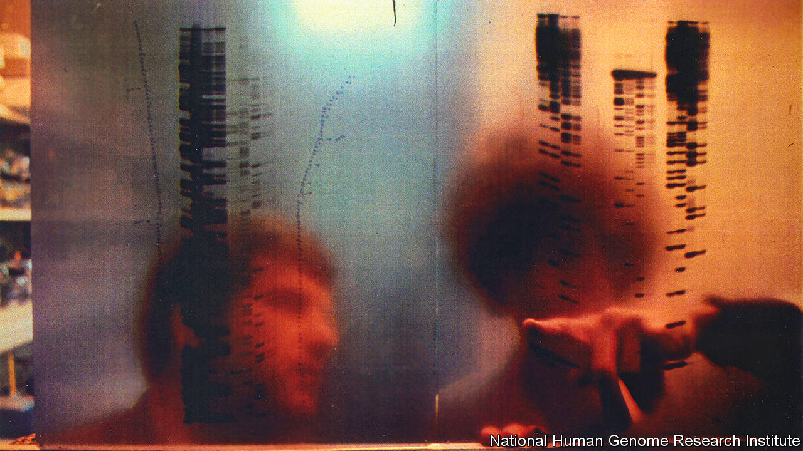
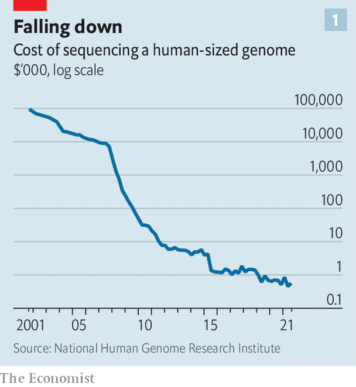
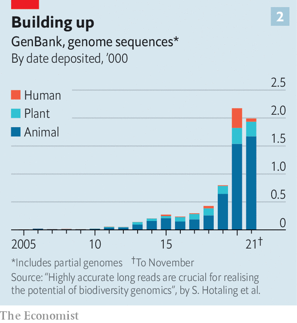

###### The Human Genome Project

# How the Human Genome Project revolutionised biology 

##### Twenty years on, the field has changed beyond recognition 

 

> Apr 8th 2023 

Big is beautiful. That was the message of post-second-world-war science. The model was the  to build the first atom bombs. When hostilities ended, it continued with larger and larger particle accelerators, to probe matter at smaller and smaller scales—and bigger telescopes to do that probing at the largest scales imaginable. And, of course, there was the , which at its height in the mid-1960s absorbed more than 4% of America’s federal budget. After the Apollo Moon landings it went on to spawn the space shuttle and the International Space Station, as well as a programme of uncrewed missions to explore the nether reaches of the solar system. 

Nice for scientists, then. But so 20th century. For all of these projects were essentially about physics. By the late 1980s biologists were gaining confidence that the next century would belong to them. Biotechnology—the ability to tweak DNA itself to make useful products—was taking wing. The number of biologists in training was booming. Some in the field were looking enviously at the physicists and asking themselves where they might queue up to dip their bread in the gravy.

The answer, after the usual political haggling, was the Human Genome Project (HGP), an American initiative globalised through the International Human Genome Sequencing Consortium of 20 laboratories, eight of which were outside the United States. Though cheap by the standards of big physics (its projected cost of $3bn would barely have bought a couple of shuttle launches to the space station), it gave biology a taste of the big time. 

It also created a substantial and continuing news story for the media to cover—an Apollo project, if you like, for the discipline. And, by spurring the development of DNA-sequencing technology, by showing how biological research could be organised on a large scale, and by revolutionising the field of molecular genetics with its results, it changed biology itself.

The idea was to spend the money working out the order of the 3bn or so base pairs that constitute the DNA of the human genome. Base pairs are the twin chemical units which form the heart of the double helix that is DNA. Their individual components (A&amp;T and C&amp;G) are the chemical letters of the genetic script. 

When the project started in 1990 people thought this script came in two forms: genes and junk. The genes almost all encoded proteins, and transferred their information to a cell’s protein-building apparatus via messenger molecules made of a DNA-like substance called RNA. The junk was, well, junk.

A billion here, a billion there

How wrong they were. There is a lot more to functional DNA, it turns out, than protein-coding genes alone. There are now reckoned also to be genes that turn out more than half a dozen classes of non-messenger RNAs, each with a different job to do. Besides those involved in making proteins, others assist in gene regulation, DNA replication and the process of splicing, by which superfluous material is excised from RNA messengers. On top of those are stretches of DNA that serve to regulate how a gene gets expressed in the body’s cells. 

Even the non-functional DNA is interesting. Much of it consists of self-copying elements called retrotransposons, which might be viewed as the genetic equivalent of parasites, though some have been co-opted into useful roles. Buried among those are fossil remains of ancient viral infections and of genes that once worked, but which natural selection has disabled. 

The other unexpected discovery was how few protein-coding genes there are. Predictions at the beginning ranged from 50,000 to 100,000. In fact, the figure is about 20,000. This is more or less the same as turned out to be the case for mice (which had their own, subsidiary genome-sequencing project), and only 50% more than for fruit flies (ditto). Whatever it is that makes human beings bigger and more sophisticated than other animals, it isn’t having more genes which encode proteins.

These things, though, took a while to find out. First, the project had to be set up. That happened under the auspices of James Watson, co-discoverer with Francis Crick of DNA’s double-helical structure and of the way base-pairing works: in a genetic sequence, A (adenine) always pairs up with T (thymine), and G (guanine) always pairs with C (cytosine). Like the genome itself, the project was a kludge. Besides the complication of its international extension via the consortium, even the American part had two masters. It was dominated by the country’s National Institutes of Health (NIH). But the Department of Energy (DoE) was also involved. The DoE’s interest in matters nuclear (it runs America’s weapons labs), and therefore mutagenically radioactive, had given it a well-established mandate to do genetic research. That complicated the bureaucracy.

No battle plan survives enemy contact

Dr Watson left in 1992, over a dispute about patenting sequences of DNA (he did not want it but the NIH, in certain circumstances, did), and was replaced by Francis Collins, a disease-gene hunter from the University of Michigan. In Britain, meanwhile, the Wellcome Trust (one of the world’s biggest medical-research charities) pitched in with a purpose-built sequencing factory called the Sanger Centre (after Fred Sanger, who invented DNA sequencing), near Cambridge. This was to be run by John Sulston, an expert on the genetics of a nematode worm called . This ended up doing about a third of the work. And then there was the formidable presence of Eric Lander, head of the Whitehead Institute/MIT Centre for Genome Research, in Cambridge, Massachusetts, which he managed to turn into the largest of America’s sequencing laboratories. 

At the start of the HGP its leaders thought it would take 15 years to complete. But they reckoned without the efforts of the man who would become the project’s disruptive-innovator-in-chief—Craig Venter. Dr Venter initially upset the applecart in 1995, by using a novel technique called whole-genome shotgun sequencing to produce the first full DNA sequence of a living organism (a bacterium called ). 

Then, in 1998, with money from Perkin-Elmer, a scientific-instrument company that was about to launch an upgraded sequencing machine, he set up a rival, private, human genome project, in the shape of a firm called Celera. The plan was that the company would make money from patenting genes it discovered that were thought to have commercial potential.

Whole-genome shotgunning, as the name suggests, blasts entire genomes into sequenceable fragments. It produced results faster than the traditional sequencing methods being used thus far by the HGP consortium. The  incident was bad enough for those running the official project. That Dr Venter might repeat it with a genome 1,700 times bigger would be even more embarrassing. But what particularly horrified people was the patenting. 

After its own early foray in that direction, the NIH had by now changed tack. The official project was putting its discoveries straight into the public domain, making them unpatentable. Dr Watson said in an interview, referring to Celera’s approach, “You shouldn’t patent something a monkey could do.” Sulston was equally critical. “I believe”, he said, “our basic information, our ‘software’ [meaning the genome], should be free and open for everyone to play with, to compete with, to try and make products from…Craig has gone morally wrong.” 

The gloves were now off. Under Dr Lander’s tutelage (for he had now become the project’s self-appointed knocker-together-of-heads) the public endeavour was reorganised to become truly big science, with an industrialised effort focused on just five laboratories, including his and Sulston’s, that had the capacity to scale up quickly. New deadlines were set: to produce a “working draft” by 2001 and to complete the genome sequence in 2003. Celera, meanwhile, built its own genome-sequencing factory, stuffed with Perkin-Elmer’s new machines, in Rockville, Maryland, a few kilometres from the NIH’s headquarters in Bethesda.

In the end, a truce was called. In a deal brokered by Ari Patrinos, head of the DoE’s side of the project, Dr Collins and Dr Venter shook hands under the benign gaze of Bill Clinton at the White House on June 26th 2000, and the race was declared a dead heat. Both sides, it was agreed, had finished a working draft. In Britain Tony Blair, then prime minister, similarly honoured Dr Sulston and Dr Sanger at 10 Downing Street. Champagne corks popped and everyone celebrated.

The memory lingers on

You can, though, celebrate finishing something only once. So when, on April 14th 2003—as Dr Lander had decreed, and two years ahead of the original schedule—the consortium declared the project truly completed, nobody really noticed. And, in truth, even then it wasn’t. That announcement was of a finished sequence which covered 99% of the genome and was 99.99% accurate. But the 99% applied only to the so-called euchromatic parts of chromosomes, the bits where the genes are. It ignored the rest—the telomeres which cap each end of a chromosome, and the centromere that links its two arms—all of which are full of repetitive, and thus hard-to-sequence, DNA. 

Yet these bits are important. Telomeres shrink each time a cell divides, limiting the number of possible divisions and so contributing to ageing. And centromeres are the places where chromosomal replication, which precedes cell division, start. But it was only in March last year that this remaining 8% of the genome was fully cracked, by a group called the Telomere-to-Telomere (T2T) consortium. And even that was not the actual end. The completion of the Y chromosome, characteristic of men and also replete with repetitive DNA, was announced by T2T only in December.

So the project is now truly over. But the captains and the kings departed long ago. Dr Watson and Dr Lander are both in the doghouse. In 2007, and again in 2019, the former made some appalling public remarks about genetics, intelligence and black people, and is pretty much shunned as a result. The latter’s robust approach to management—which did so much to get the project back on track in the face of Dr Venter’s challenge—is now out of sympathy with the times. It led to accusations that he had bullied staff during his brief tenure as President Joe Biden’s science adviser, for which he publicly apologised. 

Dr Collins, with a skill that the Vicar of Bray would have admired, not only survived two changes of administration as America’s chief geneticist but was subsequently, in 2009, made head of the NIH, where he pulled off the same administration-hopping trick, retiring in December 2021. John Sulston died in 2018. Dr Venter set up a not-for-profit research institute in his home of La Jolla, California, which last year he transferred to the University of California, San Diego; and a commercial outfit, Synthetic Genomics (now Viridos), which Dr Patrinos also joined, that works on biofuels. 

Extraordinary achievement though it was, no one has yet won a Nobel prize for the Human Genome Project. Perhaps no one will. In the end Dr Watson was half right. Obtaining the sequence itself, if not quite something a monkey could do, was, once the technology was perfected, mainly handle-turning. But what you do with that sequence is another matter.

Transcripts of reality

The sheer complexity of the genome has been a revelation. At a stage of his career when he was working at the NIH, before he left to become the public project’s gadfly, Dr Venter had sought to short-circuit the enterprise using a technique called expressed sequence tagging. This employs DNA copies of parts of the RNA messengers (because DNA is a more stable molecule) to characterise genes and also to locate them on chromosomes. On the old model of genes and junk, pursuing this route could have found a lot of the genes (because only the genes would have been transcribed into RNA in a cell in the first place). The junk, in his view back then, could probably have been ignored.

Making “transcriptomes”, of which this was an early example, has indeed become a useful tool. But the way RNA messengers are generated is more complex than simply copying a stretch of DNA. Genes themselves contain sequences called exons that end up in the messenger and others, called introns, that don’t. (They are copied, but then edited out in the process of splicing.) Also, different messengers, with different combinations of exons, sometimes emerge from the same stretch of DNA.

The discovery of intricacies like this, which give a far better understanding of how cells work than previously existed, has eroded the idea of genetics being a separate discipline and turned it into a branch of molecular biology. One of the most exciting parts of applied biology at the moment is the field of gene-editing, which has both medical and agricultural uses. It relies on tweaked versions of molecular constructs that bacteria use to chop up viral intruders by recognising their genetic material. It uses these to excise and replace bits of DNA in target organisms. Genetics? Molecular biology? Or no distinction?

Understanding genetics at the molecular level also helps the understanding and treatment of disease. This is especially true for cancer, which is caused by mutations of parts of the genome that regulate cell growth and division. It is true, too, for what are known as Mendelian disorders, in which a single malfunctioning gene is the cause of the symptoms. But it has far wider ramifications than these. 

The rise of biobanks—mass repositories of data and tissue samples that archive information on people’s medical histories and other relevant aspects of their lives, along with their genomes—is beginning to reveal more subtle impacts of genes on health, and especially how genes and environment interact to create disease. Just as any distinction between genetics and molecular biology has now been blurred, so too will the distinction between genetic and non-genetic illnesses.

 


All this is made possible by the continued improvement and cheapening of the process of sequencing itself (see chart 1 ). The latest machines, from a firm called Oxford Nanopore Technologies, do not even need to break DNA strands into fragments. Rather, they pull an entire strand through a molecular pore mere nanometres in diameter, reading the bases as the strand passes and yielding a result in minutes. 

No part of biology is untouched by the consequences of the genome project. Even muddy-boots disciplines like ecology and animal behaviour benefit. They can use sequencing to discover which species are present in an area, and sometimes to count individual animals. Sequencing has also revealed a diversity of micro-organisms on land and at sea that had hitherto just been guessed at, because most such microbes cannot be cultivated in laboratories.

And one other thing. The model of multi-centre collaboration pioneered by the International Human Genome Sequencing Consortium is now a standard way of doing biology. There is still a tension between the sort of diversity the consortium began with and the centralising economies-of-scale approach that Dr Lander imposed at the end. But with the vast improvement in communications brought about initially by email and the world wide web, which rose in parallel with the genome project, and subsequently by social media, huge collaborations are now possible, for example the Human Cell Atlas, which has 1,483 participating organisations scattered around the world.

What of the downsides? One thing which concerned people in the 1990s was that information about health risks revealed by individuals’ DNA might be abused, either by employers or insurance companies. That has not happened so far. If anything things have gone in the opposite direction, with legislation in some places banning discrimination by insurance firms based on the most obvious genetic distinction of all, that between males and females. 

Another fear was that genetic knowledge might lead to tinkering for enhancement not just of crops and animals, but of human beings. When somebody actually tried to do this, though, in 2018 in China, the roof fell in on him. He was excoriated by the world’s scientists, and imprisoned by his country’s government. 

To infinity and beyond

A third worry was that a project which, for obvious reasons, was conducted in a bunch of rich countries, would fail to benefit poorer parts of the world. At the beginning it was indeed true that most human genomes were collected in the rich world. But that is changing. 

 


In 2021, for example, the Three Million African Genomes project was set up to redress the fact that less than 2% of all sequenced genomes were, at that time, African—though Africans form 17% of humanity. The hope is thereby to ask questions the answers to which relate more to Africa than to the rest of the world. More genomes, from many species, are increasingly being added to the world’s databases (see chart 2).

The quarrelsome, egotistic white men who set the genomic ball rolling back in the 1990s have thus created something that is changing humanity’s understanding of both the world and of itself—even to the point of showing that many non-African people are actually descended from hybridisations between  and other species of humans who were already living in Asia and Europe as the former spread from its African homeland.

Genomics has therefore come to form a framework for biology in the way that the periodic table forms one for chemistry. It touches everything. And with that, the ambitions for their subject of those biological prophets of the 1980s are being fulfilled in a manner they could scarcely have dreamed of. ■


