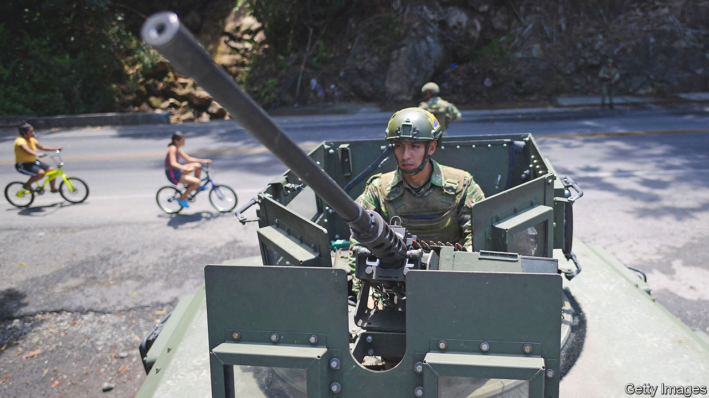

###### Total chaos

# An ambitious plan for “total peace” in Colombia is faltering 

##### Gustavo Petro’s central policy looks shakier than ever 

 

> Apr 13th 2023 

When Gustavo Petro came into power as Colombia’s first avowedly left-wing president last year, he made achieving “total peace” in the country his main priority. Less than a year later, his search for peace appears shakier than ever. 

Mr Petro’s plans always seemed ambitious. Colombia has been plagued by internal conflict for over half a century. Presidents have wrestled with the problem in varying ways: Iván Duque, his conservative predecessor, encouraged the armed forces to target the heads, or “kingpins”, of gangs. Previously, Juan Manuel Santos, president from 2010 to 2018, spent four years negotiating a peace deal with the country’s then-biggest and oldest guerrilla group, the Revolutionary Armed Forces of Colombia, known as the FARC. In 2016 most of the FARC agreed to lay down their arms in exchange for reduced sentences, seats in Congress and numerous social guarantees. 

In December Mr Petro, who as a young man was a member of m-19, a nationalist guerrilla group, announced a six-month truce with the country’s five largest armed groups, including the National Liberation Army (known as ELN), a leftist guerrilla group, and the Clan del Golfo, the largest drug gang. On March 15th the president presented a new law in Congress, which alongside his law on “total peace” establishes the legal framework for the government to negotiate with criminal armed groups and to grant them reduced sentences if they cooperate.

However both the ELN and the Clan del Golfo are no longer part of the ceasefire. The ELN claims it never signed up in the first place, while Mr Petro ended the truce with the Clan del Golfo on March 19th after the gang was found to be involved in a mining strike. The president also faces a struggle to get approval for his new law, which may be voted on in coming weeks. Francisco Barbosa, the attorney-general, criticises the law, which he says will pardon criminals. Mr Barbosa is also concerned that the law erodes the independence of the prosecutor’s office.

Alongside this, violent attacks have increased in recent weeks. On March 2nd miners went on strike in Bajo Cauca, after Mr Petro ramped up a military operation to clamp down on illegal gold mining. Colombian intelligence found that members of the Clan del Golfo infiltrated the strikes—forcing shops to close, blocking roads and leaving thousands of people without access to basic goods. It was only after the group burned six vehicles that Mr Petro finally ended the ceasefire.

Similarly on March 29th the ELN attacked an army base in Catatumbo, an area on the border with Venezuela where coca, the raw plant base of cocaine, is grown. Nine soldiers died. Less than a month before, a farmer and a police officer were killed during peasant strikes in Caquetá, in the Amazon region in the south. Over 70 police officers were taken hostage for a day.

“Those events are minor setbacks…it’s part of negotiating in the middle of conflict,” says Frank Pearl, the chief negotiator with the ELN under Mr Santos. Others are less sanguine. Mr Petro’s son and brother are accused of receiving bribes from drug gangs to achieve concessions in the ceasefire process (they both deny wrongdoing). Meanwhile Mr Petro’s cabinet turned against him in February over a health reform. “Total peace” looks more like a slogan rather than an achievable goal. ■

