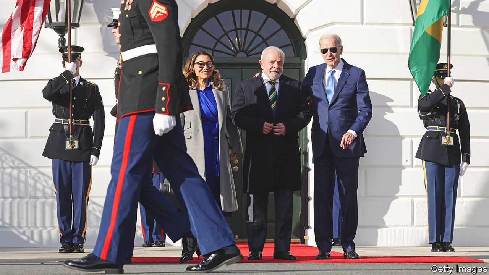
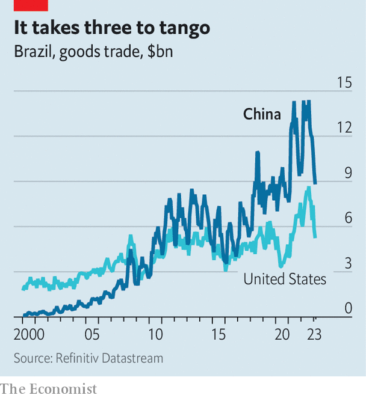
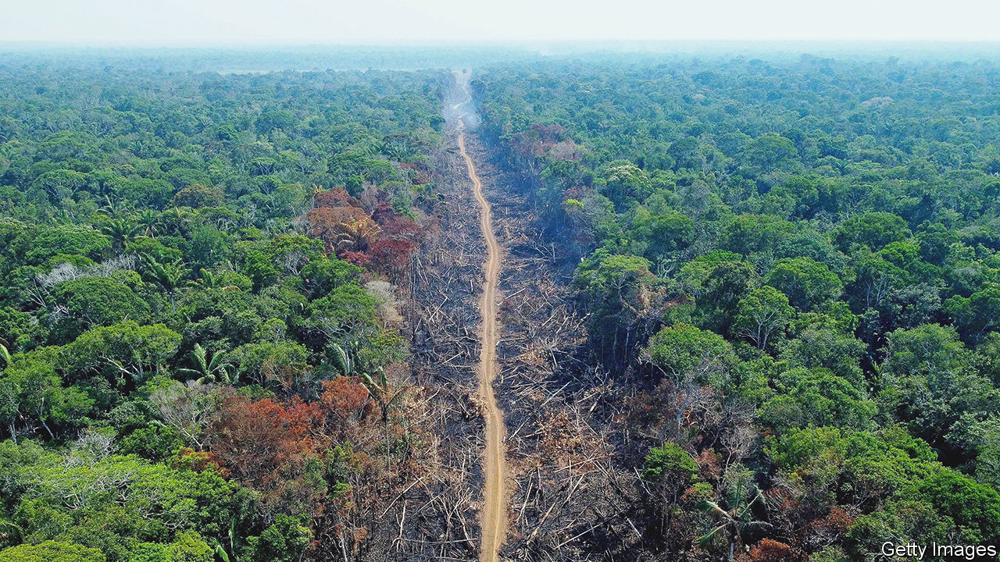

###### Back in the big league

# Brazil’s foreign policy is hyperactive, ambitious and naive 

##### Luiz Inácio Lula da Silva goes to Beijing with grand plans of a “peace club” over Ukraine 

 

> Apr 10th 2023 

When Luiz Inácio Lula da Silva was elected as  in October, his victory speech hinted at his global ambitions: “Today we say to the world that Brazil is back.” In his first 100 days in office Lula, as he is known, has tried to prove this with a series of trips abroad. In January he visited his Argentine counterpart. In February he went to the United States to meet President Joe Biden. On April 14th, as  went to press, he was due to meet Xi Jinping, China’s president, in Beijing. Next week Sergei Lavrov, Russia’s foreign minister, will visit Brazil. Lula also wants to lead the fight against climate change and to set up a “peace club” to end the war in Ukraine. His top foreign policy aide secretly travelled to Moscow to discuss the idea with Vladimir Putin, Russia’s president, in March. 

Much as in his first two terms in office between 2003 and 2010, Lula wants Brazil to have a seat at the table on the thorniest issues of the day. His ambitions should be taken seriously. As president in the early 2000s, Lula charted a pragmatic, independent diplomacy that was bent on pursuing Brazilian interests and creating a “multipolar” world at a time of American hegemony. He helped found the BRICS—a bloc of emerging economies that includes Russia, India, China and South Africa—and irked the United States by trying to broker a deal over Iran’s nuclear programme together with Turkey, which would have allowed Iran to ship enriched uranium to Turkey rather than close down its programme.

Yet while Lula’s international ambitions have remained grand,  since he was last in office. Brazil is more polarised and Lula’s domestic support has diminished: he won the election last year with a 1.8 percentage-point margin, the narrowest victory since Brazil’s return to democracy in 1989. China is no longer an emerging market but a world power. War has broken out in Europe and human-rights violations in Latin America have worsened. All this has increased the costs of being chummy with everyone. In Lula’s third term, Brazil’s commitment to non-alignment will be severely tested. By trying to play the role of global peacemaker, Lula risks looking naive rather than like an elder statesman.

In many ways, Lula’s active diplomacy represents a continuation of Brazilian tradition. Brazil comprises a third of Latin America’s population and almost the same share of its GDP. It fought alongside the Allies in both world wars and has long clamoured for a permanent seat at the UN Security Council. Its mediation in local conflicts has helped make South America the region with the fewest interstate wars. The constitution from 1988 says that foreign policy should be based on non-intervention, the peaceful settlement of conflicts and “equality among states”. 

Brazil’s foreign policy suffered under Lula’s protégée, Dilma Rousseff, who succeeded him as president, and under her successor, Michel Temer, who turned inwards after economic mismanagement by Ms Rousseff led to a deep recession in the mid-2010s. Jair Bolsonaro, a right-wing populist who was president from 2019 to 2022, . He bashed China and mostly visited other nationalists, such as Donald Trump. His enthusiastic support for deforestation made Brazil an international pariah. Lula wants to fix this legacy. 

His first balancing act will be managing the rivalry between the United States and China. Mauro Vieira, Lula’s foreign minister, has said that Brazil will not have “automatic alignments”. At their meeting, Lula and Mr Biden focused on democratic values, human rights and the environment. They bonded over their similar experiences with insurrectionists. (Mr Bolsonaro’s supporters attacked government buildings in January, much as some of Mr Trump’s supporters did in January 2021.) Yet, though officials say the trip was a success, the outcome was underwhelming. The United States signalled an intention to donate $50m to the Amazon Fund, a billion-dollar mechanism to reduce deforestation. Germany recently committed more than four times as much. 

Where’s the beef?

By contrast, the agenda with China is more “concrete, wide-ranging and far-reaching”, says Sergio Amaral, Brazil’s former ambassador to the United States. The trip, originally scheduled for March, was postponed after Lula contracted pneumonia. It was to have included a delegation of five ministers, dozens of legislators and 240 business representatives. 

Signs of goodwill abounded ahead of the original trip. Days before, China lifted a suspension on buying Brazilian beef that had been imposed a month earlier, after a case of mad-cow disease was discovered in Brazil. Under Mr Bolsonaro it took three months to get a similar ban lifted. Brazil’s government is taking steps to allow trade to be settled in yuan, China’s currency. It may sign up to China’s Belt and Road Initiative, an infrastructure programme.

 


More than 20 agreements are expected to be signed on the rescheduled trip, ranging from investments in renewable energy to co-operation on science and technology. Marina Silva, Brazil’s environment minister, told  that a priority is to seek investments in renewables, particularly in green hydrogen, a fuel that can be made using solar and wind power. Another important area is satellites. But any new deals could unnerve the United States, which worries that satellites could be used to monitor military activity. 

Most of the agreements will be about foodstuffs. A third of the business representatives in the original delegation—many of whom arrived before Lula postponed his first trip—came from the agriculture sector. Marcio Rodrigues, the head of exports at Masterboi, a meat-packing giant, was in Beijing in March. He says “the Chinese were very receptive” and points out that, despite Lula not being present, several beef, pork and chicken companies got licences to export to China. Brazil also wants to diversify and add higher-value goods to its export basket. In November China opened its market to Brazilian maize. Now Brazil is set to rival the United States as the world’s biggest exporter of the stuff. Rice and certain types of fruits, such as grapes and limes, could be next.

The weight of the agribusiness delegation reflects the nature of the relationship, which is built on the back of Brazilian commodities exports. China surpassed the United States to become Brazil’s biggest trading partner in 2009. Today it imports from Brazil almost two-thirds of its soyabeans, two-fifths of its beef, and a fifth of its iron ore. Yet the United States remains by far the largest investor in terms of FDI. In 2020 it held $124bn in investments in Brazil, compared with only $23bn from China, according to Brazil’s central bank. Much of what Brazil exports to the United States, meanwhile, is of higher value, including planes and steel. “We depend on both countries,” says Dawisson Belém Lopes of the Federal University of Minas Gerais. Deepening trade with China is unlikely to vex the United States. 

Lula may alienate Brazil’s partners in his ambitions to be a global peacemaker. His earlier attempts to broker a deal over Iran riled the United States. Lula does not appear to have learnt the lesson. His proposal to set up a “peace club” to end the war in Ukraine annoys both the West, which believes Lula has been too soft on Russia, and Xi Jinping, who has his own plan. 

 


So far Lula’s attempts at non-alignment have seemed rather one-sided. Although Brazil voted at the UN to condemn Russia for invading Ukraine, Lula has said that Volodymyr Zelensky, Ukraine’s president, is “as responsible as Putin for the war”. In January he reiterated the point after rejecting Germany’s request to send ammunition to Ukraine.

He has since softened his language. On April 6th he acknowledged that Russia “cannot keep the Ukrainian territory” it has captured since 2022, though he suggested Ukraine may have to surrender Crimea. Even so, when Lula’s top foreign-policy adviser, Celso Amorim, went to Europe in March, he met Mr Putin in Moscow but did not visit Ukraine. The most Lula has done is to Skype with Mr Zelensky. Russia is not just a partner in the BRICS, but supplies a quarter of Brazil’s fertilisers. That Mr Amorim met with Mr Putin, rather than someone of similar rank, suggests Russia benefits from playing up ties to Brazil, too.

“If you want to be taken seriously in a conversation to moderate this conflict, you have to visit both sides,” says Bruna Santos of the Wilson Centre, an American think-tank. Beyond appearing partial, Lula risks looking naive. Brazil lacks the geopolitical heft to get either Ukraine or Russia to stick to the terms of a deal, says Oliver Stuenkel of the Getulio Vargas Foundation, a university. “There is still a perception that the worst that can happen is that Brazil’s peace initiative just doesn’t have the desired effect. But there is actually a risk that it could undermine Brazil’s relationship with Europe .” 

Brazil has better chances of mediating closer to home. Shortly before Mr Amorim went to Moscow he met Nicolás Maduro, Venezuela’s autocrat, and members of the Venezuelan opposition (presidential elections are due there next year). Since returning to power, Lula has revived moribund talking shops on regional co-operation, and is pushing for a deal between the European Union and Mercosur, a trade bloc composed of Argentina, Brazil, Paraguay and Uruguay, to be ratified this year. But he may struggle to be an honest broker in Nicaragua, which is ruled by Daniel Ortega, a dictator. Lula compared Mr Ortega’s 16-year rule, consolidated by persecuting rivals, to Angela Merkel’s democratic tenure of a similar length in Germany. That will hardly endear him to the opposition.

Brazil will, however, have a chance to play a leading role in . Lula is pushing to host COP30, an environmental pow-wow, in 2025. He is also seeking to reactivate the Amazon Pact, a treaty from 1978 that brings together the eight countries that share the rainforest. Between 2004 and 2012 the annual rate of deforestation in the Amazon fell by 80% thanks in part to tougher laws promoted by Ms Silva, Lula’s climate tsar at the time. She is now back in her old job.

All this means that Brazil is already a global power on the biggest issue for humanity’s future. Lula’s legacy may be better served by spending his energy on areas where Brazil has clout, such as the environment, rather than on grand political topics where it has little or none. ■

