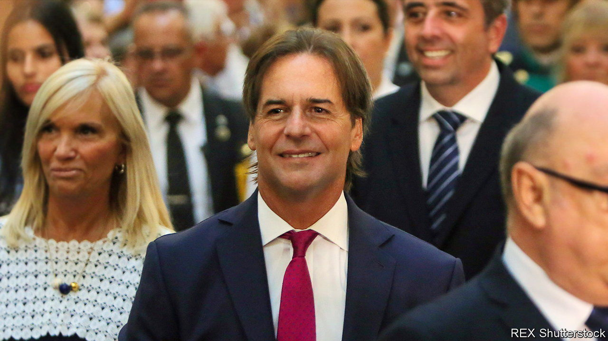

###### Losing its sheen

# Uruguay is losing its reputation as Latin America’s success story 

##### Crime and corruption scandals have hurt Luis Lacalle Pou, the conservative president 

 

> Apr 13th 2023 

Squeezed between politically polarised Brazil and economically dysfunctional Argentina, Uruguay looks like a model country. More than 95% of its electricity comes from sun, wind, water and biofuels. Same-sex couples can get married. Residents can buy cannabis from pharmacies. In international comparisons Uruguay ranks as South America’s most peaceful and least corrupt country. Other leaders skulk in palaces; Uruguay’s president, Luis Lacalle Pou, works from a glass office, overlooked by a block of flats.

This sparkling reputation has recently dulled. In February, Alejandro Astesiano—until recently Mr Lacalle Pou’s security chief—was sentenced to four and a half years in prison for influence peddling, criminal association and revealing state secrets. Prosecutors said that Mr Astesiano had sold fake birth certificates to Russians so they could get Uruguayan passports. Mr Astesiano has also been investigated for spying, including on opposition senators (which he denies). Alongside this is a recent upsurge in crime. Many wonder whether the country will remain a law-abiding exception in a violent region. 

The downfall of Mr Astesiano, a former policeman, is acutely embarrassing for Mr Lacalle Pou, a conservative. He says he had no indication that his ex-bodyguard was up to no good. But in the twenty years they have known each other, Mr Astesiano has had several tangles with the law, which include investigations by the police over allegations of fraud and theft. 

It is not the only difficulty for Mr Lacalle Pou’s administration. In 2021 the tourism minister resigned after accusations of corruption, which he denies. That year Sebastián Marset, an alleged drug kingpin, escaped capture in Dubai after Uruguayan officials issued him a new passport. In December 2022 the vice-minister for foreign affairs resigned over the case. In January the environment minister quit after it emerged that he had falsely claimed to have a business degree.

Mr Marset is thought to play a role in the events that have made the country a hub of international crime. Gangs ship assault weapons and ammunition between Argentina and Brazil through Uruguay, according to InSight Crime, an investigative outfit. Illegal fishing fleets are taking advantage of lax controls at the free port of Montevideo, the capital.

The security situation has been deteriorating for decades, says Nicolás Centurión, a researcher of organised crime. But covid-19 aggravated the problem. With flights grounded, gangs instead piled Andean cocaine onto containers shipped through Montevideo to Europe. In the past decade, Uruguay’s murder rate has nearly doubled, to 11.2 per 100,000 inhabitants in 2022. 

Mr Lacalle Pou can probably recover from these recent scandals. Corruption in Uruguay is not endemic, argues Rafael Porzecanski of Opción Consultores, a pollster. In February the president sacked police chiefs associated with Mr Astesiano. Congress is grilling the government about Mr Marset’s escape. Even so, crime ranks as the top concern of voters. Mr Lacalle Pou cannot run again, but the stink could imperil the conservatives’ chances in elections next year. ■

