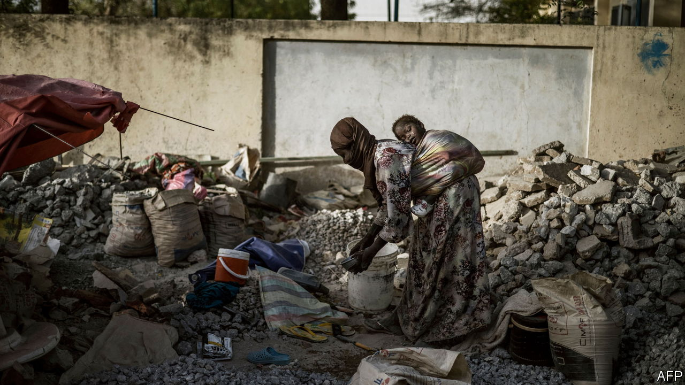

###### The Economist explains

# How to measure poverty 

##### Counting the poor is the first step towards alleviating their plight 

 

> Apr 6th 2023 

ERADICATING POVERTY in all its forms is the first of the UN’s 17 development goals. It is also a priority for many countries. To succeed, multilateral organisations and national governments need good policy—and a way to track their progress. So how should they define and measure poverty? 

In 1795 David Davies, a British priest, published a study that documented the lives of labourers in his rural parish. In perhaps the first-ever attempt to measure poverty systematically, he calculated a sum of money that would allow working-class families to live in “tolerable comfort”. More than two centuries later, the same concept underpins definitions of poverty around the world. Countries identify a minimum level of income required to meet basic needs such as food, clothing and shelter. Those who have less are considered poor. 

Unsurprisingly, these thresholds vary by country. In America, for instance, an individual was deemed poor by the government in 2022 if they earned less than around $41 a day; the similar threshold in Ethiopia is $2 a day. These definitions help governments identify who should benefit from policies to alleviate poverty. In America, for instance, how near or far families are from the poverty line determine their eligibility for health and social programmes, such as Medicaid, a government-funded health-insurance scheme. 

Poverty measures are also important for tracking the impact of policy. The World Bank, for example, uses an international poverty line to compare poverty across countries. Based on what constitutes poverty in the 28 poorest countries, the threshold of $2.15 (expressed in 2017 prices and adjusted for currency differences) is the global benchmark for extreme poverty. By this measure, the proportion of the world’s population living in extreme poverty dropped from more than 35% in 1990 to less than 10% in 2019. According to a study published by researchers at the Centre for Global Development, a think-tank, in March 2023, this ratio could fall to 2% by 2050 with the right economic conditions. 

Yet for many, such progress would not mean the near-elimination of poverty. The World Bank’s dollar measure, which defines a bare-minimum standard of living, tracks “absolute” poverty. It does not account for inequality. Yet a person’s well-being, some scholars argue, depends on how their standard of living compares with that of others. People’s conception of what constitutes basic needs changes by place and over time. 

That is why the EU calculates a “relative” poverty rate based on the share of people with incomes below 60% of the median income in the bloc. The OECD, a group of mostly rich countries, defines poverty as living on half the median household income of the country in question. By this measure, the world is much further from eliminating poverty. According to the World Bank, which introduced a relative-poverty measure in 2018, in 2019 there were three times as many people living in such “societal poverty” as there were in extreme poverty. 

Increasingly, poverty measures take into account more than just income. The UN’s multidimensional-poverty index uses ten indicators that measure education, health and sanitation. These can produce significantly different estimates. In Chad 84% of the population was poor in 2019 by the UN’s measure. But according to the World Bank only 31% of people in Chad live in extreme poverty. In theory, a multidimensional measure can be used to direct policy more effectively. Those households that lack access to medical care, for instance, can be the focus of public-health policy.

Such initiatives work best if governments know exactly who needs help. Global standards, such as the World Bank’s, are useful for picking out trends, but national policymaking requires more granular information to identify places and people that are struggling. Poor countries often lack the resources and know-how to collect such data. Their governments would often rather spend money on eye-catching projects, such as new schools. Building statistical capacity may not be glamorous. But it’s hard to help the poor when you don’t know who they are. ■

