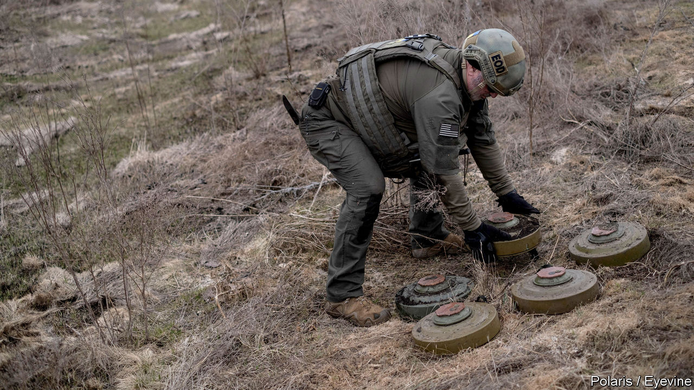

###### The Economist explains

# Why so many Russian tanks fall prey to Ukrainian mines 

##### With the right help, tanks should be able to cross minefields 

 

> Apr 12th 2023 

RUSSIA’S FAILED attempt in January and February to capture Vuhledar, a town in eastern Ukraine, has been described by some observers as a tank battle. That is not quite accurate. Videos of the offensive indicate that it was more a matter of Russian tanks against Ukrainian anti-tank weapons—in particular mines. The mines came off best. According to the , a newspaper based in Amsterdam, the Kremlin has dismissed General Rustam Muradov, the commander responsible for the assault. Similar actions have been seen elsewhere: so why do the Russians keep sending their tanks into minefields? 

Ordering such advances at Vuhledar may seem indicative of a command failure. But for tanks, a minefield should not be impenetrable. Mines rarely destroy tanks, though they will usually succeed in immobilising them by damaging their track or blowing off a wheel. If there are only a few mines attackers may push through; if they capture the territory, damaged vehicles can be recovered. But in Vuhledar, and elsewhere, Ukraine has laid large numbers of mines close together. Attempts to find gaps have been fruitless. More importantly, Russia’s de-mining efforts have been ineffective.

The most common anti-tank mine in Ukraine is the Soviet-era TM-62, which is used by both sides. It is a disc of explosive, usually weighing around 7.5kg with a pressure fuse that is triggered by a tank tread driving over it. Some TM-62s have magnetic fuses triggered by metal above them. Such mines may be buried or, more commonly in Vuhledar, left on the surface. In combat, tank drivers see through periscopes with a limited field of view and cannot necessarily spot them. America has also supplied Ukraine with 155mm howitzer rounds known as Remote Anti-Armour Munitions (RAAM). Each shell scatters nine 2.3kg magnetically activated mines. 

Tank crews have various ways of navigating minefields in relative safety. Since the second world war they have made safe lanes with rollers that are pushed ahead of the vehicle to set off mines. In theory, one tank in each Russian platoon should use a KMT ( or tracked mine trawl) which has rollers to set off pressure mines, plough blades to push buried mines out of the way and an electromagnetic device to trigger magnetic ones. But tank crews do not seem to trust their efficacy. One widely circulated video shows a Russian tank being blown up when its KMT fails to detonate a mine. Many Russian tank crews reportedly dumped their KMTs last summer. 

Platoons without KMTs rely on specialist engineer units to clear their way. Russian engineers have BMR-3MS mine ploughs or UR-77 Meteorits, which launch explosive cables to blast a clear path 90 metres long and six metres wide. In theory these provide safe routes through minefields. But tank drivers may panic under enemy fire and drive out of the lane. If defenders knock out the lead vehicle in a column it blocks the path, forcing those behind it to leave the safe route or reverse under fire. Britain’s Ministry of Defence has said that during the battle for Vuhledar Ukrainian forces fired RAAM rounds into lanes cleared by Russian engineers.

Russia’s inability to punch through minefields has seriously hampered its offensives. In the coming weeks, Ukraine will need to show mastery of what Russia has not. It is planning its own counter-offensive and Russia’s own TM-62 mines guard key territory in the south and east. Ukrainian commanders have shown themselves to be competent and adaptable. And Ukraine has received promises of a trove of Western mine-clearing equipment in recent weeks, from Finnish armoured vehicles to American explosive charges. It will be put to the test. ■

