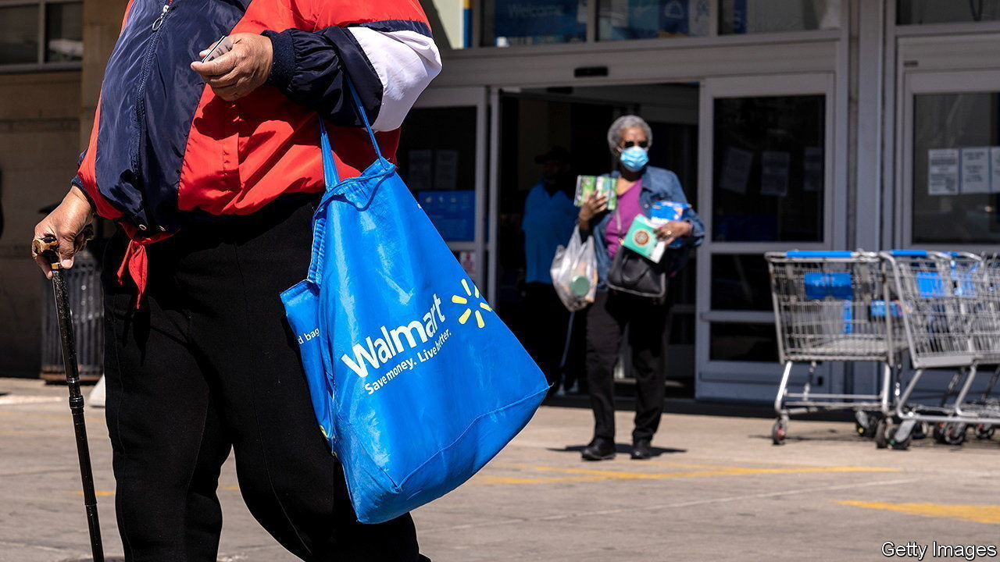
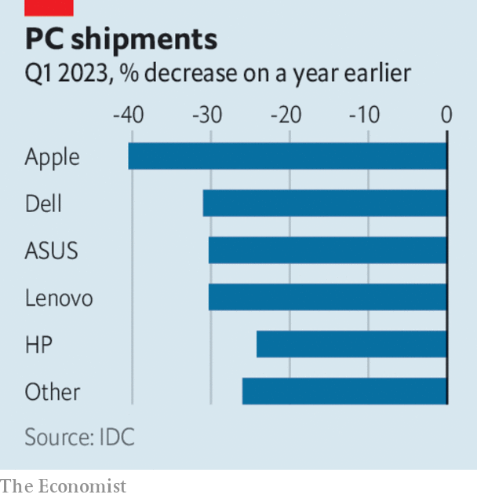

###### The world this week

# Business 

#####  

 

> Apr 13th 2023 

America’s annual  rate fell to 5% in March, the lowest it has been since May 2021. But the core inflation rate, which strips out volatile food and energy prices, rose to 5.6%. There was good news on energy prices. On a month-by-month basis the price of natural gas for consumers fell again, by 7.1%. Petrol dropped by over 4%. But with other data showing another solid monthly increase in the number of jobs created, markets are expecting the Federal Reserve to raise interest rates by a quarter of a percentage point again when it meets in early May. 

Murky outlook

The IMF slightly reduced its estimate of growth in the  this year, to 2.8%. It expects America’s GDP to increase by 1.6% and the euro area’s by 0.8%, though Britain’s could shrink by 0.3%. The fund said that “the fog around the world economic outlook had thickened”, in part because of the recent stress in financial markets caused by the collapse of Silicon Valley Bank and Credit Suisse. It also warned of the dangers from investors pricing in lower interest-rate increases.

Ueda Kazuo started his term as the  governor. At his first news conference Mr Ueda reiterated his commitment to sticking, for now, with the central bank’s ultra-loose policy of negative interest rates and controls on government-bond yields. In December the bank raised its cap on ten-year government-bond yields, from 0.25% to 0.5%, amid market pressure. 

China’s cyberspace regulator outlined new rules for dealing with , such as requiring firms to submit security reviews to the authorities before releasing new technology to the public. Content generated by chatbots must follow China’s “core socialist values” and not “subvert state power”. The measures were published shortly after Alibaba unveiled its rival version of ChatGPT. Meanwhile, the American government asked for public feedback on a proposal that could subject new AI bots to a certification process. 

Press reports suggested that  is preparing to sell most of its remaining stake in , leaving it with a holding of around 4%. The Japanese conglomerate once owned 34% of Alibaba. SoftBank was also reportedly ready to finalise a decision on listing, a chip designer, with an IPO on the Nasdaq exchange. 

Press reports suggested that revenue and profit surged last year at , the privately held Chinese firm behind TikTok and its Chinese version, Douyin. Underlying annual profit was said to have come in at $25bn, which is more than the net profits reported by Alibaba and Tencent. Revenue was $80bn, around the same as Tencent. 

 announced a new combined streaming service, called Max. It merges high-quality programming from HBO, such as “Succession” and “The Last of Us”, with unscripted filler from Discovery (“90 Day Fiancé”, “Pit Bulls and Parolees”). WBD hopes that the combination of quality and reality TV will help it catch up with Netflix and Disney+. 

 (formerly Ernst &amp; Young) abandoned a plan to separate its auditing and consulting businesses, intended to tackle conflict-of-interest issues. The plan was opposed by senior executives in EY’s auditing division in America, who worried that their lucrative work on companies’ taxes would end up in the new consultancy. Ditching the split has reportedly caused anger among those partners who would have received a pay-out. 

 


Global shipments of  fell by around a third in the first quarter of 2023, year on year, according to separate reports from two consultancies. The PC business has recorded several quarters of shrinking deliveries, in part because huge demand during the pandemic has dissipated, and also because economic uncertainty is causing firms to put off investments in new machines. 

The diminishing demand for PCs is affecting the semiconductor industry.  is to cut production of memory chips by a “meaningful level”, after quarterly profit plunged by 96%, year on year. Many of its rivals are also reducing output as chip inventories accumulate. 

China recorded a surprising surge in  growth for March, reversing five months of declines. Exports were up by 15%, year on year, mostly in electric cars, lithium and solar panels. 

A tax by any other name

The  got into a row with  after it was labelled “government funded”. The broadcaster gets its money from an annual £159 ($198) household tax (euphemistically called a “licence fee”). Twitter relented and changed the BBC’s handle to “publicly funded”. National Public Radio in America said it would quit Twitter after it was labelled “state affiliated”. Twitter then changed it to government funded. 

 warned that it is on the verge of bankruptcy. The company marketed its food containers through Tupperware parties, the butt of many a suburban joke. Cheaper products have since flooded the market. Tupperware’s fate will be sealed if it cannot improve its short-term liquidity. 

