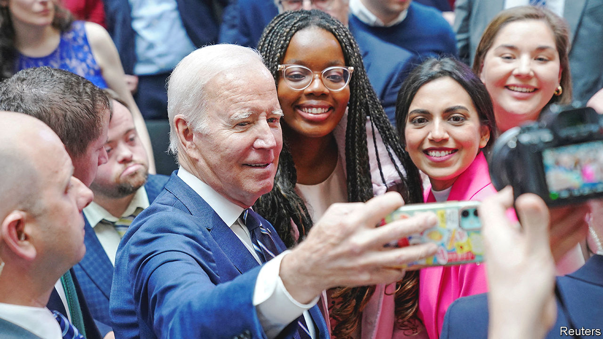
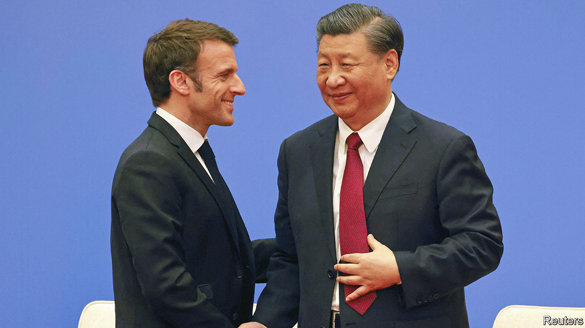

###### The world this week

# Politics 

#####  

 

> Apr 13th 2023 

To mark the 25th anniversary of the Good Friday Agreement Joe Biden visited Belfast, where he briefly met the main parties in . The settlement has ensured peace in the province but getting the politics to work has been harder. The agreement requires unionists and nationalists to share power but the devolved assembly has not sat for 40% of the time since 1998, and is suspended now too. The American president then spent three days in Ireland, visiting his ancestral homeland.

Mr Biden tried to reassure America’s allies that there would be no more leaks of , after the release of a trove of documents online from an unknown source. The sensitive materials show the extent of America’s involvement in Ukraine’s fight against Russia, including details of Ukrainian battle strengths and weapon deliveries. It was the biggest leak of top-secret information since Edward Snowden’s leak of military papers in 2013. 

In  Russia stepped up its bombardments in the front-line Donetsk region, as the battle raged for control of the small but strategically important town of Bakhmut. The commander of Ukraine’s ground forces said the Russians had switched to the type of “scorched earth” tactics that they had used in Syria defending the Assad regime. 

The Biden administration filed an appeal against a judge’s ruling that would suspend the sale of mifepristone, an . The judge sided with an anti-abortion group in deciding that the Food and Drug Administration’s approval of mifepristone in 2000 was unsafe, despite few safety concerns being raised during the 23 years it has been on sale. 

Driving the agenda

America’s Environmental Protection Agency proposed its most stringent measures to date to reduce . The new standards are intended to accelerate the transition to electric vehicles. The EPA thinks the new rules will result in EVs accounting for 67% of new light-duty vehicle sales by 2032. Carmakers were taken by surprise. They are working towards an EV target of 40-50% of car sales by 2030. 

, a justice on America’s , defended trips he had taken on a jet owned by Harlan Crow, a generous donor to the Republicans, describing him as a close friend with whom he has taken family holidays for 25 years. News of the trips sparked more criticism of the court’s lack of transparency.

 fired salvoes of rockets into  from Gaza, Lebanon and Syria after clashes between Israeli police and protesters on the Temple Mount in Jerusalem; Palestinian gunmen shot and killed three British-Israeli women in the West Bank; and an Arab-Israeli rammed a car into pedestrians in Tel Aviv, killing an Italian tourist. Meanwhile Israel’s embattled prime minister, Binyamin Netanyahu, reinstated Yoav Gallant as defence minister. His sacking had triggered huge protests and strikes.

 seized a Singaporean-registered oil tanker in the Gulf of Guinea. It was the second attack in recent weeks. Pirates boarded a Danish-owned oil tanker and kidnapped some of its crew last month. 

A court in the United Arab Emirates turned down a  request for the extradition of Atul and Rajesh Gupta, two brothers who are accused of looting state-owned companies during the presidency of Jacob Zuma. 

 government said it would disband militias formed by regional governments and integrate their members into the regular police and army. Violent clashes broke out in the Amhara region as people protested against the plan.

Over three days of   simulated a blockade and “precision strikes” on , the self-governing island that it claims. The exercises were in response to a meeting between Taiwan’s president, Tsai Ing-wen, and the speaker of America’s House of Representatives, Kevin McCarthy, in California. 

Macron the blunderer

 


Meanwhile, President  said it was “wishful thinking” to expect China to compromise on Taiwan. After meeting Mr Xi in Beijing, , the French president, suggested to reporters that Europe should not follow America’s lead, lest it be drawn into a crisis over the island. He later said that France’s position had not changed and that it favoured the “status quo” on Taiwan. Brazil’s president, , also visited China on a trade mission.

America and the  began two weeks of joint military training, the largest ever between the two countries, with 12,000 American and 5,000 Filipino troops taking part. America recently secured a deal to maintain a presence in four additional military bases in the Philippines, three of which will be on the main island of Luzon, just 400km (250 miles) south of Taiwan. 

At least 100 people were killed when  army attacked a village that was holding a ceremony to honour the local rebels of the opposition National Unity Government. The attack, by fighter jets and helicopter gunships, was the deadliest in recent months in the country’s civil war. 

The High Court in Jakarta overturned an order from a lower court that would have delayed  presidential election by two years. The elections are due to be held in February 2024. Delaying them could have sparked a constitutional crisis. The president, Joko Widodo, known as Jokowi, is due to step down after the election. 

The latest missile launch by  triggered an evacuation warning across  northern island of Hokkaido. The missile fell into the sea.

 remained in intensive care, after being admitted to hospital for a lung infection caused by chronic leukaemia. The former Italian prime minister’s Forza Italia grouping is in Italy’s coalition government. It holds the post of foreign minister. 

Recep Tayyip Erdogan began his campaign for another term as president of  in an election to be held on May 14th. He is seeking re-election with inflation at 50%. And he is widely blamed for the lax building codes that caused so many deaths in February’s . 

Five councils won the right to legally challenge the expansion of the Ultra Low Emission Zone in. The city’s mayor, Sadiq Khan, says the expansion to the outer boroughs will reduce pollution and save lives. Critics say his figures are flawed and the charge for driving in the zone will hit the poorest. 

