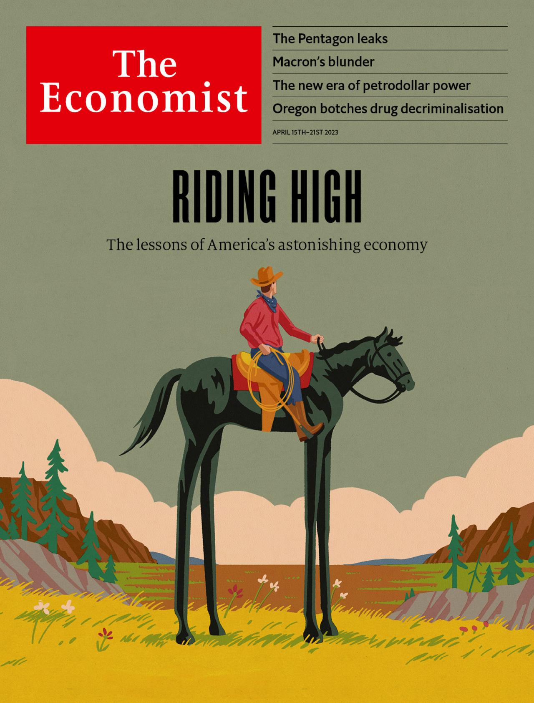

###### The world this week

# This week’s covers 

##### How we saw the world 

> Apr 13th 2023 

Some weeks, including this one, we publish more than one cover. Readers in Europe and North America will see our take on the astonishing economic performance of the United States. In several dimensions America is leaving its peers in the dust. 

 


Meanwhile, in Asia and the Middle East we look at the crafty countries that don’t want to pick sides in the great geopolitical contest of the 21st century. Those “non-aligned countries”, which have sat on the fence on the Ukraine war or in the Sino-American confrontation, are collectively becoming more important. We are argue that in a more transactional world, it will be difficult for either side to win them over.

 


