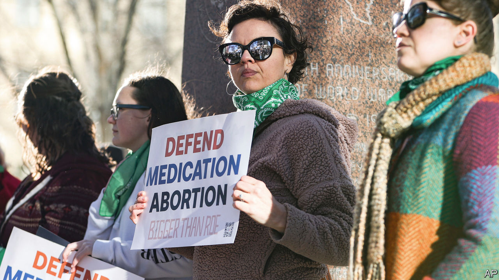

###### Mifepristone muddle

# A federal judge in Texas rules against a popular abortion medication 

##### The stage is set for a Supreme Court showdown 

 

> Apr 8th 2023 

NINE MONTHS after America’s Supreme Court rescinded the  and, in the words of the majority, returned the issue “to the people’s elected representatives”, a federal judge in Texas has grabbed the matter for himself. On April 7th Matthew Kacsmaryk ruled against an abortion medication that has been used by  with few complications. He entered a preliminary injunction nullifying the 23-year-old approval by the Federal Drug Administration (FDA) of mifepristone, one of two drugs commonly used to end pregnancies in the first ten weeks of gestation.

Mr Kacsmaryk’s extraordinary ruling—the first time a judge has revoked the FDA’s approval of a medication—means that residents even of abortion-friendly states could face more obstacles to ending pregnancies. Yet the ruling did not take immediate effect: the judge gave the federal government seven days to lodge an appeal. Both the Department of Justice and Danco Laboratories, mifepristone’s manufacturer, asked the Fifth Circuit Court of Appeals to keep the . 

There is another twist. Less than an hour after Mr Kacsmaryk’s order Thomas Rice, a federal judge in the state of Washington, issued an antithetical ruling prohibiting the FDA from ending Americans’ access to mifepristone. The muddle of the competing verdicts led the Department of Justice to ask Mr Rice how his order jibes with the competing one so that the government may “comply with all court orders in these unusual circumstances”. 

Mr Kacsmaryk’s ruling is ostensibly concerned with the purported health risks posed by mifepristone, which blocks progesterone, a pregnancy hormone, to women and girls. He agreed with the challengers—a group called the Alliance for Hippocratic Medicine—that the FDA’s approval of the drug in 2000 was rushed. The result, he wrote, has been “many deaths and many more severe or life-threatening adverse reactions” than would have occurred had the “FDA not acquiesced to the pressure to increase access to chemical abortion at the expense of women’s safety”. 

Mr Kacsmaryk brushed away studies showing that the drug is safe and effective. “Due to FDA’s lax reporting requirements”, he wrote, the number of bad results is “likely far higher than its data indicate”. 

Concern for women’s health may be the stated reason for the lawsuit, but an antipathy to abortion was the primary motivation behind it. The plaintiffs filed their suit in a district where they would be sure to draw a judge known to be hostile to abortion. Before he was tapped for the court by Donald Trump in 2019 Mr Kacsmaryk worked at the First Liberty Institute, a conservative Christian legal organisation with a mission similar to that of the Alliance Defending Freedom, the group that argued the case against mifepristone in his court. 

The judge endorsed even the plaintiffs’ most aggressive contention. He agreed that a federal law called the Comstock Act, which dates from 1873, prohibits the mailing of any “article, instrument, substance, drug, medicine or thing” that can be used to cause an abortion.

Mr Kacsmaryk’s ruling thus contains the seeds of a sweeping anti-abortion agenda that goes well beyond the Supreme Court’s overturning of last June. His interpretation of the Comstock Act could inspire a prohibition of all abortion in America, because under this reading shipments to clinics of any equipment used in abortion would be illegal. Mr Kacsmaryk also dropped another crumb for those pushing a nationwide abortion ban. His opinion contended that “unborn humans extinguished by mifepristone” are entitled to “individual justice”. This concept of “fetal personhood” would grant fetuses the full panoply of constitutional rights, starting with a right to life. 

In response to the Texas ruling President Joe Biden wrote that the court had “substituted its judgment” for the FDA’s. If such second-guessing were to stand, “virtually no” FDA-approved medication “would be safe from these kinds of political, ideological attacks”. Leaders of dozens of drug companies also weighed in against Mr Kacsmaryk’s ruling in a letter criticising the judge for creating “uncertainty for the entire biopharma industry”. And in a friend-of-the-court brief to the Fifth Circuit on April 11th, 169 industry leaders argued that, by overturning the FDA’s drug-approval process, the ruling would “chill crucial research”, undermine investments and “wreak havoc on drug development”. 

But the Fifth Circuit is one of America’s most conservative courts, and on April 12th it endorsed nearly all Mr Kacsmaryk’s reasoning except his move revoking FDA authorisation of mifepristone in 2000. So the pill will still be available but, barring further judicial intervention, the standards for prescribing and dispensing it will be far stiffer. The chaos of conflicting rulings means the case seems headed to the Supreme Court. The question will be whether the five justices who overturned  will leave abortion rights to the states—as they promised—or empower the judiciary to be the last word on the subject. ■


