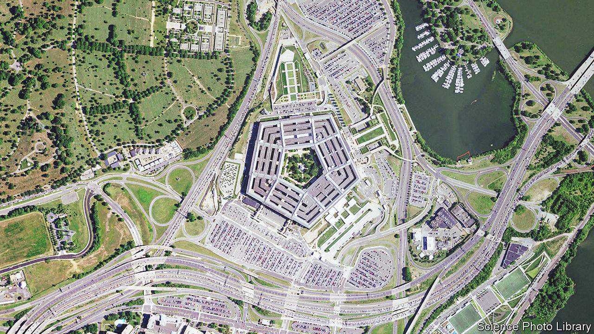

###### The slides that came in from the cold

# A leak of files is one of America’s worst intelligence breaches in a decade 

##### The classified material covers Ukraine’s army and CIA reports 

 

> Apr 10th 2023 

ON FEBRUARY 26TH officials from the SBU, Ukraine’s security service, came to a striking conclusion. Their own agents in  had defied orders and attacked a Russian surveillance plane earlier that day. American spies were listening in. They noted the morsel of intelligence in a highly classified slide on the war in Ukraine circulated by America’s joint staff on March 1st. Within days that report had been printed off and uploaded to the internet. So had scores of others. It appears to be America’s most serious intelligence leak in a decade. 

The leaked files, which include military assessments on the  and CIA reports on a range of global issues, came to broader attention when some appeared on Telegram, a messaging app widely used in Russia. Some had been published on Discord, a chat site popular with video-game enthusiasts, on March 1st and 2nd, according to Bellingcat, an investigative group. Some classified material had appeared as early as January.  has reviewed more than 50 slides. Others are still coming to light: the  says that it has reviewed some 300 documents.

Britain’s defence ministry said on April 11th that the leak “demonstrated a serious level of inaccuracy”. After the slides circulated on Telegram, at least one was crudely doctored to inflate Ukrainian casualty figures and understate Russian ones. But the rest showed no obvious signs of manipulation. Former American and European intelligence officials told  that they thought the reports were probably authentic American documents. The Pentagon’s response seemed to confirm this. A spokesman said it was leading an inter-agency panel to assess the damage and consulting allies. The Department of Justice opened an investigation into the source of the leak. A report by the on April 12th suggested the leaker worked on a military base. The timing is terrible: Ukraine is preparing a counter-offensive that could start within weeks. The leaked trove offers a remarkable window into the state of its armed forces. 

Several slides provide an eye-wateringly detailed accounting of Western plans to arm and train Ukraine’s army, including the status of nine Ukrainian brigades, the  and artillery in each one and the precise number of shells and precision-guided rockets Ukraine is firing each day. If accurate, the data could allow Russian military intelligence to identify the specific brigades that have probably been tasked with breaching Russian defences at the outset of the offensive. That, in turn, could allow Russia to carefully monitor those units to assess the location and timing of an offensive. One slide indicates that Ukraine’s 10th Corps is likely to command the operation, which will now make its headquarters an obvious Russian target. Another shows when the muddy ground is expected to harden sufficiently for heavy armoured vehicles to pass over.

Perhaps the most damaging documents lay out the state of . These are in dire shape, after parrying repeated Russian drone and missile strikes. The country’s Buk missiles were likely to run out on March 31st based on prevailing rates of fire (it is not clear whether this has actually occurred). Its S-300 missiles will last only until around May 2nd. Together the two types make up 90% of Ukraine’s medium-range air defences. The remaining batteries, including , “are unable to match the Russian volume” of fire, says the Pentagon, though on April 4th it announced it would send more interceptor missiles. Ukraine’s ability to protect its front lines “will be completely reduced” by May 23rd, it concludes. A table sets out the date at which each type of missile will be exhausted; a map depicts the location of every battery.

On April 10th the , citing additional leaked documents, reported that American intelligence analysts had come to a gloomy prognosis for the looming Ukrainian counterattack. “Enduring Ukrainian deficiencies in training and munitions supplies probably will strain progress and exacerbate casualties during the offensive,” said the document, judging that the operation was likely to fall “well short” of its objectives and that it would achieve only “modest territorial gains”. 

Secret signals

However, the documents hardly paint a rosy view of Russia’s forces. Though it has devastated the eastern city of Bakhmut—the situation there was “catastrophic” by February 28th, according to Ukraine’s military-intelligence chief, who is quoted in one report—its combat power is crippled. America’s Defence Intelligence Agency reckons that 35,500-43,000 Russian troops have died, with over 154,000 wounded, 40,000 more than the Ukrainian figure (the agency admits that these numbers are ropy). Russia has also lost more than 2,000 tanks and now fields only 419 “in theatre”. Russia’s campaign in eastern Ukraine is “heading toward a stalemate”, resulting in “a protracted war beyond 2023”.

The documents will have wider political consequences. One slide suggests there are 97 special-forces personnel from NATO countries in Ukraine, including 50 from Britain, 17 from Latvia, 15 from France and 14 from America. Most are probably training their Ukrainian counterparts; countries often deploy special forces with considerable secrecy. Even so, the Kremlin is likely to use the disclosure to justify its narrative that it is fighting not just Ukraine but the entirety of NATO. 

The leak is also a reminder that American spies collect intelligence on their allies—a fact which caused uproar in 2013 when it was revealed that America’s National Security Agency (NSA), responsible for signals intelligence, had spied on Angela Merkel, then German chancellor, among other world leaders. The latest trove shows that American agencies are snooping not only on Ukrainian generals and spooks, but also on officials in Hungary, Israel, South Korea and the International Atomic Energy Agency, a UN watchdog. 

One CIA report claims that the leaders of Mossad, Israel’s foreign-intelligence agency, encouraged its officials, and Israeli citizens, to protest against controversial judicial reforms. Another, reported by the Associated Press, claims that Russian spies boasted that the United Arab Emirates had agreed to work with them against American and British intelligence agencies. 

More importantly, the leaks describe not only who America is spying on but also how it is doing so. The description of the SBU’s assessment of the Belarus plane attack, for instance, is marked not merely as top secret—America’s highest level of classification—but also “SI-G”. That acronym indicates material derived from particularly sensitive signals intelligence, such as phone taps or electronic intercepts, according to officials familiar with the notation. Since many of the documents describe specific communications between individuals or groups, including within Russian military and intelligence agencies, they might help the targets realise how America is obtaining the information.

The publication of these documents is probably one of the four most significant intelligence leaks in this century, says Thomas Rid of Johns Hopkins University, alongside the theft of files by Edward Snowden, a former NSA contractor, in 2013, and the publication of NSA and CIA hacking tools in 2016 and 2017, respectively. The damage could be severe. The leak confirms that American agencies have penetrated Russia to a remarkable degree. But Russian spies and generals are now likely to take protective measures, such as changing their methods of communication.

America’s allies may also hesitate before sharing secrets. A vast number of Americans have access to classified information. More than 1m of them, including many contractors, like Mr Snowden, have clearance for top-secret files. And after the attacks of September 11th 2001, which occurred in part because intelligence was not shared quickly and widely enough between agencies, sensitive information was distributed far more extensively. The result was a leakier system. 

Ukrainian generals were already wary of revealing their secrets for this reason. Now they might clam up at a vital moment. “If this kind of thing happened in the UK, or in Israel, or Germany, or Australia,” says Mr Rid, “the US would have stopped sharing [intelligence] completely.” ■


