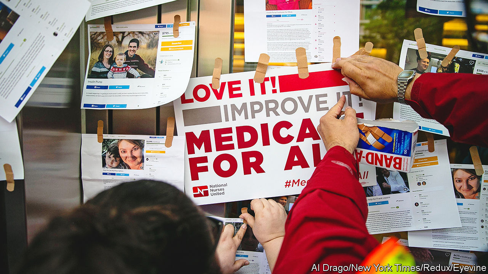
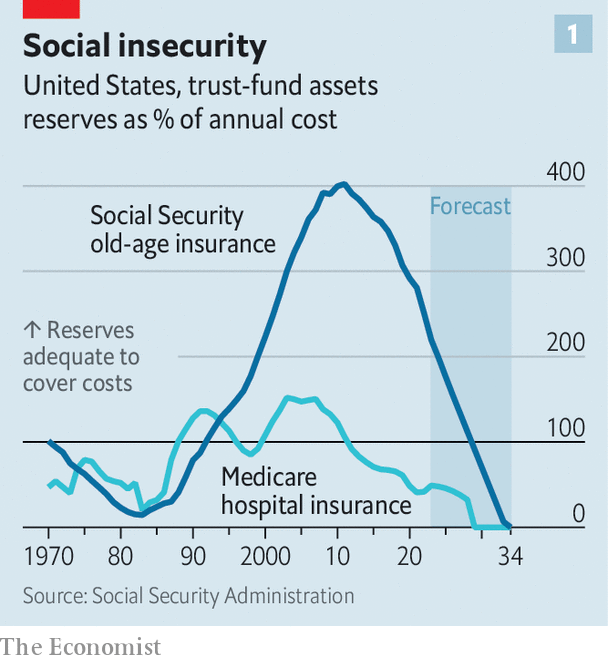

###### Third-rail thriller

# America’s entitlement programmes are rapidly approaching insolvency 

##### The politics of reforming them are already broken 

 

> Apr 9th 2023 

In some circles, the annual report from the Social Security and Medicare Board of Trustees is as hotly anticipated as a thriller. Admittedly, those circles are not very wide. Read the latest report, released on March 31st, and you can see why most people are happy to avoid the gruesome hobby.

 


The trust fund that pays for hospital insurance for patients of , the health-insurance scheme for the elderly, will run out of money by 2031; that is actually a reprieve from the previous estimate of 2028, because of the deadliness of covid-19. The fund that pays old-age benefits for Social Security, the state , will be exhausted by 2033 (see chart 1). These mandatory programmes are the behemoths of federal spending, costing $2.2trn (8.6% of GDP) in total in 2022. This eclipses the total of the discretionary spending approved in the federal budget—including on housing, education and even defence—that causes so much argument on Capitol Hill (see chart 2).

 


Both programmes would not exactly implode upon the exhaustion of their trust funds, which are built up by payroll taxes on workers. But their benefit levels would drop to match current receipts. The latest projections point to an 11% haircut for Medicare and a 23% one for Social Security when their trust funds run dry. Yet the politics of entitlement reform are so unpalatable that there is little appetite to tackle the problem. Not talking about it “is the one thing these guys can agree on”, says Maya MacGuineas, president of the Committee for a Responsible Federal Budget (CRFB), a non-partisan outfit that does find budget matters thrilling.

The conspiracy of silence is especially curious since there is at present a political crisis brewing over the country’s fiscal position. Republicans are refusing to raise the debt ceiling, a statutory limit on the amount that the Treasury can borrow, seeing their votes as leverage for a fiscal intervention. Yet they cannot agree on what concessions they would like for helping President Joe Biden avoid a default on America’s sovereign debt. 

, the Republican speaker of the House, has blanched at putting forward a formal budget proposal to negotiate with the president. Competing blocs of congressional Republicans have taken to issuing their own in the interim. Their suggestions include capping discretionary spending and repealing the climate provisions of the Inflation Reduction Act (a non-starter for the White House).

But Republicans in Congress are almost unanimous in agreeing that they have no plan to touch Social Security and Medicare, seen as a political third rail that previously shocked both President George W. Bush and Paul Ryan, a former Republican speaker. Mr McCarthy has declared any such discussions “off the table”. A Super PAC supporting Donald Trump is airing attack ads against Ron DeSantis, the Florida governor and his chief rival for the Republican nomination, based on Mr DeSantis’s votes to cut spending on the programmes while he was in Congress. What was once conservative orthodoxy is now contentious.

Democrats have leapt on the disarray of the opposition. “They can’t say what it [their plan] is for two reasons. One, the numbers don’t add up if the hints they’ve dropped are accurate. And two, they don’t want to say what it is because all of its elements are things that their constituents hate, like getting rid of all federal spending that isn’t defence,” says Sheldon Whitehouse, a Democratic senator from Rhode Island and the chairman of the powerful Budget Committee. The Republican strategy, he says, is “to go into a secret room with Biden and a hand grenade and get him to agree to stuff that nobody wants”.

After years of federal profligacy, both parties are pledging austerity in the future. Mr McCarthy says he will come up with a plan to arrive at a balanced budget in the next decade without cutting entitlements or defence spending—which is rather like a mathematician saying he will demonstrate how to square the circle in a decade. Having binged on nearly $5trn in net new spending since he took office, Mr Biden released a budget on March 9th that aims to subtract $3trn from the national debt over a decade, largely through tax increases that Republicans will reject. The plan says it will keep the Medicare fund solvent for 25 years by raising payroll taxes. But on Social Security Mr Biden would leave a shortfall of $5trn between payroll collections and benefit payments over the next decade.

During the standoff in 2011 between Democrats and Republicans, when Barack Obama was president, there was a discussion about a “grand bargain”—gradual changes to entitlement spending in exchange for accepting tax increases. This time, “everyone is saying rather explicitly, ‘we are not talking about entitlement reform’,” says Rohit Kumar of PwC, who worked with the Republican Senate leader, Mitch McConnell, during the last standoff. The eventual deal led to “sequestration”: painful spending caps that hamstrung Mr Obama for much of his second term. Now the reticence to discuss entitlements means the resolution of this impasse will probably be more modest, says Mr Kumar.

The cost of debt service has risen since the previous drama—the result of the Federal Reserve raising interest rates to fight inflation. America is expected to pay $640bn (2.4% of GDP) in net interest in 2023; this is projected to grow quickly and exceed defence spending by 2028. In 2029 net interest payments as a share of GDP are expected to exceed their previous high, of 3.16% in 1991. Yet the deficit hawks have never been quite as shy as they are now.

The obvious solution?

The maths of entitlement spending are not complicated. Fixing an imbalance between anticipated revenues and outlays can be solved in two ways: raising taxes or reducing benefits—by, say, pushing up the retirement age or promising less to future generations. (There is a magical third solution of increasing immigration to make the ratio between retirees and workers more manageable, but this cannot remedy America’s trust-fund troubles on its own.) All this is vulnerable to political attack.

For Mr Whitehouse, the Senate budget chairman, the “obvious” answer is raised contributions. At present, payroll taxes for Social Security are set at 12.4% of wages up to $160,000, split between employees and employers. The senator suggests eliminating that limit, which benefits high earners. “If it’s good enough for taxpayers making under $160,000, why do billionaires get a free ride?” If implemented today, doing so would probably cover 63% of the shortfall, according to calculations by the CRFB. Ignoring the issue covers 0% of the shortfall, and probably necessitates even more dramatic policy shocks in the next decade. Guess which one Congress will choose. ■


