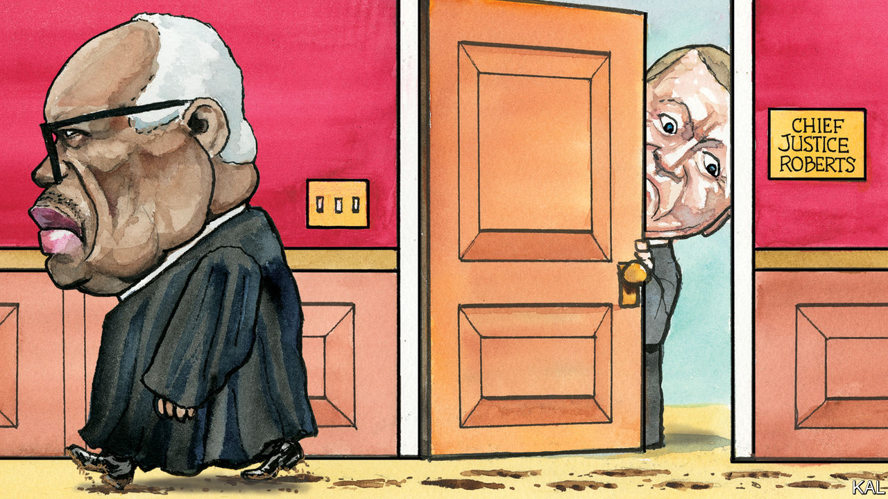

###### Lexington

# The real questions raised by Clarence Thomas’s latest scandal 

##### What ethics rules, if any, do the other Supreme Court justices follow? 

 

> Apr 12th 2023 

That a person from Clarence Thomas’s beginnings could reach the  reifies America’s fondest dream of itself, as a country that greets individual capacity with boundless possibility. Mr Thomas was born in 1948 in a shack with one electric light and no running water, in the isolated hamlet of Pin Point, on Georgia’s coast. When he was about seven he moved with his mother and brother to Savannah, where she worked as a housekeeper and they lived in an apartment that also lacked plumbing. 

Then his mother sent the boys to live with her parents. The grandfather—they called him Daddy, having little relationship to their own—put them to work selling heating oil during the school year and planting crops in the summer. As he deemed necessary he beat them, and he never praised them.

Racism in its overt and insidious cruelty bore down on Clarence Thomas from his birth. He drank from black-only fountains and went to black-only schools, and even there his dark skin set him apart. When the teacher stepped out of earshot, lighter-skinned students mocked him as “ABC”, America’s blackest child. 

Planning to be a priest, Mr Thomas went to seminary, but his calling faded as he realised the Catholic church spared little of its righteousness for confronting racism. When he learned that Martin Luther King junior had been shot, his vocation vanished: “That’s good,” he heard a student say of King. “I hope the son of a bitch dies.” After quitting seminary Mr Thomas tried to return home, but his grandfather, who had a third-grade education, kicked him out. “You’ll probably end up like your no-good daddy or those other no-good Pin Point Negroes,” he said. (Mr Thomas considers his grandfather the greatest man he ever knew.)

Fearing he might never overcome segregation in a nation so racist, Mr Thomas marched and rioted. He also got himself into Yale Law School, only to discover a more insidious racism. In seminary, he was told he was succeeding despite his race; at Yale he felt suspected of succeeding only because of it. He came to fear he would never escape the stigma of racial preference. He drank too much, got divorced and struggled to make ends meet even after he became chairman of the Equal Employment Opportunity Commission under Ronald Reagan. American Express cancelled his card, and he was almost evicted from his rented apartment.

The list of groups who wounded Clarence Thomas is long: light-skinned black people who believed themselves superior; white conservatives who assumed a black man could not share their views; black liberals who believed a black man should not share such views; white liberals who believed that, too; perhaps most, the rich white men, including Joe Biden, who had the gall during his Senate confirmation hearings to question his commitment to racial justice, and then  with accusations of sexual harassment, which he denied. Mr Thomas had played by the rules, he writes in his autobiography, “My Grandfather’s Son”, only to learn that “whites could change those rules whenever they pleased. It had always been that way, and always would be.” 

To try to see through Justice Thomas’s eyes is to glimpse that he might feel America’s elites owe him something, even, perhaps, a half-million-dollar trip by private jet and yacht among the islands of Indonesia. As a justice, he gets to make the rules now, or at least to interpret them. In early April, the investigative publication ProPublica revealed that over two decades Justice Thomas has accepted luxury trips almost every year from Harlan Crow, a right-wing Texas billionaire, without disclosing them.

It is an old Washington tale. Public servants—journalists, too—rub elbows with lobbyists and lawyers who make far more than they do. It may be hard to pity a justice for making $285,400 a year, but it is not hard to imagine some justices pitying themselves, just a little, as they sit listening to arguments from lesser, richer lawyers in bespoke suits. The downside of life tenure is that they, unlike the senators and generals they know, will never cash in as lobbyists. But they can find other ways to spend time in what F. Scott Fitzgerald called “the consoling proximity of millionaires”.

No one has made a serious argument that the judge’s vacations have corrupted his rulings. Much as liberals despise his judicial philosophy, Justice Thomas came by it the hard way. The last time he was in the news for his ethics, the matter was more troubling: he was failing to recuse himself from cases involving allies of his wife, Virginia, who worked to overturn the 2020 election. The new uproar raises fewer questions about Justice Thomas than about the Supreme Court itself.

Witless for the prosecution

In a statement, Justice Thomas said that years ago he “sought guidance from my colleagues” and learned he did not have to disclose gifts from Mr Crow, as a friend with no business before the court. That shifts the responsibility to the whole court, in particular to the chief justice, John Roberts. Are Justice Thomas’s practices typical, and are they OK? The Supreme Court has no code of conduct, and, judging from past comments, Chief Justice Roberts prefers to live in a world of trust and honour. 

Who wouldn’t? The problem is, that is not the world in which Americans live. Not only because a certain former president constantly says so, the public has good reason to suspect American justice is not on the level. How else could a federal judge feel free to substitute his judgment for that of the Food and Drug Administration and ban a trusted abortion drug? Why else would the political parties spend millions of dollars to contest a swing seat on the Wisconsin Supreme Court? And what else can the public infer from the disregard for precedent of Chief Justice Roberts’s court, now that Republicans have shifted its balance? Polling shows most Americans no longer have much confidence in the justice system or the Supreme Court. Maybe the justices should stop making the case for the prosecution, and start mounting a defence. ■


