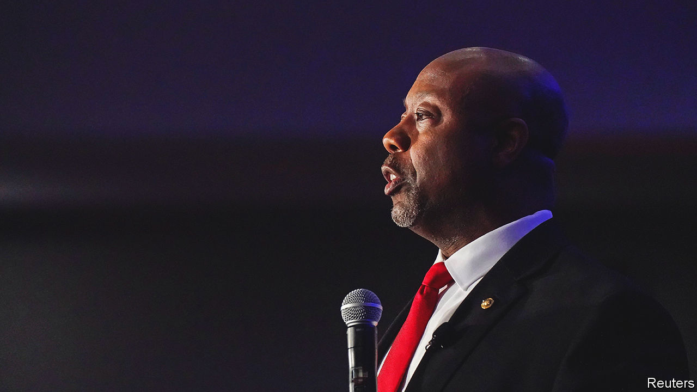

###### Perverse political maths

# Why Tim Scott is such a long shot for the Republican nomination 

##### Hardly anyone in his party has a bad word to say about the South Carolina senator 

 

> Apr 13th 2023 

It is treacherous to posit mathematical laws for something as chaotic as politics. Nevertheless, if you scrutinise the likely contenders for the Republican presidential nomination for 2024, you can see an inverse relationship between shamelessness and viability. 

At the top is Donald Trump, unhumbled by loss, insurrection or indictment, who this week said he would not stand down even if : “I’d never drop out, it’s not my thing.” Next is Ron DeSantis, Florida’s governor, willing to abandon his past allegiance to Mr Trump and his  when expedient. Those who try to cultivate a public sense of decency, like Mike Pence, a former vice-president, and Asa Hutchinson, a former Arkansas governor, are far down. 

If the relationship holds true, it bodes poorly for Tim Scott, a senator from South Carolina. He announced on April 12th that he would form a presidential exploratory committee—becoming the second figure from the Palmetto State, after Nikki Haley, a former governor, to join the fray. Hardly anyone in the party has a bad word to say about Mr Scott, who grew up from poverty with a single mother to become the first African-American senator to represent a Southern state since 1881. Polling of the state’s Republicans, by Winthrop University, showed Mr Trump’s support at 41%, with Mr DeSantis and Ms Haley close to 20% and Mr Scott back at 7%. And that would be his most favourable state.

He is not a belligerent ideologue. His congressional record was noted most for his championing of “opportunity zones”—a tax-incentive scheme to revitalise left-behind neighbourhoods passed in 2017—and for a bipartisan effort at police reform that eventually foundered. He did not shy away from criticising Mr Trump for his racist remarks, but never broke decisively with him (voting twice against impeachment). 

Yet culture warrior is the archetypal role of the modern Republican primary candidate. Mr Scott clearly feels he must play the part. “If the radical left gets their way, millions more families will be trapped in failing schools, crime-ridden neighbourhoods and crushing inflation,” he intones in his launch video. It may not be enough to win, but the vice-presidential role may beckon.■


