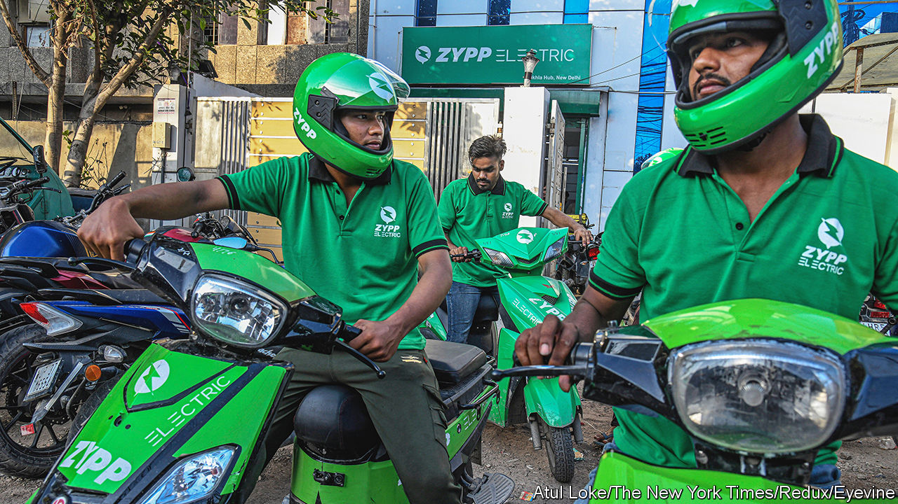

###### Two wheels good

# Forget Teslas, India’s EV revolution is happening on two wheels 

##### Electric scooters are spreading fast 

 

> Apr 20th 2023 

Even licence plates contribute to the feast of colour that is an Indian city. Private vehicles have plates with black characters on white; commercial ones, black writing on yellow; rental vehicles, yellow on black; prized diplomatic plates are white and blue. And in the past few months a fourth colour scheme has become a lot more common: white on green. That is the licence plate allocated to electric vehicles (EVs), and they are suddenly everywhere—especially in the form of two- and three-wheelers. 

Say the words “electric vehicle” and racy images of Tesla and its boss Elon Musk spring to Western minds. But outside rich countries, especially in India, the two-wheeler is the chariot of the middle classes. More than 70% of all vehicles on Indian roads are two-wheelers, chiefly scooters and motorcycles. Three-wheeled autorickshaws (which foreign tourists insist on calling “tuk-tuks”) make up another 10%. These two categories accounted for 92% of EVs registered in India last year. 

Their growth is impressive. EVs represented 4% of the 16m two-wheelers sold in 2022, up from 1% the previous year, according to Counterpoint, a market research firm. E-rickshaws are spreading much faster. About 40% of the 632,000 three-wheelers sold in 2022 were electric. That is projected to rise to 95% by the end of this decade. Four-wheelers are lagging. Just 1.3% of the 3.8m cars newly registered in India last year were electric, up from 0.5% in 2021. Much of this growth is being driven by consumers in smaller cities, where public transport is poor and two-wheelers rule. 

The growth spurt is largely fuelled by government incentives for both producers and consumers. In 2013, the then Congress-led government launched the first national scheme—the National Electric Mobility Mission Plan—to push EVs. Two years later, Narendra Modi, by then the prime minister, launched a demand-incentive scheme known by the acronym fAME, with an expanded second phase in 2019. Most state governments subsidise EV purchases, too. The incentives spurred the growth of EV scooter startups such as Ola Electric Mobility and Okinawa, which have gobbled up market share, though new firms are still emerging. The government aims for EVs to account for 30% of passenger car sales, 70% of commercial ones and 80% of two- and three-wheelers by 2030.

Is that realistic? A report by two government think-tanks charged with forecasting two-wheeler EV penetration produced a wide range of scenarios, with adoption by 2031 ranging from 3.1% to 87.7%. Arghya Sardar of Technology Information Forecasting and Assessment Council, one of the think-tanks, says it will be around 72%. Bain, a consultancy, forecasts a more modest 40-45%. Either way, incentives alone will not be sufficient. Battery technology will need to improve and become cheaper. Battery-swapping could also help.

Many challenges remain. The high upfront cost of EVs, despite the incentives, is a persistent one. Charging infrastructure will have to be built to address range anxiety, particularly for four-wheelers. The e-rickshaw market grew big and fast because an informal manufacturing industry produced vehicles using old-fashioned lead-acid batteries. It needs to be regulated and its technology upgraded. 

Yet the payoff looks considerable. Over 85% of India’s crude oil is imported. Petrol alone made up 24% of India’s import bill in 2021-22. By contrast, coal, on which India’s electricity supply depends, is mostly produced domestically. EVs should therefore help India cut its goods-import bills and energy dependence. That alone would not address climate change. But it would have major health benefits. Internal combustion engines produce an especially deadly form of pollution, known as PM2.5. One study estimates they contribute 20-35% of these lung-burning particles in the filthy air of Indian cities. And the number of vehicles on the roads is ballooning.

More hopefully still, India is starting to make strides in greening its energy mix, with the aim of meeting half of its needs with renewables by 2030. That is heroically ambitious. Still, the quiet electric revolution taking place on Indian roads shows the possibility of real progress. ■

