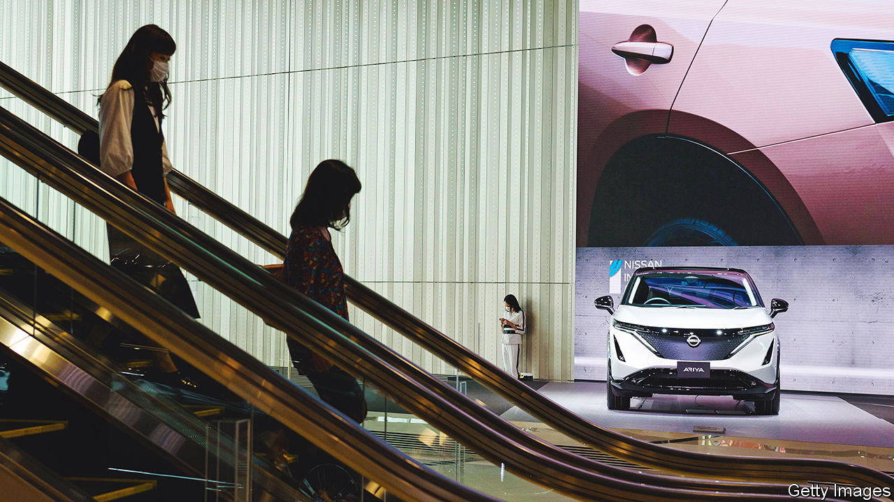
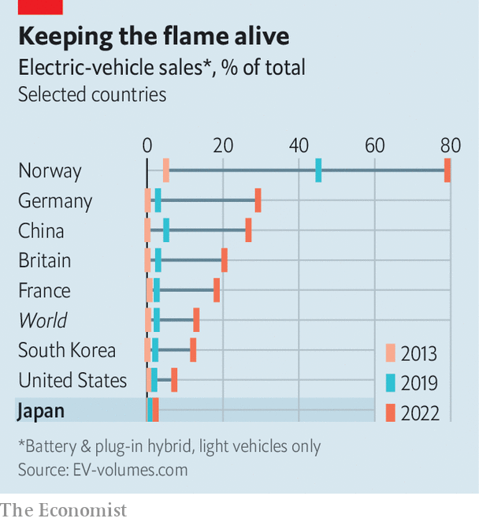

###### Fumbling the future

# How Japan is losing the global electric-vehicle race 

##### Toyota, Honda and Nissan, innovators of yesteryear, are playing catch-up 

 

> Apr 16th 2023 

The green floors of JATCO’s Fuji Area 2 factory hum with quiet confidence. Diligent inspectors appraise the gears and pulleys that make up the Japanese car-parts maker’s transmission systems.  stamp parts and flip them onto production lines. For decades, JATCO, like the rest of Japan’s vaunted auto industry, has perfected carmaking. Japan has been at the forefront of the industry, pioneering just-in-time manufacturing and leading the development of hybrid cars. But the next big evolution—the shift to  (EVs)—has become a source of angst. “The EV shift will be a big transformation, there’s no denying that,” says Sato Tomoyoshi, JATCO’s CEO. “Our company will have to change drastically.” 

So far, Japan and its carmakers are lagging in the race towards eVs, the industry’s fastest-growing product area. Battery-powered electric vehicles and plug-in hybrids (PHEVs) accounted for around 13% of all cars sold globally in 2022, up from 2.6% in 2019. In some markets, including , the share is some 20%. But in Japan, it was just 2%. The firms pulling ahead in the EV race include , such as Tesla and China’s BYD, and established giants such as Germany’s Volkswagen. 

 


Japanese carmakers are not among them. None is in the top 20 for global EV sales, even though Nissan and Mitsubishi released some of the world’s first EVs more than a decade ago. Toyota, the world’s largest car company, sold just 24,000 EVs out of its 10.5m in total sales in 2022. (Tesla sold 1.3m.) Sales of Toyota’s first fully electric model, an SUV called the bZ4X, had to be paused last summer due to defects that caused the wheels to fall off. 

Critics worry that this early stalling on EVs could cause the wheels to fall off the Japanese auto industry at large. Some see parallels with semiconductors and consumer electronics, industries which Japanese firms initially dominated, then missed important trends abroad and ultimately lost out to nimbler competitors. A similar decline in the auto industry, which accounts for nearly 20% of Japan’s exports and some 8% of Japanese jobs, would have huge economic and social implications.

Japanese carmakers are revving to catch up. Toyota has a new cEO, , tapped in part to lead the company’s push for electrification. At his first press conference on April 7th, Toyota announced plans to release ten new EV models and boost annual EV sales to 1.5m by 2026. “We will thoroughly implement electrification, which we can do immediately,” said Mr Sato. 

Honda has plans to launch 30 EV models by 2030 and set up an EV joint venture with Sony last year. The company pitched a corporate reorganisation taking effect this month as an “electrification acceleration”. In February Nissan said it would release 19 new EV models by 2030; it now calls electrification the “core of our strategy”. 

Japan’s slow start on EVs stems in part from its earlier successes—or as Mr Sato of JATCO puts it, it is a classic case of the innovator’s dilemma. Industry leaders hesitated to embrace a new technology that might undermine areas in which Japan leads, such as standard hybrid vehicles, which combine an internal combustion engine (ICE) and an electric motor powered by batteries that capture energy from regenerative braking (rather than charging with outside electricity, as with PHEVs). Engineers at Japanese firms that fine-tuned complex hybrids were also unimpressed by eVs, which are simpler mechanically. “Within the industry, there are still a lot of people attached to the engine,” Mr Sato says. Executives worried about the implications of the EV shift on their network of suppliers such as jATCO, given that EVs require fewer parts and widgets than ICEs. Carmakers assumed eventually switching gears to EVs would be a cinch: “The logic was that when the time comes, we can easily shift from hybrids to EVs,” says a former executive at a large Japanese car company. 

Japan also made an early wrong turn with hydrogen, another emergent auto technology with the potential to be carbon-free. Toyota, Japan’s most influential carmaker, bet that using hydrogen fuel-cells would become the leading way to electrify cars. Abe Shinzo, Japan’s prime minister from 2012 to 2020, championed policies to make Japan a “hydrogen society”; in 2015, Toyota delivered its first hydrogen fuel-cell sedan, the Mirai, to Abe himself. While hydrogen may come to play a big role in decarbonising hard-to-electrify sectors, such as steel production or fuelling long-haul trucks, it has so far turned out to make little sense as a technology to electrify light consumer vehicles. Even in Japan, which has built a fair amount of hydrogen-refuelling infrastructure, Toyota has struggled to peddle the pricey Mirai: the company has sold a total of just 7,500 fuel-cell vehicles in its home market. 

While governments in China, Europe and America have increasingly subsidised EVs as part of their climate policies, Japan has done less to incentivise their adoption. The government has called for 100% of vehicles sold by 2035 to be electrified. But that would include hybrid vehicles, in contrast to other governments which have defined the next generation of vehicles more narrowly. Subsidies for fuel-cell vehicles remain much larger in Japan than those for EVs. Strict regulation has hampered the expansion of : Japan has roughly one-quarter as many public EV chargers as South Korea, its much smaller neighbour. 

Nagging scepticism about EV technology explains some of Japan’s wariness. Japanese carmakers and officials are “still questioning”, says Tsuruhara Yoshiro of AutoInsight, an industry journal: “Are EVs what consumers want? Do they provide value to them? Are they the best way to reduce CO2?” Toyoda Akio, the previous Toyota CEO and grandson of the company’s founder, liked to say that “carbon is the enemy, not the internal combustion engine.” Even under Mr Sato, a protégé of Mr Toyoda, the company is sticking to what it calls a “multi-pathway” strategy that sees EVs as one part of a diverse fleet. “We think that the way to get the most carbon-dioxide emissions reductions net overall throughout the world is to tune the solution for each part of the world,” says Gill Pratt, Toyota’s chief scientist. For example, in developing countries, where renewable energy uptake has generally been slower than in the West, traditional hybrids might offer a more practical and economical way to reduce emissions in the interim. 

But some think Japan’s carmakers are moving too late to catch up with the changing times in more developed markets. “They are like the Tokugawa shogun-era closed country—they refused to see what is happening in the world,” says Murasawa Yoshihisa, a management consultant. While Japanese cars were once synonymous with fuel efficiency and therefore environmentalism, they risk coming to stand for climate denialism. Japan’s three biggest carmakers—Toyota, Honda and Nissan—rank lowest among the top ten global auto companies on decarbonisation efforts, according to a recent study by Greenpeace, an environmental group.

As Toyota’s experience with the bZ4X suggests, designing and building top-of-the-line EVs may not be as simple as the Japanese firms assumed. “They were so overconfident that once they decide to do it, they will dominate the EV market,” Mr Murasawa says. “But their offerings have turned out to be old-fashioned.” Creating EVs that appeal to consumers requires putting , while Japanese firms traditionally prioritise hardware. Even as they at last start gearing up, Japanese companies are already losing loyal customers. Japanese brands that “built a legacy” in America have been “caught flat-footed in the context of 2022”, concludes S&amp;P Global Mobility, an American research outfit. As the study notes, consumers switching to EVs in 2022 were largely moving away from Toyota and Honda. ■


